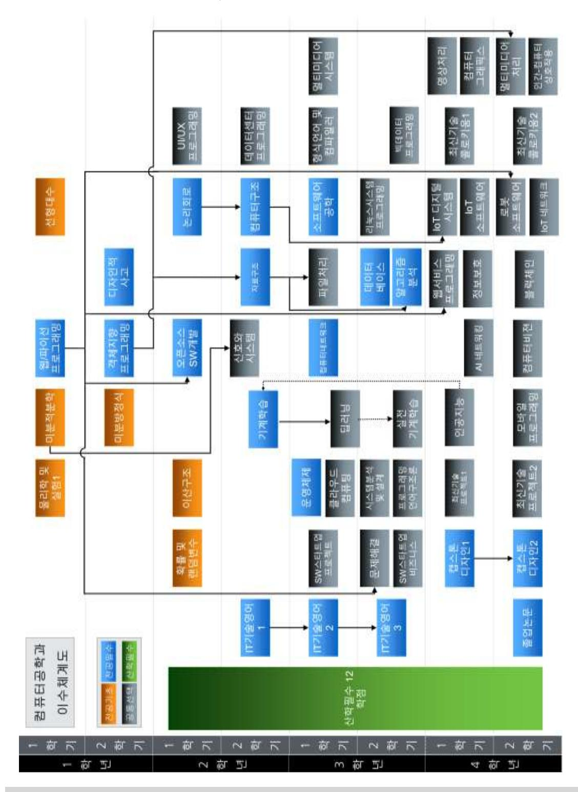
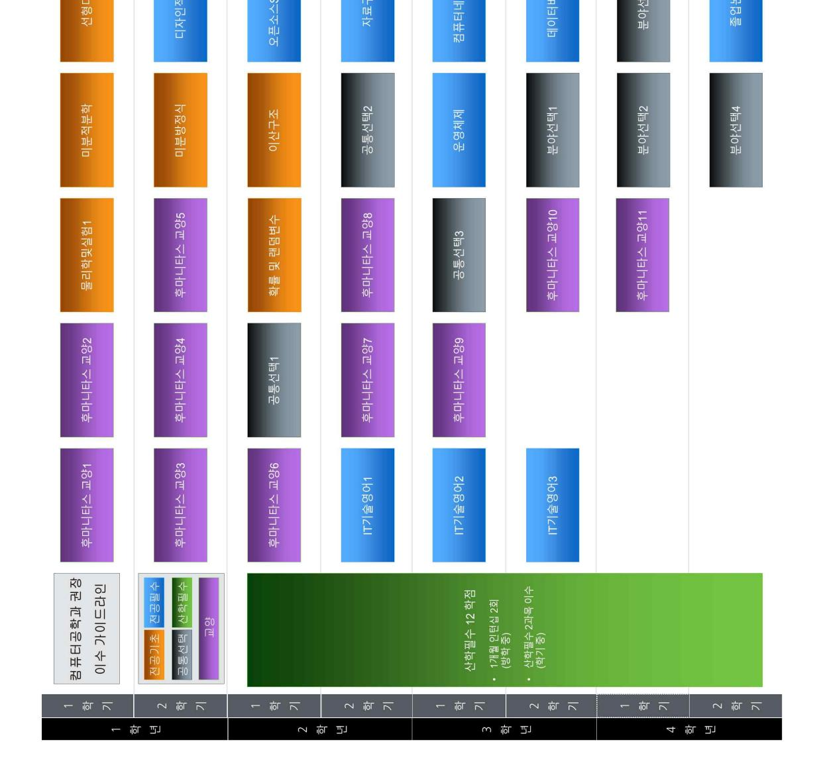

# 소프트웨어융합대학 교육과정

대학소개

- ◩ 소프트웨어융합대학은4차산업혁명을주도할실천적소프트웨어인재양성을위해서컴퓨터공학과와소프트웨어융합학과의 2학과 멀티 트랙의 체제로 2018년도 설립한다.
- ◩ 소프트웨어융합대학의STEP(SoftwareTalentEnhancementProgram)에기반한심화소프트웨어전문가양성교육을컴 퓨터공학과에서수행한다.이는산업계및글로벌스탠다드에준하는실습과프로젝트교육강화등을통해서빅데이터,모바 일/보안, IoT(Internet of Thing), 스마트 콘텐츠 분야의 소프트웨어 전문가를 양성하는 교육을 수행한다.
- ◩ 소프트웨어융합대학의SWING(SoftWareIndustryforNext-Generation)에기반한소프트웨어신산업융합전문가양성교 육을 소프트웨어융합학과에서 수행한다. 이를 소프트웨어 핵심과 융합 목표 전공을위한압축교육을 통해서 게임 콘텐츠, 데이터사이언스,미래자동차・로봇및미래를스스로설계하고기획해갈수있는글로벌리더양성을통한소프트웨어신산 업 융합 전문가를 양성하는 교육을 수행한다.

#### **1. 교육목적**

창의력과 전문성을 갖추고 새로운 산업과 학문을 주도할 실전적 소프트웨어 인재 양성

#### **2. 교육목표**

- 1)소프트웨어중심기업/학계및소프트웨어관련창업을주도하기위하여,심화소프트웨어전문가교육을수행함으로써소프트 웨어 분야 핵심 개발 능력을 보유한 인재를 육성
- 2)융합목표분야관련기업및융합창업을주도하기위하여,소프트웨어신산업융합전문자교육을수행함으로써,융합분야에 특화된 전공지식과 소프트웨어 개발 능력을 보유한 인재를 육성

#### **3. 설치학과**

- 가. 컴퓨터공학과
- 나. 소프트웨어융합학과

#### **4. 대학 졸업 요건**
<!DOCTYPE html>
<html lang="ko">
<head>
<meta charset="UTF-8">
<title>전공 이수 요건표</title>

</head>
<body>

<table>
    <thead>
        <tr>
            <th rowspan="3">학과명</th>
            <th rowspan="3">프로그램명</th>
            <th rowspan="3">졸업 이수 학점</th>
            <th colspan="4">단일전공과정</th>
            <th colspan="5">다전공과정</th>
            <th colspan="3">부전공과정1</th>
            <th colspan="3">부전공과정2</th>
        </tr>
        <tr>
            <th colspan="3">전공학점</th>
            <th rowspan="2">계</th>
            <th rowspan="2">타전공 인정 학점</th>
            <th colspan="3">전공학점</th>
            <th rowspan="2">계</th>
            <th rowspan="2">전공 필수</th>
            <th rowspan="2">전공 선택</th>
            <th rowspan="2">계</th>
            <th rowspan="2">전공 필수</th>
            <th rowspan="2">전공 선택</th>
            <th rowspan="2">계</th>
        </tr>
        <tr>
            <th>전공 기초</th>
            <th>전공 필수</th>
            <th>전공 선택</th>
            <th>전공 기초</th>
            <th>전공 필수</th>
            <th>전공 선택</th>
        </tr>
    </thead>
    <tbody>
        <tr>
            <td>컴퓨터 공학과</td>
            <td>컴퓨터공학</td>
            <td>140</td>
            <td>18</td>
            <td>48</td>
            <td>30</td>
            <td>96</td>
            <td>12</td>
            <td>12</td>
            <td>27</td>
            <td>15</td>
            <td>54</td>
            <td>15</td>
            <td>6</td>
            <td>21</td>
            <td>24</td>
            <td>6</td>
            <td>30</td>
        </tr>
        <tr>
            <td>소프트웨어 융합학과</td>
            <td>소프트웨어융합학</td>
            <td>130</td>
            <td>15</td>
            <td>37</td>
            <td>36</td>
            <td>88</td>
            <td>12</td>
            <td>15</td>
            <td>21</td>
            <td>24</td>
            <td>60</td>
            <td>18</td>
            <td>12</td>
            <td>30</td>
            <td>12</td>
            <td>9</td>
            <td>21</td>
        </tr>
    </tbody>
</table>

    
※ 교양이수는 후마니타스칼리지 교양교육과정을 따라야 함

    
※ 전공이수는 각 전공별 교육과정 시행세칙에서 정한 졸업이수요건을 만족해야 함

    
※ 부전공과정2는 이수해야할 교과목이 지정되어있으므로, 각 학과 교육과정 시행세칙에서 정한 졸업이수요건을 만족해야 함

</body>
</html>

※ 교양이수는 후마니타스칼리지 교양교육과정을 따라야 함

※ 전공이수는 각 전공별 교육과정 시행세칙에서 정한 졸업이수요건을 만족해야 함

※ 부전공과정2는 이수해야할 교과목이 지정되어있으므로, 각 학과 교육과정 시행세칙에서 정한 졸업이수요건을 만족해야 함

※ 2018학년도 이후 신입생(편입생, 순수외국인 제외)은 소프트웨어 기초지식 습득 및 마인드 함양을 위해, 각 학과에서 정한 SW교육을 이수해야 함

# **5. 전공별 교육과정 편성 교과목수**

| 학과/프로그램명  |          | 전공필수+ |          |     |          |     |          |     |              |               |     |
|-----------|----------|-------|----------|-----|----------|-----|----------|-----|--------------|---------------|-----|
| 학과명       | 프로그램명    |       | 전공기초 (A) |     | 전공필수 (B) |     | 전공선택 (C) |     | 전공선택(교직) (D) | 전공선택 (B+C) |     |
|           |          | 과목수   | 학점수      | 과목수 | 학점수      | 과목수 | 학점수      | 과목수 | 학점수          | 과목수           | 학점수 |
| 컴퓨터공학과    | 컴퓨터공학    | 6     | 18       | 19  | 48       | 39  | 111      | -   | -            | 58            | 159 |
| 소프트웨어융합학과 | 소프트웨어융합학 | 5     | 15       | 14  | 37       | 75  | 194      | -   | -            | 94            | 244 |

※ 단기현장실습/장기현장실습 과목은 제외한 현황임

# **6. 졸업능력인증제**

- \* 2016년 8월이후소프트웨어융합대학졸업생은 TOEIC SPEAKING 5급이상,OPIC IL레벨이상을취득하거나이에준하는 공인영어성적(TOEIC630점,NewTEPS271점,G-TELP54점(LEVEL2),TOEFL(IBT)72점등)을취득하여,제출기간내소프트 웨어융합대학 행정실로 제출하여야 졸업능력인증을 Pass한다. - 제출 기간 내 면제신청서 및 재직증명서, 4대보험 가입증명서를 소프트웨어융합대학 행정실로 제출
- \* 외국국적 외국인 특별자의 경우는 상기의 공인영어성적 또는 한국어능력시험 4급 이상을 취득하여야 한다.
- \* 수료자 중 취업자에 해당하는 경우, 졸업능력인증 면제심사를 요청할 수 있다.(2019년 8월 졸업사정대상자부터 적용)

# **7. 소프트웨어융합대학 전공과목(영어강좌)이수안내**

2008학번이후신입생은전공과목의영어강좌3과목이상이수를졸업요건으로충족해야하며,편입학생의경우전공과목영어 강좌 1과목 이상을 이수해야 한다.

# 컴퓨터공학과 교육과정

학과소개

- ◩ 고도의정보산업사회에서는새로운학문으로컴퓨터공학이근본이되며정보가가장중요한자원이될것이다.이들정보를 수집하고처리하는데있어컴퓨터공학기술은필수적이며핵심적이다.컴퓨터공학과에서는정보산업에서가장핵심이되는 빅데이터분석분야,모바일및보안분야,IoT분야,스마트컨텐츠분야등의교육을추구하고있다.프로그래밍능력을증진 시키는 프로그래밍언어 교육은 매우 중요하고도 기본적이어서 이론 및 실습을 통해 철저히 교육하고 있다.
- ◩ 졸업후에는대학원에진학하거나유학을가며,국내의수많은정보통신,컴퓨터,인터넷,멀티미디어,게임,애니메이션,전자 상거래관련기업,산업체,금융기관,국공립연구소에진출할수있다.그리고벤처기업을창업하는졸업생이점점늘고있다. 향후정보화사회가본격적으로도래할것으로예측됨에따라컴퓨터공학전공자의수요가폭발적으로증가될것으로예상되 며,창의력과전문성을가진컴퓨터공학전공자들이국가경쟁력제고에큰역할을할것으로기대된다.국가적,사회적,시대 적요구에비추어보아컴퓨터공학전공에서교육하고다루는기술은산업발전의핵심이자주체이며,이러한점에서컴퓨터공 학 전공의 향후 발전 전망은 매우 밝고 무한하다고 할 수 있다.

#### **1. 교육목적**

IT강국을 선도할 수 있는 창의력과 전문성을 갖춘 글로벌 컴퓨터공학 인재 양성

#### **2. 교육목표**

- 1)컴퓨터공학 전문지식 습득과정보화사회에 대한이해를 바탕으로 글로벌사회에서각분야 리더로서 활동할수있는 능력 배양
- 2) 기초과학의 충실한 학습을 바탕으로 지식기반 사회에서 요구되는 창의적 능력 배양
- 3) 기술적 문제를 공식화하고, 첨단 공학 도구를 사용하여 실험을 하고 수행함으로써 당면 문제를 체계적으로 해결할 수 있는 능력 배양
- 4) 공학적 윤리의식을 갖추고 미래가치를 창출하고 산업발전을 선도할 수 있는 능력 배양

#### **3. 학과별 교과목 수**

| 학과명    | 구분  | 전공기초 | 전공필수 |      | 전공선택 | 전공과목 |
|--------|-----|------|------|------|------|------|
|        |     |      |      | 산학필수 | 전공선택 |      |
|        | 과목수 | 6    | 19   | 8    | 31   | 64   |
| 컴퓨터공학과 | 학점수 | 18   | 48   | 18   | 93   | 177  |

※ 단기현장실습/장기현장실습 과목은 제외한 현황임

# **4. 컴퓨터공학과 졸업 요건**

1) 교육과정 기본구조표
<!DOCTYPE html>
<html lang="ko">
<head>
<meta charset="UTF-8">
<title>컴퓨터공학과 전공 이수 요건표</title>

</head>
<body>

<table>
    <thead>
        <tr>
            <th rowspan="4">학과명</th>
            <th rowspan="4">졸업 이수 학점</th>
            <th colspan="5">단일전공과정</th>
            <th colspan="5">다전공과정</th>
            <th colspan="3">부전공과정1</th>
            <th colspan="3">부전공과정2 (SW트랙)</th>
        </tr>
        <tr>
            <th colspan="4">전공학점</th>
            <th rowspan="3">계</th>
            <th rowspan="3">타 전공 인정 학점</th>
            <th colspan="3">전공학점</th>
            <th rowspan="3">계</th>
            <th rowspan="3">전공 필수</th>
            <th rowspan="3">전공 선택</th>
            <th rowspan="3">계</th>
            <th rowspan="3">전공 필수</th>
            <th rowspan="3">전공 선택</th>
            <th rowspan="3">계</th>
        </tr>
        <tr>
            <th rowspan="2">전공 기초</th>
            <th rowspan="2">전공 필수</th>
            <th colspan="2">전공선택</th>
            <th rowspan="2">전공 기초</th>
            <th rowspan="2">전공 필수</th>
            <th rowspan="2">전공 선택</th>
        </tr>
        <tr>
            <th>산학 필수</th>
            <th>전공 선택</th>
        </tr>
    </thead>
    <tbody>
        <tr>
            <td>컴퓨터공학과</td>
            <td>140</td>
            <td>18</td>
            <td>48</td>
            <td>12</td>
            <td>18</td>
            <td>96</td>
            <td>12</td>
            <td>12</td>
            <td>27</td>
            <td>15</td>
            <td>54</td>
            <td>15</td>
            <td>6</td>
            <td>21</td>
            <td>24</td>
            <td>6</td>
            <td>30</td>
        </tr>
    </tbody>
</table>

    
※ 교양이수는 교양교육과정을 따름[1]

    
※ 전공이수는 컴퓨터공학과 교육과정 시행세칙에서 정한 졸업이수요건을 만족해야 함[1]

    
※ 2018학년도 이후 신입생(편입생, 순수외국인 제외)은 소프트웨어 기초지식 습득 및 마인드 함양을 위해, 컴퓨터공학과에서 정한 SW교육을 이수해야 함[1]

</body>
</html>

2) 졸업논문

컴퓨터공학과의'캡스톤디자인2'를이수하는것으로경희대학교졸업을위한"졸업논문"합격으로인정한다.단,"졸업논문(컴퓨 터공학)"을 필히 수강 신청하여야 한다.

3) 졸업능력인증제

졸업능력인증제 pass는 졸업의 필수이며, 소프트웨어융합대학 졸업능력 인증제를 따른다.

# 컴퓨터공학과 교육과정 시행세칙

#### 제 1 장 총 칙

- 제1조(학과 설치 목적) ①본시행세칙은본교학칙제34조,제36조,제58조에의거하여,컴퓨터공학과의운영에관한사항을규 정함의 목적으로 한다.
  - ②글로벌시대에국제적으로인정받을수있는엔지니어의배출을목표로소프트웨어중심대학사업의기준과Washington/Seoul Accord의기준을준수하기위함이며,지식기반시대와산업변화에적극적으로대응하기 위한순환형개선시스템의도입을 그 목적으로 한다.
  - ③이에따라,컴퓨터공학과는컴퓨터공학분야의공학지식의습득과응용을거쳐설계에이르는능력을키우고미래공학현장 문제를해결할수있는공학도로양성하기위하여2017학년도부터소프트웨어중심대학사업을수행하며,지식기반시대와산 업변화에 적극적으로 대응하고 이에 부합하는 공학교육을 위하여 순환형 교육개선 시스템을 도입하여 운영한다.
  - ④소프트웨어중심대학사업단은과학기술정보통신부및정보통신기술진흥센터(IITP)에서주관하는IT교육혁신으로산업에부 흥한인재양성을위한사업이다.컴퓨터공학과는글로벌시대를맞이하여국제적으로인정받을수있는전문인력양성을위 해, 소프트웨어중심대학 사업에서 권장하는 커리큘럼을 반영한 컴퓨터공학을 설치・운영한다.

제2조(일반원칙) ①컴퓨터공학과를단일전공,다전공,부전공으로이수하고자하는학생은본시행세칙에서정하는바에따라교 과목을 이수할 수 있다.

- ② 교과목의 선택은 지도교수와 상의하여 결정한다.
- ③ 모든 교과목은 [별표1] 교육과정 편성표에 제시된 이수학년과 개설학기에 준해 이수할 것을 권장한다.
- ④전공과목의선수과목은[별표5]와같으며,선·후수과목의체계를준수하여이수하여야한다.선·후수과목의체계는전산시스 템에 반영되어있으며 수강신청시 자동으로 적용된다.

#### 제 2 장 교양과정

제3조(교양과목 이수) 전문교양과목은공학교육인증교양과목과본교후마니타스교양과정기본구조표에서정한소정의학점을 모두 만족하여야 한다.

#### 제 3 장 전공과정

- 제4조(전공 및 트랙과목 이수) ①컴퓨터공학과의단일전공과정을이수하고자하는학생은[표1]에명시된전공기초,전공필수, 산학필수,전공선택학점을이수하여야한다.다전공자의경우는[표2]에서지정한전공기초,전공필수교과목을반드시이수해 야 하고, 부전공자의 경우는 [표3]에서 지정한 전공필수, 전공선택 교과목을 반드시 이수해야 한다.
  - ②컴퓨터공학을단일전공,다전공,부전공으로이수하고자하는자는본시행세칙에서지정한소정의전공이수학점을이수하여 야 하며, [별표2]에서 제시된 학년별 교육과정 이수체계를 따를 것을 권장한다.
  - ③2008학번이후신입학생의경우에는전공과목의영어강좌3과목이상을이수해야졸업요건이충족되며,편입생의경우에는 전공과목의영어강좌1과목이상을이수해야졸업요건이충족된다.단,전공과목이라함은이수구분이전공기초,전공필수, 산학필수, 전공선택인 과목을 의미한다.
  - ④단일전공과정이수자는타전공교과목을이수한경우전공선택(최대12학점)으로인정받을수있으며,전공학점인정타전공 교과목은 [별표4]와 같다.

| 구분               |                      | 교과목명                                                                                                                                                                                                                               | 과목수 |  |  |  |  |  |  |  |
|------------------|----------------------|------------------------------------------------------------------------------------------------------------------------------------------------------------------------------------------------------------------------------------|-----|--|--|--|--|--|--|--|
| 전공 기초 (18) |                      | 물리학 및 실험 1, 미분적분학, 선형대수, 확률 및 랜덤변수(EE), 이산구조, 미분방정식 6                                                                                                                                             |     |  |  |  |  |  |  |  |
| 전공 필수 (48) |                      | 디자인적사고(SWCON), 웹/파이선프로그래밍(SWCON), 객체지향프로그래밍, 논리회로(EE), 컴퓨터구조, 자료구조, 운영체제, 컴퓨터네트워크, 소프트웨어공학, 알고리즘분석, 데이터베이스, 오픈소스SW개발, IT기술영어 1/2/3, 캡스톤디자인 1, 캡스톤디자인 2, 졸업논문(컴퓨터공학), 기계학습 |     |  |  |  |  |  |  |  |
|                  | 산학필수(12)             | 1・2, 최신기술프로젝트 최신기술콜로키움 1, 최신기술콜로키움 2(SWCON), 1・2, SW스타트업비즈니스, SW스타트업프로젝트, 연구연수활동 단기현장실습/장기현장실습                                                                                                       | 10  |  |  |  |  |  |  |  |
| 전공 선택 (30) | 공통 선택             | 신호와시스템(EE), 문제해결, 형식언어 및 컴파일러, 파일처리, 독립심화연구1・2 멀티미디어시스템, 시스템분석 및 설계, 프로그래밍언어구조론,                                                                                                                  |     |  |  |  |  |  |  |  |
|                  | 빅데이터/ 인공지능분야      | 딥러닝, 실전기계학습, 인공지능, 빅데이터프로그래밍, 클라우드컴퓨팅, 데이터센터프로그래밍(SWCON), AI 네트워킹                                                                                                                                             |     |  |  |  |  |  |  |  |
|                  | 모바일 및 보안 분야 | 정보보호, 모바일프로그래밍, 웹서비스프로그래밍, 블록체인                                                                                                                                                                                           |     |  |  |  |  |  |  |  |
|                  | IoT 분야            | 리눅스시스템프로그래밍, IoT디지털시스템, IoT소프트웨어, 로봇소프트웨어, IoT 네트워크                                                                                                                                                                 | 5   |  |  |  |  |  |  |  |
|                  | 스마트컨텐츠 분야         | 영상처리, 컴퓨터그래픽스, 멀티미디어처리, 인간-컴퓨터상호작용, UI/UX프로그래밍, 컴퓨터비젼                                                                                                                                                               | 6   |  |  |  |  |  |  |  |

※ 산학필수는 단기현장실습/장기현장실습을 포함하여 최신기술프로젝트 1・2, 최신기술콜로키움 1・2, SW스타트업비지니스, SW스타트업프로젝트, 연구연수 활동 1・2 중 12학점 이상을 이수하여야 한다.

#### [표2] 다전공 전공과목 편성표

| 구 분          | 교과목명                                                                                                         |
|--------------|--------------------------------------------------------------------------------------------------------------|
| 전공기초 (12) | 미분적분학, 선형대수, 확률 및 랜덤변수, 이산구조                                                                  |
| 전공필수 (27) | 객체지향프로그래밍, 자료구조, 컴퓨터구조, 운영체제, 컴퓨터네트워크, 소프트웨어공학, 알고리즘분석, 데이터베이스, 캡스톤디자인 2, 졸업논문 |
| 전공선택 (15) | 다전공 전공필수에 포함되지 않은 컴퓨터공학과 단일전공의 전공필수/전공선택 교과목                                            |

※ 졸업논문을 제외한 모든 과목은 3학점임

※ 2020년 1학기부터 컴퓨터공학을 다전공으로 이수하는 학생의 경우, '객체지향프로그래밍'은 '객체지향프로그래밍 및 실습' 으로 대체할 수 있으며, '자료구조'는 '자료구조 및 알고리즘'으로 대체할 수 있음

#### [표3] 부전공 전공과목 편성표

| 구 분    |                   | 교과목명                                                                                    |
|--------|-------------------|-----------------------------------------------------------------------------------------|
|        | 전공필수 (15)      | 웹/파이선프로그래밍, 객체지향프로그래밍, 자료구조, 운영체제, 알고리즘분석                                   |
| 부전공과정  | 1 전공선택 (6)  | 부전공과정1 전공필수에 포함되지 않은 컴퓨터공학과 단일전공의 전공필수/전공선택 교과목                    |
| 부전공과정  | 전공필수 (24) 2 | 웹/파이선프로그래밍, 디자인적사고, 컴퓨터구조, 운영체제, 데이터베이스, 알고리즘분석, 자료구조, 캡스톤디자인 1 |
| 「SW트랙」 | 전공선택 (6)       | 웹서비스프로그래밍, 프로그래밍언어구조론                                                                |

※ 부전공과정 2(SW트랙)의 대체교과목은 [별표7] 참조

제5조(타전공과목 이수) 타전공과목의이수는[별표4]전공학점인정타전공교과목표에명시된과목에대해서전공학점으로인정 한다.

제6조(산학필수 이수) 단기현장실습/장기현장실습을포함하여최신기술프로젝트1・2,최신기술콜로키움1・2,SW스타트업비지니 스, SW스타트업프로젝트, 연구연수활동 1・2 중 12학점 이상의 산학필수 학점을 이수하여야 한다.

제7조(대체교과목의 지정) 컴퓨터공학과의 전공과목의 대체과목은 [별표6]과 같다.

제8조(지식창업 트랙 운영) ①학생들이스스로진로를설계하고창업과진로를열어갈수있도록사회적문제의인식과창의적 문제해결 역량 강화를 위한 지식창업트랙을 운영한다.

②'지식창업트랙'신청자는지식창업교양6학점,지식창업심화교양6학점,지식창업심화전공6학점을포함하는18학점을이수 해야 한다. 지식창업트랙 교육과정은 [표4]와 같다.

|                | 구분(학점) 교과목명 |                                                                                                                                                                                       | 이수 학점 | 이수구분                                             | 개설           | 주관 부서             |  |
|----------------|----------------|---------------------------------------------------------------------------------------------------------------------------------------------------------------------------------------|----------|--------------------------------------------------|--------------|----------------------|--|
| 지식 창업 교양 | 필수             | - 창업과도전 (3) - 특허와지적재산권(3) - 아이디어에서제품까지(3)                                                                                                                           | 6        | * 교양 -배분이수교과 -자유이수교과                    | 후마니타스 칼리지 |                      |  |
| 지식 창업 심화 | 창업 전공 선택 | - 특허와창의적사고(3) - 지식재산권법의이해(3) - 창업과재무관리(3)    - 창업전략과모의창업(3)          - 지식재산창업(3) - B2B마케팅전략(3) - 비지니스모델(3) | 6        | * 교양 -배분이수교과 -자유이수교과                    | 후마니타스 칼리지 | 지식 창업 교육 센터 |  |
| 과정             |                | - SW스타트업비즈니스(3) - 캡스톤디자인 2(3)                                                                                                                                             | 6        | * 전공 -전공선택 -전공필수 (최대 6학점 중복인정) | 컴퓨터공학과       |                      |  |
|                |                | 이 수 학 점 계                                                                                                                                                                             | 18       |                                                  |              |                      |  |

[표4] 지식/창업트랙 교육과정편성표

제9조(대학원 과목의 이수) ①3학년까지의평균평점이3.5이상인학생은컴퓨터공학과대학원학과장의승인을받아학부학생 의 이수가 허용된 대학원 교과목을 통산 6학점까지 이수할 수 있으며, 그 취득학점은 전공선택으로 인정한다.

②또한,학원시행세칙에따라본교의학사학위과정재학중본교의일반대학원에서개설한교과목을이수하여A학점이상취 득한 경우에는 학사학위 취득에 필요한 학점의 초과분에 한하여 제 1항의 절차를 거쳐 6학점 이내에서 대학원 진학 시에 대학원 학점으로 인정받을 수 있다.

# 제 4 장 졸업이수요건

제10조(졸업이수학점) ①컴퓨터공학전공은 최소 졸업이수학점은 140학점이다.

② 교양학점은 후마니타스 교양교육과정을 만족하여야 한다.

③ 졸업논문을 포함하여 해당 졸업이수요건을 충족시켜야 한다.

- 제11조(컴퓨터공학 졸업이수요건) ①단일전공과정 : 컴퓨터공학과학생으로서단일전공자는전공기초18학점,전공필수 **48**학 점, 산학필수 12학점, 전공선택 **18**학점을 포함하여 전공학점 96학점 이상 이수하여야 한다.
  - ②다전공과정 : 컴퓨터공학과학생으로서타전공을다전공과정으로이수하거나,타학과학생으로서컴퓨터공학전공을다전공과 정으로이수하는학생은전공기초12학점,전공필수27학점,전공선택15학점을포함하여전공학점54학점이상이수하여 야 한다.
  - ③부전공과정1 : 컴퓨터공학전공을부전공과정1로이수하고자하는자는전공필수15학점을포함하여전공학점21학점을이 수하여야 한다.
  - ④부전공과정2(SW트랙):컴퓨터공학전공을부전공과정2(SW트랙)로이수하고자하는자는[표3]에명시된전공필수24학 점, 전공선택 6학점을 이수하여야 한다.
  - ⑤ 전공과목의 영어강좌 3과목 이상 이수를 졸업요건으로 충족해야 하며, 졸업능력인증제도를 따른다.
- 제12조(편입생 전공이수학점) ①편입생은전적대학에서이수한학점중본교학점인정심사에서인정받은학점을제외한나머지 학점을 추가로 이수하여야 한다.
  - ②교과목의선·후수관련,편입학생에한하여교과목담당교수가인터뷰를통하여선수과목의필요여부를판단하여선수과목 미이수 학생에 대하여 수강을 허용할 수 있다.

제13조(영어강좌 이수학점) 2008학번이후신입학생의경우에는전공과목의영어강좌3과목이상을이수해야졸업요건이충족되 며, 편입생의 경우에는 전공과목의 영어강좌 1과목 이상을 이수해야 졸업요건에 충족된다. 단, 전공과목이라 함은 이수구분이 전공기초, 전공필수, 산학필수, 전공선택인 과목을 의미한다.

제14조(졸업논문) 컴퓨터공학과의 '캡스톤디자인2'를 이수하는 것으로 경희대학교 졸업을 위한 "졸업논문" 합격으로 인정한다. 단, "졸업논문(컴퓨터공학)"을 필히 수강 신청하여야 한다.

제15조(SW교육 졸업요건) 2018학년도이후입학생(편입생,순수외국인제외)은SW교양또는SW코딩교과목에서총6학점을 이수하여야 한다. SW교양 및 SW코딩 교과목 개설 및 운영에 관한 세부사항은 소프트웨어 교육교과운영시행세칙을 따른다.

### 제 5 장 기 타

제16조(학생상담) 학생상담의 시기, 방법 등 세부사항은 컴퓨터공학과의 내규를 따른다.

제17조(보칙) 본 내규에 정하지 않는 사항은 컴퓨터공학과 학과회의 의결에 따른다.

부 칙

제1조(시행일) 본시행세칙은 2019년 3월 1일부터 시행한다.

제2조(경과조치) ①2010학번이후학생중컴퓨터공학을단일전공또는다전공하는학생들은응용과학대학교육과정인'물리학 1' 및 '물리학실험'을 '물리학 및 실험 1'로 대체 인정한다.

- ②2011년이전입학생중컴퓨터공학전문프로그램(ABEEK)은단일전공과정과다전공과정졸업이수요건을전공기초21학 점, 전공필수 33학점, 전공선택 27학점으로 변경한다.
- ③2012,2013년입학생중컴퓨터공학전문프로그램(ABEEK)은단일전공과정과다전공과정졸업이수요건을전공기초21학 점, 전공필수 54학점, 전공선택 24학점으로 변경한다.
- ④ 2009년이후2017년이전입학생중컴퓨터공학프로그램(일반형)은단일전공과정과다전공과정의졸업이수요건을전공 기초 21학점으로 변경한다.

| [표6] 입학년도에 따른 컴퓨터공학 프로그램(일반형) 졸업이수 요건표 |        |      |        |      |    |      |      |      |    |      |  |
|----------------------------------------|--------|------|--------|------|----|------|------|------|----|------|--|
| 입학년도                                   | 졸업이수학점 |      | 단일전공과정 |      |    |      | 타 전공 |      |    |      |  |
|                                        |        | 전공기초 | 전공필수   | 전공선택 | 합계 | 전공기초 | 전공필수 | 전공선택 | 합계 | 인정학점 |  |
| 2004 - 2005년                     | 130    | 15   | 15     | 34   | 64 | 15   | 15   | 34   | 64 | 12   |  |
| 2006 - 2007년                     | 130    | 15   | 15     | 39   | 69 | 15   | 15   | 39   | 69 | 12   |  |
| 2008년                                  | 136    | 15   | 15     | 39   | 69 | 15   | 15   | 39   | 69 | 12   |  |
| 2009 - 2011년                     | 136    | 21   | 15     | 39   | 75 | 21   | 15   | 39   | 75 | 12   |  |
| 2012 - 2014년                     | 136    | 21   | 42     | 12   | 75 | 21   | 24   | 12   | 57 | 12   |  |
| 2015 - 2017년                     | 130    | 21   | 42     | 12   | 75 | 21   | 24   | 12   | 57 | 12   |  |
| 2018년                                  | 140    | 18   | 45     | 33   | 96 | 12   | 27   | 15   | 54 | 12   |  |

|  | [표5] 입학년도에 따른 컴퓨터공학전문 프로그램(ABEEK) 졸업이수 요건표 |  |  |
|--|--------------------------------------------|--|--|

- 을 수강한 경우 전공선택(최대 12학점)으로 인정받을 수 있다. ⑱ 컴퓨터공학과 전공기초 교과목은 타 단과 대학의 다음의 [별표 8]의 유사 교과목으로 대체 가능함.
- (ABEEK)으로 인정한다. ⑰컴퓨터공학과를단일전공으로이수하고자하는2017년도이전입학생이[별표4]의전공학점인정타전공교과목표의교과목

입학년도 졸업이수학점 전공이수학점 타 전공

2007년 130 21 33 27 81 12 2008 - 2011년 136 21 33 27 81 12 2012 - 2017년 143 21 54 24 99 12

전공기초 전공필수 전공선택 합계 인정학점

- ⑯2019년2월이후졸업자가2018년도이후컴퓨터공학과개설교과목을수강하면해당교과목은컴퓨터공학전문프로그램
- ⑮ 컴퓨터공학과에 전과한 학생은 응용과학대학 교육과정인 '미분적학 1'을 '미분적분학'으로 대체 인정한다.
- 단, 본인의 IT역량 확인을 위해 주기적인 TOPCIT 응시를 장려한다. ⑭컴퓨터공학과를다전공으로이수하고자하는학생은응용과학대학교육과정인'미분적분학1'을'미분적분학'으로대체인정한다.
- ⑬ 2017, 2018년도 입학한 학생들의 졸업요건인 TOPCIT 최소 1회 이상 응시는 소급적용하여 삭제한다.
- 으로 '현장연수활동' 이수를 인정할 수 있다. 관련하여 '현장실습시행세칙'에 따른다.
- ⑫2017년도이전학생중컴퓨터공학전문프로그램(ABEEK)의'현장연수활동'은'현장실습','단기현장실습'또는'장기현장실습'
- ⑪ 2017년도 이전 입학생의 경우, 각 학번별 선수과목 대신 [별표5]의 선수과목 지정표에 따른 선수과목을 따를 수 있다.
- ⑩ 부전공과정2(SW트랙)의 대체교과목은 [별표7]을 적용한다.
- 형)의 졸업이수요건은 [표6]을 적용하며, 교과목 변경으로 인한 대체과목 일람은 [별표6]을 적용한다.
- 할 수 있다. ⑨2017년도이전졸업자중컴퓨터공학전문프로그램(ABEEK)의졸업이수요건은[표5]을적용하고,컴퓨터공학프로그램(일반
- 를 할 수 있다. ⑧2017학번이전학생중전공필수인'시스템분석및설계'를수강하지않은학생은'소프트웨어공학'이수를전공필수로인정
- 설계학점 12학점을 이수해야 한다. ⑦2017학번이전학생중공학교육인증프로그램(ABEEK)이수를포기하고자하는학생은공학교육인증지원시스템에서프로그 램포기신청후'공학인증프로그램이수포기'신청서를출력하여프로그램PD및프로그램운영위원회의심의를거쳐포기
- ⑥2017학번이전학생중공학교육인증프로그램(ABEEK)을이수중인학생은본인의졸업요건을준수하며,[별표1]의과목중
- ⑤ 제외된전공기초이수교과목(미분적분학2,물리학및실험2,일반화학,일반생물)대신전공교과목의추가이수를권장한다.

#### [별표1]

### 컴퓨터공학과 교육과정 편성표
<table id='0' style='font-size:14px'><thead><tr><td rowspan="2">순번</td><td rowspan="2">이수 구분</td><td rowspan="2">교과목명</td><td rowspan="2">학수번호</td><td colspan="4">시간</td><td rowspan="2">이수 학년</td><td colspan="2">개설학기</td><td rowspan="2">부전공1</td><td rowspan="2">부전공2 (SW트랙)</td><td rowspan="2">P/F 비고 평가</td></tr><tr><td>학점 이론</td><td>실기</td><td>실습</td><td>설계</td><td>1학기</td><td>2학기</td></tr></thead><tbody><tr><td>1</td><td rowspan="6">전공 기초 전공 필수</td><td>물리학 및 실험 1</td><td>APHY1002</td><td>3</td><td>2</td><td>2</td><td></td><td>1</td><td>○</td><td></td><td></td><td></td><td></td></tr><tr><td>2</td><td>미분적분학</td><td>AMTH1009</td><td>3</td><td>3</td><td></td><td></td><td>1</td><td>○</td><td></td><td></td><td></td><td></td></tr><tr><td>3</td><td>선형대수</td><td>AMTH1004</td><td>3</td><td>3</td><td></td><td></td><td>1</td><td>○</td><td></td><td></td><td></td><td></td></tr><tr><td>4</td><td>확률 및 랜덤변수</td><td>EE211</td><td>3</td><td>3</td><td></td><td></td><td>2</td><td>○</td><td>○</td><td></td><td></td><td></td></tr><tr><td>5</td><td>미분방정식</td><td>AMTH1001</td><td>3</td><td>3</td><td></td><td></td><td>1</td><td></td><td>○</td><td></td><td></td><td></td></tr><tr><td>6</td><td>이산구조</td><td>CSE201</td><td>3</td><td>3</td><td></td><td></td><td>2</td><td>○</td><td>○</td><td></td><td></td><td></td></tr><tr><td>7</td><td rowspan="18"></td><td>디자인적사고</td><td>SWCON103</td><td>3</td><td></td><td></td><td>3</td><td>1</td><td>○</td><td>○</td><td>○</td><td></td><td></td></tr><tr><td>8</td><td>웹/파이선프로그래밍</td><td>SWCON104</td><td>3</td><td>2</td><td>2</td><td></td><td>1</td><td>○</td><td>○</td><td>○</td><td>○</td><td></td></tr><tr><td>9</td><td>객체지향프로그래밍</td><td>CSE103</td><td>3</td><td>2</td><td>2</td><td></td><td>1</td><td>○</td><td>○</td><td>○</td><td></td><td></td></tr><tr><td>10</td><td>논리회로</td><td>EE209</td><td>3</td><td>3</td><td></td><td></td><td>2</td><td>○</td><td>○</td><td>○</td><td></td><td></td></tr><tr><td>11</td><td>컴퓨터구조</td><td>CSE203</td><td>3</td><td>3</td><td></td><td></td><td>2</td><td>○</td><td>○</td><td>○</td><td>○</td><td></td></tr><tr><td>12</td><td>자료구조</td><td>CSE204</td><td>3</td><td>2</td><td>2</td><td></td><td>2</td><td>○</td><td>○</td><td>○</td><td>○</td><td></td></tr><tr><td>13</td><td>운영체제</td><td>CSE301</td><td>3</td><td>3</td><td></td><td></td><td>3</td><td>○</td><td>○</td><td>○</td><td>○</td><td></td></tr><tr><td>14</td><td>컴퓨터네트워크 소프트웨어공학</td><td>CSE302</td><td>3</td><td>3</td><td></td><td></td><td>3 3</td><td>○</td><td>○</td><td>○</td><td></td><td></td></tr><tr><td>15</td><td>알고리즘분석</td><td>CSE327</td><td>3</td><td>3</td><td></td><td></td><td>3</td><td>○</td><td>○</td><td>○</td><td>○</td><td></td></tr><tr><td>16</td><td>데이터베이스</td><td>CSE304 CSE305</td><td>3 3</td><td>2 3</td><td>2</td><td></td><td>3</td><td>○ ○</td><td>○</td><td>○</td><td>○</td><td></td></tr><tr><td>17 18</td><td>오픈소스SW개발</td><td>CSE223</td><td>3</td><td></td><td></td><td>3</td><td>2</td><td>○</td><td>○ ○</td><td>○</td><td></td><td></td></tr><tr><td>19</td><td>IT기술영어 1</td><td>CSE208</td><td>1</td><td>1</td><td></td><td></td><td>2</td><td></td><td>○</td><td>○ ○</td><td>○</td><td></td></tr><tr><td>20</td><td>IT기술영어 2</td><td>CSE308</td><td>1</td><td>1</td><td></td><td></td><td>3</td><td>○</td><td></td><td>○</td><td>○</td><td></td></tr><tr><td>21</td><td>IT기술영어 3</td><td>CSE309</td><td>7</td><td>1</td><td></td><td></td><td>3</td><td></td><td>○</td><td>○</td><td>○</td><td></td></tr><tr><td>22</td><td>캡스톤디자인 1</td><td>CSE406</td><td>3</td><td></td><td></td><td>3</td><td>4</td><td>○</td><td>○</td><td>○</td><td>○</td><td></td></tr><tr><td>23</td><td>캡스톤디자인 2</td><td>CSE405</td><td>3</td><td></td><td></td><td>3</td><td>4</td><td>○</td><td>○</td><td>○</td><td></td><td></td></tr><tr><td>24</td><td>졸업논문</td><td>CSE403</td><td>0</td><td></td><td></td><td></td><td>4</td><td>○</td><td>○</td><td>○</td><td>○</td><td></td></tr><tr><td>25</td><td>기계학습</td><td>SWCON202</td><td>3</td><td>3</td><td></td><td></td><td>2</td><td>○</td><td>o</td><td></td><td></td><td></td></tr><tr><td>26</td><td rowspan="4"></td><td>신호와시스템</td><td>EE210</td><td>3</td><td>3</td><td></td><td></td><td>2</td><td>○</td><td>○</td><td>○</td><td></td><td></td></tr><tr><td>27</td><td>문제해결</td><td>CSE321</td><td>3</td><td>2</td><td>2</td><td></td><td>3</td><td></td><td>○</td><td>○</td><td></td><td></td></tr><tr><td></td><td>형식언어 및 컴파일러</td><td>CSE322</td><td></td><td></td><td></td><td></td><td></td><td>○</td><td></td><td>○</td><td></td><td></td></tr><tr><td>28</td><td></td><td></td><td>3</td><td></td><td></td><td></td><td>3</td><td></td><td></td><td></td><td></td><td></td></tr><tr><td>29</td><td rowspan="4">전공 선택</td><td>파일처리</td><td>CSE323</td><td>3 3</td><td>3 3 3</td><td></td><td></td><td>3</td><td>○ ○</td><td></td><td>○</td><td></td><td></td></tr><tr><td>30 31</td><td>멀티미디어시스템 시스템분석 및 설계</td><td>CSE324 CSE303</td><td>3</td><td>3</td><td></td><td></td><td>3 3</td><td></td><td>○ ○</td><td>○</td><td></td><td></td></tr><tr><td>32</td><td>프로그래밍언어구조론</td><td>CSE328</td><td>3</td><td>3</td><td></td><td></td><td>3</td><td></td><td>○ ○</td><td></td><td></td><td></td></tr><td>33</td><td>SW스타트업비즈니스</td><td>CSE330</td><td>3</td><td>3</td><td></td><td></td><td>3</td><td>○</td><td>○</td><td></td></table>                                                                                                                                                                                                                                                                                                                                                                                                                                                                                                                                                                                                                                                                                                                                                                                                                                                                                                                                                                                                                                                                                                                                                                                                                                                                                                                                                                                                                                                                                                                                                                                                                                                                                                                                                                                                                                                                                                                                                               |          |  |      |      |    |    |  |  |    |      |  |  |      |     |  |    |
<table id='0' style='font-size:14px'><thead><tr><td rowspan="2">순번</td><td rowspan="2">이수 구분</td><td rowspan="2">교과목명</td><td rowspan="2">학수번호</td><td rowspan="2">학점</td><td colspan="3">시간</td><td rowspan="2">이수 학년</td><td colspan="2">개설학기</td><td rowspan="2">부전공1</td><td rowspan="2">부전공2 (SW트랙)</td><td rowspan="2">P/F 평가</td><td rowspan="2">비고</td></tr><tr><td>이론</td><td>실기</td><td>실습 설계</td><td>1 학기</td><td>2학기</td></tr></thead><tbody><tr><td>34</td><td rowspan="30"></td><td>SW스타트업프로젝트</td><td>CSE334</td><td>3</td><td></td><td></td><td>3</td><td>3</td><td></td><td>○</td><td>○</td><td></td><td></td><td></td></tr><tr><td>35</td><td>최신기술프로젝트 1</td><td>CSE436</td><td>3</td><td></td><td></td><td>3</td><td>4</td><td></td><td>○</td><td>○</td><td></td><td></td><td></td></tr><tr><td>36</td><td>최신기술프로젝트 2</td><td>CSE437</td><td>3</td><td></td><td></td><td>3</td><td>4</td><td></td><td>○</td><td>○</td><td></td><td></td><td></td></tr><tr><td>37</td><td>최신기술콜로키움 1</td><td>CSE438</td><td>2</td><td>2</td><td></td><td></td><td>4</td><td>○</td><td></td><td>○</td><td></td><td>○</td><td></td></tr><tr><td>38</td><td>최신기술콜로키움 2</td><td>SWCON302</td><td>2</td><td>2</td><td></td><td></td><td>2-4</td><td></td><td>○</td><td>○</td><td></td><td>○</td><td></td></tr><tr><td>39</td><td>단기현장실습</td><td></td><td>*1) 3/6</td><td></td><td>6/12</td><td></td><td>2-4</td><td>○</td><td>○</td><td>○</td><td></td><td></td><td></td></tr><tr><td>40</td><td>장기현장실습</td><td></td><td>*1) 9/12</td><td></td><td>18/24</td><td></td><td>2-4</td><td>○</td><td>○</td><td>○</td><td></td><td></td><td></td></tr><tr><td>41</td><td>연구연수활동 1</td><td>CSE496</td><td>1</td><td></td><td>1</td><td></td><td>2-4</td><td>○</td><td></td><td>○</td><td></td><td></td><td></td></tr><tr><td>42</td><td>연구연수활동 2 독립심화학습 1 (컴퓨터공학과)</td><td>CSE497</td><td>1</td><td></td><td></td><td>1</td><td>2-4</td><td></td><td>○</td><td>○</td><td></td><td>○</td><td></td></tr><tr><td>43</td><td>독립심화학습 2 (컴퓨터공학과)</td><td>CSE495 CSE499</td><td>3</td><td></td><td>3</td><td>3</td><td>3 3</td><td>。</td><td></td><td>○ ○</td><td></td><td>○</td><td></td></tr><tr><td>44 45</td><td>인공지능</td><td>CSE338</td><td>3 3</td><td>3</td><td></td><td></td><td>4</td><td>○</td><td>。</td><td>○</td><td></td><td></td><td></td></tr><tr><td>46</td><td>빅데이터프로그래밍</td><td>CSE434</td><td>3</td><td>3</td><td></td><td></td><td>3</td><td></td><td>○</td><td>○</td><td></td><td></td><td></td></tr><tr><td>47</td><td>클라우드컴퓨팅</td><td>CSE335</td><td>3</td><td></td><td>3</td><td></td><td>3</td><td>○</td><td></td><td>○</td><td></td><td></td><td></td></tr><tr><td>48</td><td>데이터센터프로그래밍</td><td>SWCON221</td><td>3</td><td>2</td><td></td><td>2</td><td>2</td><td>○</td><td>○</td><td>○</td><td></td><td></td><td></td></tr><tr><td>49</td><td>정보보호</td><td>CSE423</td><td>3</td><td>3</td><td></td><td></td><td>4</td><td>○</td><td></td><td>○</td><td></td><td></td><td></td></tr><tr><td>50</td><td>모바일프로그래밍</td><td>CSE435</td><td>3</td><td>3</td><td></td><td></td><td>4</td><td></td><td>○</td><td>○</td><td></td><td></td><td></td></tr><tr><td>51</td><td>웹서비스프로그래밍</td><td>CSE433</td><td>3</td><td>3</td><td></td><td></td><td>4</td><td></td><td>○</td><td>○</td><td>○</td><td></td><td></td></tr><tr><td>52</td><td>리눅스시스템프로그래밍</td><td>CSE332</td><td>3</td><td>2</td><td></td><td>2</td><td>3</td><td></td><td>○</td><td>○</td><td></td><td></td><td></td></tr><tr><td>53</td><td>IoT디지털시스템</td><td>CSE439</td><td>3</td><td>2</td><td></td><td>2</td><td>4</td><td></td><td>○</td><td>○</td><td></td><td></td><td></td></tr><tr><td>54</td><td>IoT소프트웨어</td><td>CSE440</td><td>3</td><td>2</td><td></td><td>2</td><td>4</td><td>○</td><td></td><td>○</td><td></td><td></td><td></td></tr><tr><td>55</td><td>로봇소프트웨어</td><td>CSE427</td><td>3</td><td>2</td><td></td><td>2</td><td>4</td><td></td><td>○</td><td>○</td><td></td><td></td><td></td></tr><tr><td>56</td><td>영상처리</td><td>CSE426</td><td>3</td><td>3</td><td></td><td></td><td>4</td><td>○</td><td></td><td>○</td><td></td><td></td><td></td></tr><tr><td>57</td><td>컴퓨터그래픽스</td><td>CSE428</td><td>3</td><td>3</td><td></td><td></td><td>4</td><td>○</td><td>○</td><td>○ ○</td><td></td><td></td><td></td></tr><tr><td>58</td><td>멀티미디어처리</td><td>CSE430</td><td>3</td><td>3</td><td></td><td></td><td>4 4</td><td></td><td>○</td><td>○</td><td></td><td></td><td></td></tr><tr><td>59</td><td>인간-컴퓨터상호작용 UI/UX프로그래밍</td><td>CSE431</td><td>3 3</td><td>3</td><td></td><td></td><td>2</td><td>○</td><td></td><td>○</td><td></td><td></td><td></td></tr><tr><td>60</td><td>컴퓨터비젼</td><td>CSE224 CSE441</td><td>3</td><td>3 3</td><td></td><td></td><td>4</td><td></td><td>○</td><td>○</td><td></td><td></td><td></td></tr><tr><td>61</td><td></td><td></td><td></td><td></td><td></td><td></td><td>4</td><td></td><td>○</td><td></td><td></td><td></td><td></td></tr><tr><td>62</td><td>블록체인</td><td>CSE442</td><td>3 3</td><td>3</td><td></td><td></td><td>4</td><td>○</td><td></td><td></td><td></td><td></td><td></td></tr><tr><td>63 64</td><td>AI 네트워킹 IoT 네트워크</td><td>CSE443 CSE444</td><td>3</td><td>3 3</td><td></td><td></td><td>4</td><td>○</td><td></td><td></td><td></td><td></td><td></td></tr><td>65 66</td><td>딥러닝 실전 기계학습</td><td>CSE339 CSE340</td><td>3 3</td><td>3</td><td></td><td>3</td><td>3 3</td><td>o O</td><td>○ o</td></table>

1) 단기현장실습/장기현장실습은 각 활동별로 3학점, 6학점, 9학점, 12학점을 산학필수 학점으로 이수함

컴퓨터공학과 이수체계도

Ⅶ. 대학별 전공교육과정 321

권장 이수 가이드라인

[별표3]

[별표4]

### 전공학점인정 타전공 교과목표

| 순번 | 과목개설학과명   | 과목코드     | 교과목명                             | 학점 | 인정이수구분 | 비고 |
|----|-----------|----------|----------------------------------|----|--------|----|
| 1  | 소프트웨어융합학과 | SWCON207 | 수치해석프로그래밍                        | 3  | 전공선택   |    |
| 2  | 소프트웨어융합학과 | SWCON211 | 게임프로그래밍입문                        | 3  | 전공선택   |    |
| 3  | 소프트웨어융합학과 | SWCON212 | 게임PX디자인                          | 3  | 전공선택   |    |
| 4  | 소프트웨어융합학과 | SWCON311 | 게임그래픽프로그래밍                       | 3  | 전공선택   |    |
| 5  | 소프트웨어융합학과 | SWCON312 | 체감형기술이론 및 실습               | 3  | 전공선택   |    |
| 6  | 소프트웨어융합학과 | SWCON313 | 가상/증강현실이론 및 실습             | 3  | 전공선택   |    |
| 7  | 소프트웨어융합학과 | SWCON314 | 게임공학                             | 3  | 전공선택   |    |
| 8  | 소프트웨어융합학과 | SWCON331 | 로봇프로그래밍                          | 3  | 전공선택   |    |
| 9  | 소프트웨어융합학과 | SWCON3XX | 게임콘텐츠캡스톤다자인                      | 3  | 전공선택   |    |
| 10 | 소프트웨어융합학과 | SWCON3XX | 로봇센서데이터처리                        | 3  | 전공선택   |    |
| 11 | 소프트웨어융합학과 | SWCON425 | 데이터사이언스 및 시각화              | 3  | 전공선택   |    |
| 12 | 소프트웨어융합학과 | SWCON4XX | 자연어처리                            | 3  | 전공선택   |    |
| 13 | 소프트웨어융합학과 | SWCON491 | 게임프로그래밍을 통한 인공지능과 데이터분석 | 3  | 전공선택   |    |
| 14 | 소프트웨어융합학과 | SWCON492 | 소프트웨어융합네트워킹                      | 3  | 전공선택   |    |

[별표5]

## 컴퓨터공학과 선수과목 지정표

| 순번 | 학과명        |        | 교과목명(후수과목)  |    |          |             |    |                    |
|----|------------|--------|-------------|----|----------|-------------|----|--------------------|
|    |            | 학수번호   | 교과목명        | 학점 | 학수번호     | 교과목명        | 학점 | 비고                 |
| 1  |            | CSE204 | 자료구조        | 3  | CSE103   | 객체지향프로그래밍   | 3  |                    |
| 2  |            | CSE203 | 컴퓨터구조       | 3  | EE209    | 논리회로        | 3  |                    |
| 3  |            | CSE304 | 알고리즘분석      | 3  | CSE204   | 자료구조        | 3  |                    |
| 4  |            | CSE406 | 캡스톤디자인 1 | 3  | SWCON103 | 디자인적사고      | 3  |                    |
| 5  |            | CSE405 | 캡스톤디자인 2 | 3  | CSE406   | 캡스톤디자인 1 | 3  | 단일전공 이수자만 해당 |
| 6  | 컴퓨터 공학과 | CSE321 | 문제해결        | 3  | SWCON104 | 웹/파이선프로그래밍  | 3  |                    |
| 7  |            | EE210  | 신호와시스템      | 3  | AMTH1009 | 미분적분학       | 3  |                    |
| 8  |            | CSE223 | 오픈소스SW개발    | 3  | SWCON104 | 웹/파이선프로그래밍  | 3  |                    |
| 9  |            | CSE323 | 파일처리        | 3  | CSE204   | 자료구조        | 3  |                    |
| 10 |            | CSE424 | IoT디지털시스템   | 3  | CSE203   | 컴퓨터구조       | 3  |                    |
| 11 |            | CSE433 | 웹서비스프로그래밍   | 3  | SWCON104 | 웹/파이선프로그래밍  | 3  |                    |
| 12 |            | CSE431 | 멀티미디어처리     | 3  | CSE103   | 객체지향프로그래밍   | 3  |                    |

※ 우측 선수과목 수강 시에 좌측 후수과목 수강을 허용함

[별표6]

대체과목 일람표

|    | 학과명    | 구 교과과정            |                  | 현행 교과과정                                                                                                                |          |  |
|----|--------|-------------------|------------------|------------------------------------------------------------------------------------------------------------------------|----------|--|
| 순번 |        | 교과목명              | 학점               | 교과목명                                                                                                                   | 학점       |  |
| 1  |        | 미분적분학 1        | 3                | 미분적분학                                                                                                                  | 3        |  |
| 2  |        | 기초공학설계            | 3                | 디자인적사고                                                                                                                 | 3        |  |
| 3  |        | 프로그래밍기초           | 3                | 웹/파이선프로그래밍                                                                                                             | 3        |  |
| 4  |        | 고급객체지향프로그래밍       | 3                | 객체지향프로그래밍                                                                                                              | 3        |  |
| 5  |        | 컴퓨터공학개론           | 3                | 오픈소스SW개발                                                                                                               | 3        |  |
| 6  |        | 창의적설계 1        | 3                | 캡스톤디자인 1                                                                                                            | 3        |  |
| 7  |        | 창의적설계 2        | 3                | 캡스톤디자인 2                                                                                                            | 3        |  |
| 8  |        | 창의적설계             | 3                | 캡스톤디자인 1                                                                                                            | 3        |  |
| 9  | 컴퓨터공학과 | 창의적종합설계(컴퓨터공학)    | 3                | 캡스톤디자인 1                                                                                                            | 3        |  |
| 10 |        | 졸업연구              | 3                | 캡스톤디자인 2                                                                                                            | 3        |  |
| 11 |        | 설계프로젝트 A/B/C/D | 12 (각 3학점) | 최신기술프로젝트 1・2, 1・2, 최신기술콜로키움 SW스타트업비즈니스, SW스타트업프로젝트 1・2 연구연수활동 (단, 단기현장실습/ 장기현장실습은 제외) | 12       |  |
| 12 |        | 현장연수활동            | 1-3              | 단기현장실습/장기현장실습                                                                                                          | 3/6/9/12 |  |
| 13 |        | 현장실습              | 3-6              | 단기현장실습                                                                                                                 | 3-6      |  |
| 14 |        | 머신러닝              | 3                | 딥러닝                                                                                                                    | 3        |  |

[별표7]

부전공과정 2(SW트랙) 이수자를 위한 웹/파이선프로그래밍 강좌 대체이수 인정 과목

| 순번 | 학과                                 | 교과목명            |
|----|------------------------------------|-----------------|
| 1  | 원자력공학과                             | 공학프로그래밍입문       |
| 2  | 건축공학과                              | 공학프로그래밍입문       |
| 3  | 물리학과                               | 정보물리학           |
| 4  | 교양학과(배분이수교과 논리, 분석, 수량세계) | 프로그래밍을통한논리적사유연습 |
| 5  | 교양학과(자유이수 자유이수 기타)           | 프로그래밍입문         |

#### [별표8]

# 전공기초 교과목 강좌 대체 이수 인정 교과목

| 순번 | 컴퓨터공학과 전공기초 교과목명      | 대체 인정 교과목                                                                                                                    |
|----|-----------------------------|------------------------------------------------------------------------------------------------------------------------------------|
| 1  | APHY1002 물리학 및 실험1 | APHY100 물리학실험1(응용과학대학 응용물리학과) APHY1000 물리학1(응용과학대학 응용물리학과) PHYS1101 물리학및실험1 (이과대학 물리학과) 중 한 과목 |
| 2  | AMTH2002 미분적분학1          | MATH1101 미적분학및연습1 (이과대학 수학과)                                                                                              |
| 3  | AMTH1003 미분적분학2          | MATH1102 미적분학및연습2 (이과대학 수학과)                                                                                              |
| 4  | AMTH1009 미분적분학           | MATH1101 미적분학및연습1 (이과대학 수학과) MATH1102 미적분학및연습2 (이과대학 수학과) 중 한 과목                                     |
| 5  | AMTH1001 미분방정식           | MATH2411 미분방정식1 (이과대학 수학과) MATH2412 미분방정식2 (이과대학 수학과) 중 한 과목                                         |
| 6  | AMTH1004 선형대수            | MATH2111 선형대수학1 (이과대학 수학과) MATH2112 선형대수학2 (이과대학 수학과) 중 한과목                                             |

## 컴퓨터공학과 교과목 해설

#### ∙ 확률 및 랜덤변수 (Probability and Random Variables)

전산학에서응용할수있는제반기초이론을습득하고실제적인응용확률통계와통계소프트웨어패키지를사용하는방법을익힌다. This course studies basic probability and random variable theories that can be used in the field of computer engineering, and also introduces statistics theory and software packages.

#### ∙ 이산구조 (Discrete Structures)

수학적인 관점에서 논리적인디지털 컴퓨터 구조를이해하기 위해 형식논리, 알고리즘 증명, 재귀,집합, 순열과 조합,이항정리, 이진관계, 함수 및 행렬, 그래프, 트리, 그래프 알고리즘, 프로그램의 검증, 부울 대수와 컴퓨터 논리 등에 관하여 배운다. Inordertounderstandthelogicalstructureofdigitalcomputerfrommathematicalviewpoints,thiscourseisdesigned to learn formal logic, proof of algorithm, recursion, set, permutation and combination, binomial theorem, binary relation,functionandmatrix,graph,tree,graphalgorithm,programverification,Booleanalgebra,andcomputerlogic.

#### ∙ 디자인적사고 (Design Thinking)

새로운소프트웨어개발을위한디자인중심의창의적 설계접근방법과아이디어 발상을위한 이론적프로세스를팀워크를통해 학습 한다.

We will learn the design-oriented creative design approach for newsoftwaredevelopmentandthetheoreticalprocess for idea development throughteamwork.

#### ∙ 웹/파이선프로그래밍 (Web/Python Programming)

웹 프로그래밍과 파이선 프로그래밍의 기초적인 내용을 배우도록 한다. 웹 프로그래밍은 HTML5/CSS3/Javascript를 사용하는 WebApp을개발함으로서,클라이언트개발을가능하게한다.아울러Node.js를통한서버프로그래밍까지할수있도록한다.파 이선은 기초 문법에 대한 이해를 수행할 수 있도록 한다.

Learnthe basics ofWeb programming and Python programming.Web programming enables clientdevelopment by developing WebApp using HTML5 / CSS3 / Javascript. It also allows server programming through Node.js. Python makes it possible to understand basic grammar.

#### ∙ 객체지향프로그래밍 (Object-Oriented Programming)

객체지향프로그래밍기초에서배운 데이터형,입출력,선택문, 반복문,함수,배열,포인터,문자열등을기본으로하여클래스, 함수오버로딩,연산자오버로딩,상속,가상함수,템플릿,네임스페이스등의고급객체지향프로그래밍기법을배우고이를실습을 통해 익힌다.

Based onthe basic knowledge of object-oriented programming such as datatype, I/O, selection, iteration,function, array, pointer, string, etc., this course provides advanced techniques on object-oriented programming like class, function overloading, operator overloading, inheritance, virtual function, template, name space.

#### ∙ 논리회로 (Logic Circuit)

디지털논리회로의기본요소인논리소자특성이해및디지털논리회로(조합회로,순서회로)에대한설계방법을익혀실제적응용 디지털 회로설계와 컴퓨터의 기본구조 설계에 관해 학습한다.

This course introduces design and implementation of digital logic circuits. By understanding of logic device property anddesignmethodindigital system,itfocusesonbasicdesignfor computerarchitectureandpracticaldigital circuit using combinational and sequential circuit.

#### ∙ 컴퓨터구조 (Computer Architecture)

컴퓨터구조설계의기초이론으로써기본적인컴퓨터시스템의구성과설계에대한개념과기법을소개한다.데이터의표시방법, 레지스터의전송과마이크로동작,컴퓨터소프트웨어를포함하여연산장치,제어장치,입출력장치의구조와설계기법을학습함으 로써컴퓨터를설계할수있는지식을습득하고명령포맷,CPU내부구조,하드와이어드제어에의한제어유닛설계,마이크로프로 그램제어에의한제어유닛설계,인터럽트,DMA등에의한I/O처리기술을배운다.이과목을수강하기전에논리회로를수강할 것을 권고한다.

Basic concepts of computer architecture and organization include data representation, register transfer, micro operation, systemsoftwareetc.ThiscoursestudiesonI/Ointerfacetechniqueswhichincludeinstructionformat,CPU structure, control unit design using hardwired-control and micro-programmed control, interrupt, DMA.

#### ∙ 자료구조 (Data Structures)

자료추상화,배열,리스트,스택,큐,트리,그래프등의자료구조와그러한자료구조를활용할수있는알고리즘을배운다.이과목 을 통해서 학생들은 전산학의 지식을 확대하고 프로그래밍 기술을 향상시킬 수 있다.

This coursefocuses on data abstraction, data structures such as array, list, stack, queue,tree,graph and algorithms thatutilizethosedatastructures.Fromthiscourse,thestudentscanexpandtheirknowledgeofcomputerscienceand sharpen their programming skills.

#### ∙ 운영체제 (Computer Operating System)

운영체제는사용자프로그램의수행과주변장치나기억공간과같은다양한자원할당을감시한다.이과목에서는멀티프로그래밍, 시분할,그리고비동기적프로세서의개념을소개한다.특히동기화,스케쥴링,교착,메모리관리,가상메모리관리,파일시스템,디 스크 스케쥴링, 정보공유, 보호/보안 및 분산운영체제와 같은 주제를 중점적으로 학습한다.

Operating systems monitorthe execution of user programs andthe allocation of variousresources such as memory space and peripheral devices. In this class, we introduce the basic concepts of multiprogramming, timesharing and asynchronous processes. The coursefocuses on synchronization, scheduling, deadlock, memory management, virtual memory management, file system, disk scheduling, information sharing, protection and security, and distributed operating system.

#### ∙ 컴퓨터네트워크 (Computer Networks)

컴퓨터네트워크를구성하는각종네트워킹장치들의계층모델,특성,동작방법,그리고운용기술에대하여학습한다.또한이들 장치를상호연결한인터네트워크의구성과동작방법에대하여소개한다.본과목의수강을통하여컴퓨터네트워크의구성과동작 방법에대하여소개한다.본과목의수강을통하여컴퓨터네트워크의7계층구조와인터넷4계층구조를이해할수있고,간단한 LAN(LocalAreaNetwork)을설계할수있으며,계층모델을기반으로한컴퓨터네트워크의이론적이해및분석력을함양함으로 써 컴퓨터 네트워킹 개념에 대한 이론과 실용 기술을 체득할 수 있다.

This course deals with layered models, characteristics, operations and management of networking devices. Also,the course introduces to the internetworking among networked devices. Students through this course can understand aboutconfigurationofcomputernetworkanditsoperations.Asacorearchitecture,thiscoursedealswithOSI7layers and 4 layered architecture for Internet. So, students can obtain the capability to design LANs through theoretical understanding and analytical learning.

#### ∙ 소프트웨어공학 (Software engineering)

소프트웨어공학분야는프로그램이방대하고,오랜기간동안많은프로그래머들이참여하는경우발생되는문제를다룬다.본강 좌에서학습하는분야는프로그래밍프로젝트의설계와구성,시험과프로그램신뢰도,소프트웨어비용의성격과발생원인인지, 여러 프로그래머간의 협조, 사용자 친화적 인터페이스 설계 및 문서화 등이다.

Thefield of software engineeringdealswithproblemsthat arisewhen programs arelarge, whentheyinvolvemany programmers, and when they exit over long periods of time. Topics will include organizing and designing a

programming project, testing, and program reliability, identifying the nature and sources of software costs, coordinating multiple programmers, documentations and design of friendly use interfaces.

#### ∙ 알고리즘분석 (Algorithm Analysis)

알고리즘의 기본적인 이해를 하고 대표적인 알고리즘의 형태를 배운다. 알고리즘 방법을 divide-and-conquer, dynamic programming,greedyalgorithms,branch-and-bound등으로분류하고,각각의특성을이해하도록한다.아울러기본적인복잡 도 문제를 살펴본다. 본 과목을 이수 후 새로운 문제에 대한 해결 방법을 도출할 수 있는 능력을 키운다.

Basic concepts of algorithms are presented and fundamental types of algorithms are discussed. Algorithms are classifiedintodivide-and-conquer,dynamicprogramming,greedyalgorithm,andbranch-and-boundandpropertiesof thealgorithmsarediscussed.Also,fundamentalcomplexityproblemsareintroduced.Studentswillbeabletoenhance their capability to solve new problems through the course.

#### ∙ 데이터베이스 (Database)

데이터베이스시스템을이루는기본구성요소에대한이론을소개하고,ER-모델및관계데이터모델을중심으로한데이터베이스 설계 이론과 동시성 제어, 회복, 트랜잭션 관리와 같은 데이터베이스 관리 시스템을 구현하는 이론을 소개한다.

This courseistoprovidethebasicunderstanding aboutdatabase systems and introducedatabasedesigntechniques basedonER-modelandrelationaldatamodel.ItalsodealswiththeoreticalissuesforimplementingDBMS(DataBase Management Systems) such as concurrency control, recovery, andtransactions managements.

#### ∙ 오픈소스SW개발 (Open Source SW Development)

오픈소스SW개념을소개하고활성화의중요성을이해한다.그리고,SW개발전과정에서널리사용되는오픈소스솔루션들을실 습하며 자신의 SW를 개발하여 오픈소스로 공개하는 프로젝트를 진행한다.

ThiscourseintroducestheconceptsofopensourceSWanddiscussesimportanceofitsinvigoration.Thenitdealswith how to use open source solutions that are widely used in SW development processes. It also offers students an opportunityto develop his own SW and publish it as open source.

#### ∙ IT기술영어 1/2/3 (IT Technical English 1/2/3)

IT 기초이론과 최근의 연구동향 및 컴퓨터공학의 전문용어를 습득함으로써 논문 및 원서해석에 필요한 기초능력을 기른다. By acquiring the IT basic theory and recent research trends and terminology of computer engineering, learn to improve basic skills needed article and books.

#### ∙ 캡스톤디자인 1 (Capstone Design 1)

이과목에서는급변하는컴퓨터,멀티미디어,인터넷등컴퓨터전분야에관련된새롭고다양한주제를일정소규모의학생들이 그룹을형성하여교수들과심도있게학습할수있는기회를제공한다.교과진행방법은관심주제에대한세미나,산업현장인턴 실습,실제프로젝트수행,연구논문작성등이다.이과목을효과적으로수행하기위해서학생들은학기초에관심분야에대한학업 계획서를 작성하여 관련 교수와 상담을 통해 학습 주제를 결정하도로 되어 있다.

This course offers students an opportunityto study new and various subjectsrelatedto computer, multimedia, and Internettechnologiesasagroupwiththeir supervisor.Thecourseincludes seminar,industryinternship,project study, andresearchpaperwriting.Inordertoefficiently completethis course, studentsareadvisedtodeterminetheirown researchtopics by preparing their study plans and contacting their supervisor in the beginning ofthe semester.

#### ∙ 캡스톤디자인 2 (Capstone Design 2)

이과목에서는급변하는컴퓨터,멀티미디어,인터넷등컴퓨터전분야에관련된새롭고다양한주제를일정소규모의학생들이 개인별로교수들과 심도있게학습할 수 있는 기회를제공한다.교과 진행방법은 관심 주제에대한 세미나,산업 현장 인턴실습, 실제프로젝트수행,연구논문작성등이다.캡스톤디자인1를수강한학생들이다음학기에수강하는과목으로캡스톤디자인1에

이어서 연구 활동을 계속해 나가며, 지정된 날에 연구 결과에 대한 최종 발표를 하고, 보고서를 작성하여 제출한다. This course offers students an opportunityto study new and various subjectsrelatedto computer, multimedia, and Internet technologies with their supervisor. The course includes seminar, industry internship, project study, and research paper writing. The course is provided for the students who have already completed the Special Topics in CapstoneDesign1.The studentsareadvisedtocontinuetheirresearchesand studiesbasedonthemid-resultofthe Special Topics in Capstone Design 1, present their final research results, and submit the correspondingreports.

∙ 졸업논문 (Graduation Thesis)

컴퓨터공학과는 캡스톤디자인 1 및 캡스톤디자인 2를 이수하는 것으로 졸업을 위한 "졸업논문" 합격 여부를 결정한다. Bachelor of Engineering in Computer Engineering decides acceptance of graduation thesis by completing Capstone Design 1 andCapstone Design 2.

#### ∙ 신호와시스템 (Signals and Systems)

연속및이산신호와시스템의수학적표현기법,분석및신호합성에관한기본개념과변환기법을다룬다.Fourier변환,Z-변환, Laplace 변환 등을 기초로 한 신호와 시스템 분석 방법에 관한 기본이론 및 필터링, 변조 등의 응용 예를 강의한다. Signals and Systems provides basic theory for mathematical modeling and analysis of electrical circuits, communications, control,imageprocessing, and electromagnetics. Signals and systems are analyzedinthetime and frequency domains. This course covers basic continuous and discrete time signals, system properties, linear time invariant systems, convolution, continuous and discrete time Fourier analysis.

#### ∙ 문제해결 (Problem Solving)

다양한유형의문제해결을위한기본이론들을알고리즘개발을통해습득한다.또한개발한알고리즘을컴퓨터프로그램으로구현 함으로써 프로그래밍 실력을 배양한다.

This courseintroducesfundamentaltheoriesfor solving varioustypesofproblemsthroughalgorithmdevelopment.It also emphasizes how to implement the algorithms developed in computer programming languages.

#### ∙ 형식언어 및 컴파일러 (Formal Languages and Compiler)

전산학의근간을이루는형식언어에대한기본적인이해와컴파일러와의연관관계를배운다.구체적으로,언어의문법적표현과 분류,유한상태기계,push-down자동장치,정규언어,튜링기계,파싱기법의요소들을이해하고응용할수있는능력을키운다. Inthiscourse,elementaryknowledgeofformallanguagesonwhichcomputerscienceisbasedandtherelationofthe formal language and compiler concept are discussed. In detail, language grammars and expressions, finite state machines, push-down automata, regular language,turing machine, parsing methods are studied.

#### ∙ 파일처리 (File Processing)

대용량기억장치에데이터를조작하는개념과기법을익히고,대용량기억장치의활용능력을배양하며,자료구조와파일처리기법 의 응용을 위한 기초지식을 습득할 수 있다.

Thiscoursedealswiththeconceptsandtechniquesformanipulatingdatainmassstoragedevicessuchasharddisks. Thiscourseallowsstudentstolearnbasicknowledgeforapplicationofdatastructuresandfileprocessingtechniques. It also helps students expand the ability to utilize mass storage devicesfor managing a large amount of data.

#### ∙ 멀티미디어시스템 (Multimedia System)

멀티미디어의 정의 및 기본 개념, 멀티미디어 시스템 요구사항과 기술동향, 코딩과 압축, 전송기술을 배운다. 그리고 멀티미디어 시스템 설계 시 필요한 기술 등 응용 방향을 제시하며 실습을 수행한다.

This course provides the basic concepts and the requirements of the multimedia system, video coding and compression,andthetechnologyfortransmissions.Thiscoursealsoprovidestherequiredtechnologytodesignofthe

multimedia system and practical applications,followed bythe performing the practices.

#### ∙ 시스템분석 및 설계 (Systems Analysis and Design) 시스템 개발과정을 소개하며,소프트웨어 시스템분석 및 설계 시에확장성과 재사용을용이하게 하기 위한 구조적 방법과 객체 지향적 방법을 익힌다.

This course introduces the system development processes and focuses on the structural and object-oriented methodologies in software system analysis and design to support scalability and reusability.

#### ∙ 프로그래밍언어구조론 (Structures of Programming Languages)

이과목은프로그래밍언어의기본적인개념을다루는데,1)다양한언어구조에대한설계문제들을토의하고,2)그런구조들을 일반적인 언어에서는 어떻게 설계 선택을 했는지 조사하며, 3) 설계 선택 대안들을 비교하는 내용으로 구성된다. This course treats the fundamental concepts of programming languages by 1) discussing the design issues of the variable language constructs, 2) examining the design choices for these constructs in some of the most common languages, and 3) critically comparing design alternatives.

#### ∙ SW스타트업비즈니스 (SW Start-Up Business)

실리콘벨리의수많은성공한창업가들이컴퓨터공학과출신으로이미컴퓨터공학은창업가들로하여금가장핵심적이고중요한기 술로부각되고있다.구글,마이크로소프트,샤오미등에서제시하는차세대기술에대해연구하고이러한기술을기반으로한모의 창업을 통해 졸업 후 사업가 역량을 배양한다.

Many successful entrepreneurs major computer engineering from the Silicon Valley. Computer engineering has emerged as the most critical and important skills of entrepreneurs. This course researching on a next-generation technology proposed byGoogle,Microsoft andXiaomi. Students simulate a mock business basedonresearchresult and improve business skills needed atthe company after graduation.

#### ∙ SW스타트업프로젝트 (SW Start-Up Project)

산업사회가고도화되면서창업의비중이점차높아지고있는추세이다.오픈소스SW를기반으로창업아이템선정,사업기획,제품 샘플 개발까지의 일련의 과정을 포함한 모의창업을 연계하여 실제 창업 프로세스를 경험한다. As the industrial society becomes more sophisticated, the proportion of start-ups is gradually increasing. Based on

open source software, students experiencethe actual start-up processby linkingmock startups including a series of processes from startup item selection, business planning, and product sample development.

- ∙ 단기현장실습 (Short-Term Internship) 관련 기업에서 실무 경험을 통해 전공지식을 응용한다.(활동기간에 따라 학점 부여) This course gives a chance to applytheoretical knowledge in afield.
- ∙ 장기현장실습 (Long-Term Internship) 관련 기업에서 장기 실무 경험을 통해 전공지식을 응용한다.(활동기간에 따라 학점 부여) This course gives a chance to applytheoretical knowledge in afield through long-term practical experience.
- ∙ 연구연수활동 1/2 (Research Internship in Computer Engineering 1/2) 연구실에서 진행하는 연구에 대한 실무 경험을 통해 전공지식을 응용한다. This course gives a chance to applyresearch knowledges in laboratories.
- ∙ 인공지능 (Artificial Intelligence) 인공지능 분야는 전통적인 Symbolic AI 와 신경망에 기반한 Connectionist AI 로 나뉜다. 최근에 기계학습의 딥러닝 분야에서

ConnectionistAI가각광을받고있으므로기계학습및딥러닝과목을따로만들어ConnectionistAI을깊이배우고,인공지능 과목에서는SymbolicAI분야를깊이학습하는것을목표로한다.딥러닝이잘해결할수없는문제영역이어떤것들인지이해하 고, Symbolic AI 분야 해결 방법들을 배운다.

Artificial intelligence is divided into traditional Symbolic AI and neural network-based Connectionist AI. Recently, Connectionist AI has been in the spotlight in deep learning of machine learning. Our department create separate coursesformachinelearning anddeeplearningtolearnConnectionistAIdeeply.InAI course, studentslearndeeply aboutSymbolicAIfield.Studentscanunderstandwhatproblemareasdeeplearningcannot solveandlearn solutions for Symbolic AI problems.

#### ∙딥러닝 (Deep Learning)

딥러닝의배경지식인기초수학(선형대수,확률,정보이론)을리뷰하고,기본개념과다양한딥러닝기술의이론지식을학습한다. Basic mathematics (linear algebra, probability, information theory), which is a background knowledge of deep learning, isreviewed. Students learnthe concepts andtheoretical knowledge of various deep learningtechnologies.

#### ∙ 실전 기계학습 (Machine Learning in action)

딥러닝/머신러닝기본지식을실제문제에응용할수있는실습과목이다.학생들은머신러닝/딥러닝기본모델링기법을배우고 프로젝트/competition에 참여하여 다양한 실전 경험을 쌓는다.

This courselearnshowto applymachinelearning anddeeplearningtechnologytopractical applications.The course allowsthe studentsto learn basic models and optimizationtechniques by participatingKaggle-based challenges and performing projects for practical applications.

## ∙ 빅데이터프로그래밍 (Big Data Programming) 

대량의 정형 또는 비정형데이터의집합체인빅데이터의5V(규모,다양성,속도,정확성,가치)요소에 대해 학습하고,빅데이터로 부터 가치를 추출하고 결과를 분석하기 위한 하둡의 맵리듀싱에 대해 학습한다. Learn5Velements(Volume,Variety,Velocity,Veracity,Value)ofBigData,acollectionoflargequantitiesofstructured orunstructureddata,andlearnHadoopandMapReducingforextracting valuesfromBigDataandanalyzingresults.

#### ∙ 클라우드컴퓨팅 (Cloud Computing)

클라우드 컴퓨팅의 개념을 이해하고 프로젝트를 진행한다. 가상화 기술(Virtual Machine)의 특징을 이해하고 IaaS, PaaS, SaaS 등의개발프로젝트를진행한다.아마존과구글의클라우드서비스활용방법과PaaS(Azure,Openshift,Cloudfoundry)를이용 한 클라우드 서비스의 개발 실습과 OpenStack을 통한 가상 자원의 프로비저닝 및 운영기술에 대한 실무를 배양한다. Understandtheconceptofcloudcomputingandproceedwiththeproject.Understandthefeaturesofvirtualmachine and develop projects such as IaaS, PaaS, SaaS. Learn how to use cloud service of Amazon and Google and cloud service development practiceusing PaaS(Azure,Openshift,Cloudfoundry) and cultivatepractical skill of provisioning and operating virtual resourcesthrough OpenStack.

#### ∙ 데이터센터프로그래밍 (Datacenter Programming)

데이터센터와서버프로그래밍에대한이론을이해하고실습을수행한다.대표적인기술로서클라우드컴퓨팅(OpenStack등),콘 테이너기술(Docker등),빅데이터분석(Spark,Hadoop등)에대해서이해하고,실습을통해서직접프로그램을개발하여본다. Understandthetheoryandpracticeofdatacenterand serverprogramming.Asarepresentativetechnology, students understand about cloud computing (OpenStack etc.), container technology (Docker etc.), big data analysis (Spark, Hadoop, etc.) and develop program directly by practice.

#### ∙ AI 네트워킹 (AI Networking)

본과정에서는인터넷프로토콜의핵심기술을다룬다.또한SVM,CNN,RNN,강화학습과같은머신러닝의중요기술을기반으로

네트워킹응용을어떻게구현할것인가에대해강의한다.그리고프로젝트를통해수강생들은AI기반인터넷응용과IoT네트워킹에 대한 설계 능력과 구현능력을 배양한다.

Inthis course, student canlearnonthekeytechnologyofinternetProtocol suchasTCP/IP.Inaddition,itintroduces themachinelearningalgorithms suchasSVM,CNN,RNN, etc.Also,thenetworkrelated applicationsusingmachine learning will be learned. Through project,the student can obtainthe designing and implementing capabilities of AI based internet application and IoT systems.

#### ∙ 정보보호 (Information Security)

본과정에서는네트워크보안의기본개념과암호화알고리즘,인터넷보안메커니즘과무선망보안등에대하여다룬다.그리고국내 외 보안기술표준화동향 등에 대해서도 강의한다.

Students learn about the basic concepts of network security, Internet security mechanism, and security for wireless networks through this course. In order to provide the opportunity for understanding the state-of-art security technology,this course also introduces the current domestic and international standardization status.

#### ∙ 모바일프로그래밍 (Mobile Programming)

오픈소스자바프로그래밍개발환경에서모바일프로그래밍의기본개념을배우고여러응용프로그래밍을구현함으로서실제업 무에 적용 가능한 실무능력을 향상시키고, 최신 적용가능 라이브러리 및 테크닉에 대해 학습한다.

ThiscoursedesignedforlearningafundamentalconceptofthemobileprogrammingbasedontheopensourceJAVA development environment and improving practical skills, and learn the latest applicable programming libraries and techniques.

#### ∙ 웹서비스프로그래밍 (Web Service Programming)

본과목에서는HTML/CSS를기본으로하여javascript을이용한Node.js등과같은각종웹프레임워크를이용한웹서비스백엔드 및 프런트엔드를 개발하는 방법을 소개한다.

This course introduce how to implement web service front-end and back-end using HTML/CSS, javascrip, and the diverse webframeworks for Node.js.

#### ∙ 블록체인 (Blockchain)

본강의에서는블록체인기술의기본원리,플랫폼,어플리케이션에 대한다양한 토픽들을다룬다.블록체인의어플리케이션으로서 암화화페 메커니즘과 그 비즈니스 어플리케이션 등에 대해 강의한다.

Thislecture covers varioustopicsonbasicprinciples,platformsandapplicationofblockchaintechnology. Thelecture also deals with the mechanism of cryptocurrency and its business applications.

#### ∙ 리눅스시스템프로그래밍 (LINUX System Programming)

가장널리 사용되고 있는 운영체제 중의 하나인 LINUX 환경에서의 프로그램 개발 환경을 습득하여, UNIX 전문가로서의 계기를 제공한다.LINUX사용법및개발환경에서시작하여,fileI/O,file&directory,process&thread,signal,IPC,synchronization, socket 등의 고급 프로그래밍 기법을 LINUX system call을 직접 사용함으로써 실습한다.

This courseprovides anopportunityfor a LINUX expert. First, variousdevelopmenttoolsinUNIX arepresented such asvi,make,gcc,gdb.Next,thiscourseintroducesvariousLINUXsystemcallsandgivesalotofprogrammingpractices on file I/O, file & directory, process & thread, signal, IPC, synchronization, and sockets.

#### ∙ IoT디지털시스템 (IoT Digital System)

소프트웨어와하드웨어를포함하는SoC(SystemonaChip)의기본설계개념과AlteraDE2board를사용구현방법을다룬다. 아울러 FPGA구현을 위한 Verilog-HDL 코팅방법과 실제적인 응용에 접근한 프로젝트들을 익힌다.

This course deals with the basic design concept of SoC(System on a Chip) including Hardware/Software and the

implementation method using Altera DE2 training board. And,also this course provides the Verilog-HDL coding method for FPGA implementation and some projects about practical application.

#### ∙ IoT소프트웨어 (IoT Software)

컴퓨터공학기초과목의이해를바탕으로EmbeddedSystem에서의응용프로그램개발을경험한다.즉,IntelPXA255기반의 Embedded System Toolkit을 사용하여, cross-compilation 개발 환경을 구축하고 Embedded Linux kernel porting, 각종 device control 등을 통해 Embedded System 개발 능력을 갖춘 후, 팀을 이루어 창의적인 응용 프로그램을 개발한다. With a basic knowledge on computer engineering, this course gives an experience on embedded system programming.Inthis course,wedevelopthe cross-developmentenvironmentin LinuxandportO/Skernel& various device drivers to an embedded system toolkit with an Intel PXA255 processor.

#### ∙ 로봇소프트웨어 (Robot Software)

Part 1. 내장형 시스템의 일종인 휴대폰 단말기에서 WIPI 기반 응용 프로그램을 작성하는 기법을 익힌다.

Part 2. 로봇축구 시스템을 이해하고 전략을 작성하여봄으로써 임베디드 시스템의 응용 기법을 익힌다. 로봇축구는 시뮬 로봇과 마이크로봇을 다룬다.

Part1.This courseintroducehowtodevelopapplicationprogramsonembedded systems suchasmobilephonesby using WIPI platform.

Part 2. This course introduce what isrobot soccer system as an application ofthe embedded system. Programming the strategies for SIMULOSOT and MICROSOT is the main part of the project.

#### ∙ IoT 네트워크 (Internet of Things)

본과목은사물인터넷과디지털화라는두가지핵심개념을통해디지털트랜스포메이션이어떻게이루어지는지강의한다.이를위 해IoT네트워킹기술과4차산업사회를주도하는최신ICT기술에대하여학습한다.IoT가무엇인지,IoT가무엇을하는지,그리고 IoT를 통한 디지털화가 4차 산업사회에 어떠한 영향을 주는지에 대한 개념을 기술적 측면에서 논한다.

Thiscourseteacheshowdigitaltransformationisrealizedthroughtwokeyconcepts:theInternetofThings(IoT)and digitization. Tothis end, studentslearn about IoT networkingtechnologies andthe latestICTtechnologiesthat lead thefourthindustrialsociety.TheconceptofwhattheIoTis,whattheIoTdoes,andhowIoTdigitalizationaffectsthe fourth industrial society are discussed from technical points of view.

#### ∙ 영상처리 (Image Processing)

2차원신호인디지털영상신호의표현,영상신호처리의기본단계,영상신호처리시스템의요소,디지털영상의기초,푸리에변환, FFT, DCT를 포함한 영상변환, 영상신호의 향상, 및 영상신호의 복구에 대하여 강의한다.

This course teaches representation of 2D digital image signal, basic processing steps of image signal, elements of image signal processing system, image transform including Fourier transform, FFT and DCT, enhancement and restoration of image signal.

#### ∙ 컴퓨터그래픽스 (Interactive Computer Graphics)

2D와3D객체의생성과디스플레이를위한기본적인기술들을소개한다.주요강의내용은그래픽스를위한자료구조,그래픽프 로그래밍 언어, 기학학적 변환, shading, 가시화 등을 포함한다.

Thiscourseintroducetechniquesfortheinteractivegenerationanddisplayoftwoandthreedimensionalobjects.The topics to be covered will include data structure for graphics, geometric transformation, shading, visualization, and languages for graphics.

#### ∙ 멀티미디어처리 (Multimedia Processing) 

영상과 그래픽스, 그리고 비디오의 표현체계, 컬러체계, 비디오 코딩에 필요한 각종 알고리즘의 기본적이고 상세한 개념, 비디오 무손실/손실 압축 방법, JPEG, MPEG 등의 국제 표준 등의 멀티미디어 통신에 필요한 기본 알고리즘에 관한 연구를 수행한다. This course providesthe datarepresentation, color models ofthe image, graphics and video, and also providesthe basic anddetailed conceptsofthe algorithms,lossless andlossy video compression,theinternational standards such asJPEG and MPEGfor multimedia communications.

#### ∙ 인간-컴퓨터상호작용 (Human-Computer Interaction)

본과목은인간-컴퓨터상호작용전반에걸친기본원칙들과그원칙들의응용사례들을소개하는과목으로상호작용가능한컴퓨터 시스템을사용자중심의방법론안에서디자인하는방법,그리고이러한시스템을사용성측면에서평가하는방법을배우게된다. 특히,컴퓨터공학은물론인지과학,사회과학,상호작용디자인등여러학문분야가다양하게유기적으로연결되어있는학문으로 써,본과목에서다룰기본원칙과방법론들은상호작용가능한모든소프트웨어및하드웨어시스템에적용가능함으로통신,협동, 교육, 의료 등 인간들의 삶의 질을 향상시키는데 아주 중요한 역할을 한다고 볼 수 있다.

This course aims at introducing basic principles and application examples of human-computer interaction(HCI). The studentswilllearnthewayhowtodesigninteractive computer systemsthrough auser-centered approach andhow to evaluate such systems interms of usability. The principles, methods,techniques, andtoolsto bethought inthis coursearebasedondiverseareasincludingcomputerscience,cognitivescience,socialscience,andinteractiondesign. The HCI principles and methods are used in designing and evaluation of most software and hardware systemsthat interact with human such as education, entertainment, and medical application.

#### ∙ UI/UX프로그래밍 (UI/UX Programming)

본교과목은UI/UX프로그래밍에필요한모든과정을순차적으로학습하고,실제인터페이스구현에적용해보는수업이다.우선, UI/UX의정의및최적의사용자경험을제공하기위한필요한요소들에대한이론적인배경을배우고,이를달성하기위해따라야 하는디자인프로세스에대한실습을수행한다.또한,인터페이스프로그래밍관련기초프로그래밍기술을학습하여,수업프로젝 트를 통해 학생이 스스로 모든 과정을 직접 겪어보는 학습과정을 거친다.

This course aimsto learn allthe steps required for UI/UX programming sequentially and applies it toreal interface implementation.First, studentswilllearnthetheoreticalbackgroundaboutthedefinitionofUI/UXandthenecessary factorstoprovidetheoptimaluserexperience,andconductapracticaltrainingonthedesignprocesstoachievethis. In addition, students will learn basic programming skills related to interface programming, and through the class project, the student goes through a process of learning all of the processesthemselves.

#### ∙ 컴퓨터비젼 (Computer Vision)

본과목은사람이시각정보를이용하여지능적인판단과행동을하는것과마찬가지로,컴퓨터(기계)도사람과같이시각정보를 획득,처리하고이를이용하여객체인식및행동인식과같은지능적인일을수행할수있도록하는최신연구분야를공부한다. 기초적인 영상 분석 및 기계 학습 방법들을 활용하여 Feature Extraction, Visual Tracking, Shape Matching, Pattern Detection,ObjectRecognition,GestureRecognition,SceneUnderstanding및3DReconstruction와같은세부연구분야 들을 공부한다.

Computer vision is an interdisciplinary research field that deals with how computers can be made for gaining high-level understanding from digital images or videos. In this class we study following topics: Feature Extraction, Visual Tracking, Shape Matching, Pattern Detection, ObjectRecognition, GestureRecognition, Scene Understanding, 3D Reconstruction.

#### ∙ 최신기술프로젝트 1/2 (New Technology Project 1/2)

본과목에서는산업계최신트렌드를반영한주제를기반으로심화프로젝트를수행한다.최신트렌드로빅데이터분석,모바일및 보안, IoT, 스마트컨텐츠 등의 분야를 다룬다.

This courseaimsto carryoutfurtherprojectsbasedontopicsthatreflectthelatesttrendsintheindustry.Thelatest trends cover big data analysis, mobile and security, IoT, and smart content.

#### ∙ 최신기술콜로키움 1/2 (New Technology Colloquium 1/2) 

본과목에서는유명회사의CTO를초빙하여관련분야의다양한주제에대한특강을진행한다.CTO Talk Concert를통해산업계 의 특징과 노하우 등을 간접적으로 학습한다.

Inthiscourse,CTOswhoworkinfamouscompaniesareinvitedandgivealectureonvarioustopicsinrelatedfields. Through the CTO Talk Concert, students learn indirectly the characteristics and know-how of the industry.

#### ∙ 독립심화학습 1/2(컴퓨터공학과) (Individual In-depth Study 1/2)

논문 작성 및 제출, 특허 출원, 소프트웨어 도서 출간, 첨단 기술 백서 출간 등을 설계 및 진행

Students design his/her own course to write, submit and/or publish a technical paper/patent/books on software/technical white-paper.

- 특허 출원 (Patent Writing): 학생은지도교수의지도하에,본인의아이디어를특허화하고,최종출원하는절차를수행해본다. 특허작성을희망하는학생은계획서와실적서를제출하고,실질적인작성여부등에기반하여지도교수로부터P/F중적합한학점 을 부여 받는다.

Underthe supervisionofanadvisor,the studentwillpatenthisideasand conductthefinalapplicationprocedure.A student who wishes to write a patent must submit a proposal and an achievement book, and receive appropriate creditsfromthe advisor based on whether he/ she is actually writing or not.

- 소프트웨어 도서출간 (Software Books Publishing): 학생이컴퓨터공학과학생혹은대외외부인에게도움을줄수있는소프 트웨어도서를출간하도록한다.도서는전자도서형태를지행하며오픈소스형태로배포되어야한다.학생은작성계획과작성한 도서를 지도교수에게 제출하고, 실질적인 작성 여부 등에 기반하여 지도교수로 부터 P/F 중 적합한 학점을 부여 받는다.

Have studentspublisha softwarebookthat canbeusedbycomputerengineering studentsoroutsiders.Booksmust bedistributedinanopen-sourceformatandinelectronicform.The studentwill submitthepreparationplanandthe bookhe/ she haspreparedtothe supervisor andreceive appropriate creditsfromthe supervisorbasedonwhether the essay is actually written or not.

- 첨단 기술 백서 출간 (Published High Technology White-paper): 학생이컴퓨터공학과학생혹은대외외부인에게도움을줄 수있는첨단기술에대한도서를출간하도록한다.도서는전자도서형태를지행하며오픈소스형태로배포되어야한다.학생은 작성계획과작성한도서를지도교수에게제출하고,실질적인작성여부등에기반하여지도교수로부터P/F중적합한학점을부여 받는다.

Have studentspublishbooksoncuttingedgetechnologiesthatcanhelpcomputerengineering studentsoroutsiders. Booksmustbedistributedinanopen-sourceformat andin electronicform. The studentwill submitthepreparation planandthebookhe/ shehaspreparedtothe supervisorandreceiveappropriatecreditsfromthe supervisorbased on whether the essay is actually written or not.