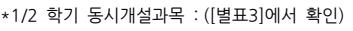
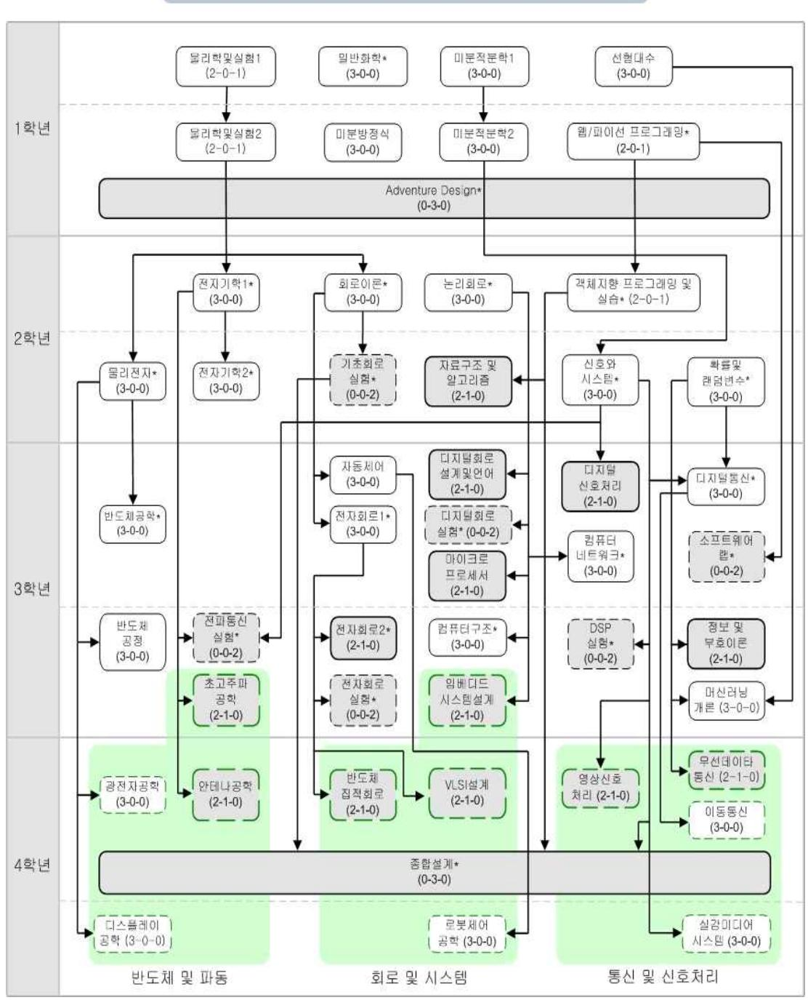
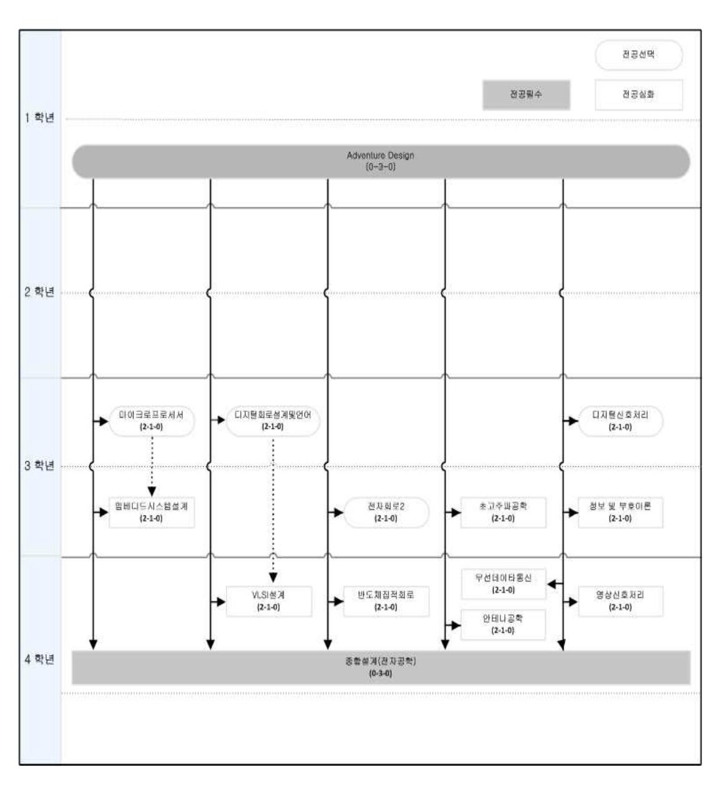

# 전자정보대학 교육과정

#### 대학소개

◩ 21세기 네오르네상스 시대의 4차 산업혁명을 주도해 나갈 공학기술 인재 양성을 지향하는 전자정보대학은 1999년에 신설되 었으며, 전자공학과와 생체의공학과로 이루어져 있다. 차세대 산업혁명은 정보통신, 바이오, 나노기술 등의 다양한 첨단 기술 의 융합을 통해 초연결, 초지능, 초융합의 고도 기술사회의 도래를 예고하고 있다. 따라서 전자정보대학에서는 이와 같은 미래 기술 사회를 선도하고, 미래 가치를 창출하며, 차세대 산업혁명을 주도할 세계적 수준의 공학 인재를 양성하기 위하여 교육과 연구에 정진하고 있다. 전자정보대학에서는 학과별로 특성화된 교육 및 연구가 이루어지고 있으며, 또한 다양한 타 전공과의연계를 통한 학제간 융합 교육 및 연구가 진행되고 있다.

#### **1. 교육목적**

-  창의적인 학문연구와차세대 공학기술개발을 선도할 인재 양성
-  산업계의 문제를 능동적으로해결할 수 있는 실무형 공학기술 인재 양성
-  리더십과 도덕성을겸비한 사회공헌적공학기술 인재 양성

#### **2. 교육목표**

-  과학, 기술, 공학, 수학 핵심 기반 지식을 충실히 학습하고,전공학문의지식을 창의적으로 발전시키고응용할 수 있는 연구 개발 인재를 양성한다.
-  전문 지식과 실무 능력을 겸비하고, 다양한 타 학문과의융합을 통하여,새로운 지식과 기술을 독창적으로 창출할 수 있는 창의

능동형 인재를 양성한다.

-  새로운 미래 산업 가치를 창출하고, 차세대 산업혁명을선도할 진취적 인재를 양성한다.
-  글로벌 기술 사회에서바른 윤리의식과도덕성을겸비하고,미래 사회와기업에공헌 할 수 있는 국제 지도자형인재를 양성한다.

#### **3. 설치학과**

가.전자공학과나.생체의공학과

#### **4. 대학 졸업 요건**

| 학과명    |       |      |      |      | 단일전공과정 |    |        |      |      | 다전공과정 | 부전공과정 |        |      |      |    |
|--------|-------|------|------|------|-------|----|--------|------|------|------|-------|--------|------|------|----|
|        | 프로그램명 | 졸업이수 |      |      | 전공학점  |    | 타      |      |      | 전공학점 |       | 타      |      |      |    |
|        |       | 학점   | 전공기초 | 전공필수 | 전공선택  | 계  | 전공인정학점 | 전공기초 | 전공필수 | 전공선택 | 계     | 전공인정학점 | 전공필수 | 전공선택 | 계  |
| 전자공학과  | 전자공학  | 130  | 30   | 26   | 28    | 84 | -      |      | 35   | 24   | 59    | -      | 9    | 12   | 21 |
| 생체의공학과 | 생체의공학 | 130  | 24   | 23   | 37    | 84 | -      | 6    | 23   | 28   | 57    | -      | 3    | 21   | 24 |

※ 교양이수는 후마니타스칼리지 교양교육과정을 따라야 함

※ 전공이수는 각 전공별 교육과정 시행세칙에서 정한 졸업이수요건을 만족해야 함

※ 2018학년도이후 신입생(편입생, 순수외국인 제외)은 소프트웨어 기초지식습득 및 마인드 함양을 위해, 각 학과에서 정한 SW교육을 이수해야 함

# **5. 전공별 교육과정 편성 교과목수**

| 학과/프로그램명   |      | 전공필수+ |      |       |          |  |
|------------|------|------|------|-------|----------|--|
|            | 전공기초 | 전공필수 | 전공선택 | 전공선택(교직) | 전공선택(B+C) |  |
| 학과명프로그램명   | (A)  | (B)  | (C)  | (D)   |          |  |
|            | 과목수학점수 | 과목수학점수 | 과목수학점수 | 과목수학점수 | 과목수      |  |
| 전자공학과전자공학  | 1030 | 1026 | 3291 | --    | 42       |  |
| 생체의공학과생체의공학 | 824  | 923  | 2471 | --    | 3394     |  |
|            |      |      |      |       |          |  |

# **6. 졸업능력인증제**

- \* 2016년 8월 이후 전자정보대학 졸업생은 TOEIC SPEAKING 5급 이상, OPIC IL레벨 이상을 취득하거나 이에 준하는 공인영어 성적(TOEIC630점,TEPS271점,G-TELP54점(LEVEL2),TOFEL(IBT)72점)을 취득하여, 제출 기간 내 전자정보대학 행정실로제출하여야졸업능력인증을 Pass한다.
- \* 외국국적 외국인 특별자의경우는 상기의 공인영어성적또는 한국어능력시험 4급 이상을 취득하여야 한다.
- \* 수료자 중 취업자에 해당하는경우, 졸업능력인증면제심사를 요청할 수 있다.(2019년 8월 졸업사정대상자부터 적용) - 제출 기간 내 면제신청서 및 재직증명서,4대보험 가입증명서를 전자정보대학 행정실로 제출

## **7. 전자정보대학 전공과목(영어강좌)이수안내**

2008학번이후신입생은전공과목의영어강좌3과목이상이수를졸업요건으로충족해야하며,편입학생의경우전공과목영어강좌1과목이상을이수해야한다.

| 학과소개                                                                                        |  |
|---------------------------------------------------------------------------------------------|--|
| 전자공학과 교육과정◩ 전자공학과는21세기초연결지능데이터사회와고도산업사회의중추적인기술인AI(ArtificialIntelligent),빅데이터(Big           |  |
| Data),IT(InformationTechnology)의기반이되는반도체,전자,통신,네트워크,머신러닝을교육하고이로써인공지능,                       |  |
| 컴퓨터,인터넷,통신,전파,실감미디어,데이터의융합된복합학문의고급연구인력,창의적엔지니어및공학지도자의양성을목표로하고있다.반도체및파동,회로및시스템,통신및신호처리등분야로전공심화교육과정을편성하고 |  |
| 아울러융합교육과경험적공학학습프로그램을시행함으로써글로벌시대에경쟁력을갖춘엔지니어를양성한다.                                            |  |

#### **1. 교육목적**

하드웨어적 요소와 소프트웨어적 요소로 구성된 IT 전자 전파관련 소자 및 시스템 전문가 양성

#### **2. 교육목표**

가.전자공학분야의전문지식을바탕으로글로벌사회의리더로활동한다.나.산업체실무에서요구되는창의적설계능력을갖춘다. 다.기술적인문제해결을위한체계적인사고력과첨단공학도구활용능력을갖춘다.라.공학적윤리의식을갖추고미래산업의가치를창출할수있는능력을갖춘다.

#### **3. 학과별 교과목 수**

| 학과명   | 프로그램 | 구분  | 전공기초 | 전공필수 | 전공선택 | 전공과목 |  |
|-------|------|-----|------|------|------|------|--|
|       | 전자공학 | 과목수 | 10   | 10   | 32   | 52   |  |
| 전자공학과 |      | 학점수 | 30   | 26   | 91   | 147  |  |

#### **4. 전자공학과 졸업 요건**

1) 교육과정 기본구조표

<!DOCTYPE html>
<html lang="ko">
<head>
  <meta charset="UTF-8">
  <title>전자공학과 전공 테이블</title>
  
</head>
<body>
  <table>
    <thead>
      <tr>
        <td rowspan="3">학과명</td>
        <td rowspan="3">프로그램</td>
        <td colspan="6">단일전공과정</td>
        <td colspan="5">다전공과정</td>
        <td colspan="3">부전공과정</td>
      </tr>
      <tr>
        <!-- 단일전공과정 -->
        <td colspan="4">전공학점</td>
        <td colspan="1" rowspan="2">계</td>
        <td colspan="1" rowspan="2">타전공인정학점</td>
        <!-- 다전공과정 -->
        <td colspan="3">전공학점</td>
        <td colspan="1" rowspan="2">계</td>
        <td colspan="1" rowspan="2">타전공인정학점</td>
        <!-- 부전공과정 -->
        <td rowspan="2">전공필수</td>
        <td rowspan="2">전공선택</td>
        <td rowspan="2">계</td>
      </tr>
      <tr>
        <!-- 단일전공과정 (상세) -->
        <td>전공기초</td>
        <td>전공필수</td>
        <td>전공선택</td>
        <td></td>
        <!-- 다전공과정 (상세) -->
        <td colspan="2">전공기초/전공필수</td>
        <td>전공선택</td>
      </tr>
    </thead>
    <tbody>
      <tr>
        <td>전자공학과</td>
        <td>전자공학</td>
        <!-- 단일전공과정 -->
        <td>30</td>
        <td>26</td>
        <td>28</td>
        <td></td>
        <td>84</td>
        <td>-</td>
        <!-- 다전공과정 -->
        <td colspan="2">35</td>
        <td>24</td>
        <td>59</td>
        <td>-</td>
        <!-- 부전공과정 -->
        <td>9</td>
        <td>12</td>
        <td>21</td>
      </tr>
    </tbody>
  </table>
</body>
</html>

※ 교양이수는 교양교육과정을 따름

※ 전공이수는 전자공학과 교육과정 시행세칙에서 정한 졸업이수요건을 만족해야 함

※2018학년도 이후 신입생(편입생,순수외국인제외)은 소프트웨어 기초지식 습득 및마인드 함양을 위해, 전자공학과에서정한 SW교육을 이수해야함

- 2) 2008학번 이후 신입생은 전공과목의 영어강좌 3과목 이상 이수를 졸업요건으로 충족해야 하며, 편입학생의 경우 전공과목 영어강좌 1과목 이상을 이수해야 한다.
- 3) 졸업논문

"종합설계(전자공학)"를 이수하여 학점을 취득한 경우 "졸업논문"을 합격으로 인정한다. 단,"졸업논문(전자공학)"을 필수적으로 수강신청 하여야 한다.

- ① (경과조치) 구. 전자정보학부 전자공학전공 학생은 졸업연구(2)를 종합설계(전자공학)(3)으로 대체 인정한다.
- ② (경과조치)2017학번 이전 신입생은 종합설계(전자·전파공학), 졸업논문(전자·전파공학)을 이수한 것을 "졸업논문" 합격으로 인정한다.
- 4) 졸업능력인증제

졸업능력인증제 pass는 졸업의 필수이며, 전자정보대학 졸업능력인증제를 따른다.

# **전자공학 교육과정**

# **시행세칙**

#### 제 1 장 총 칙

제1조(학과설치목적) 전자공학 교육과정은 폭넓은 분야에 응용할 수 있는 기초학문 습득, 전자공학 전문 및 융합 능력의 배양을 기본 목적으로 한다.

제2조(일반원칙) ① 본 전자공학 단일전공과정 교육과정은 전자공학과 재학생에 적용된다. 단, 타학과 재학생으로서 전자공학 다전 공과정 또는 부전공과정을 이수하고자 하는 학생은 이 시행세칙에서 정하는 바에 따라 교과목을 이수하여야 한다.

- ② 교과목은 전공기초, 전공필수와 전공선택으로 나누어 개설된다.
- ③ 전공필수 과목은 적절히 배분하여 매 학기 개설한다.[별표3]
- ④ 전공선택 과목은 2개 학기에 1회씩 개설함을 원칙으로 한다. 단, 학과에서 정한 경우 예외적으로 적용한다.[별표3]
- ⑤ 모든 교과목은 [별표4]와 같은 선수과목 이수체계에 따라 이수하여야 한다. 선수과목 체계는 수강신청 컴퓨터 시스템에 입력 되어 있으며 수강신청시 자동으로 적용된다.

제3조(이수학점) 전자공학은 [표1]과 같이 학점을 이수하여야 한다.

[표1] 이수학점 편성표
<!DOCTYPE html>
<html lang="ko">
<head>
  <meta charset="UTF-8">
  <title>전자공학과 전공 테이블</title>
  
</head>
<body>
  <table>
    <thead>
      <tr>
        <td rowspan="3">학과명</td>
        <td rowspan="3">프로그램</td>
        <td rowspan="3">졸업이수학점</td>
        <td colspan="6">단일전공과정</td>
        <td colspan="5">다전공과정</td>
        <td colspan="3">부전공과정</td>
      </tr>
      <tr>
        <!-- 단일전공과정 -->
        <td colspan="4">전공학점</td>
        <td colspan="1" rowspan="2">계</td>
        <td colspan="1" rowspan="2">타전공인정학점</td>
        <!-- 다전공과정 -->
        <td colspan="3">전공학점</td>
        <td colspan="1" rowspan="2">계</td>
        <td colspan="1" rowspan="2">타전공인정학점</td>
        <!-- 부전공과정 -->
        <td rowspan="2">전공필수</td>
        <td rowspan="2">전공선택</td>
        <td rowspan="2">계</td>
      </tr>
      <tr>
        <!-- 단일전공과정 (상세) -->
        <td>전공기초</td>
        <td>전공필수</td>
        <td>전공선택</td>
        <td></td>
        <!-- 다전공과정 (상세) -->
        <td colspan="2">전공기초/전공필수</td>
        <td>전공선택</td>
      </tr>
    </thead>
    <tbody>
      <tr>
        <td>전자공학과</td>
        <td>전자공학</td>
        <td>130</td>
        <!-- 단일전공과정 -->
        <td>30</td>
        <td>26</td>
        <td>28</td>
        <td></td>
        <td>84</td>
        <td>-</td>
        <!-- 다전공과정 -->
        <td colspan="2">35</td>
        <td>24</td>
        <td>59</td>
        <td>-</td>
        <!-- 부전공과정 -->
        <td>9</td>
        <td>12</td>
        <td>21</td>
      </tr>
    </tbody>
  </table>
</body>
</html>

제4조(학위명) 본 전자공학 이수자의 학위증, 졸업증명서, 성적증명서 등에는 동일하게 다음과 같이 표기한다.

| 대학                        | 학과                    | 학위명                   |
|---------------------------|-----------------------|-----------------------|
| 전자정보                      | 전자공학과                 | 공학사                   |
| ElectronicsandInformation | ElectronicEngineering | BachelorofEngineering |

#### 제 2 장 교양과정

제5조(교양과목이수) 본교 후마니타스 교양과정 기본구조표에서 정한 소정의 학점을 모두 만족하여야 한다.

#### 제 3 장 전공과정

제6조(단일전공과정 전공과목의 이수) ① 단일전공과정을 졸업하기 위하여 전공과목은 이수과목체계에 따라서 전공기초 30학점, 전공필수 26학점을 포함하여 전공학점 84학점 이상을 이수하여야 한다.[표1]

② 전공기초, 전공필수, 전공선택의 과목편성표는 [표2]와 같다.

③ 실험학점은 기초회로실험(실험 2학점)을 필수로 이수하여야 하며 전공선택 실험과목 중 1과목 이상을 이수하여야 한다.[표2]

④ (경과조치)2014학년도까지 디지털회로실험(2학점)을 이수하면 전공선택 학점 및 실험과목으로 인정한다.

⑤ (경과조치)2015학년도부터 2016학년도까지 디지털회로설계 및 언어를 이수하면 해당 과목을 실험과목으로 인정한다.

- ⑥ 2008학번 이후 신입생은 전공과목의 영어강좌 3과목 이상 이수를 졸업요건으로 충족해야 하며, 편입학생의 경우 전공과목 영어강좌 1과목 이상을 이수하여야 한다.
- ➆ 2019년 1학기부터 '웹/파이선 프로그래밍' 과목 수강자는,'웹/파이선 프로그래밍' 과목과 '프로그래밍기초' 과목의 학점을 전공

기초로 중복 인정하지 않으며, 두 과목 모두 수강한 학생은 '프로그래밍기초' 과목은 자유선택으로,'웹/파이선 프로그래밍' 과목 은 전공기초로 인정한다. ⑨ 2019년 1학기부터 '기초공학설계' 과목과 'AdventureDesign' 과목의 학점을 전공필수로 중복 인정하지 않으며, 두

- ⑧ '미분적분학 1'은 '미분적분학'으로 대체할 수 있다.
- 과목 모두 수강한 학생은 '기초공학설계' 과목은 자유선택으로,'AdventureDesign' 과목은 전공필수로 인정한다.
- ⑩ 2020년 1학기부터 '객체지향프로그래밍', '고급객체지향프로그래밍', '객체지향프로그래밍 및 실습' 과목의 학점을 전공기초로 중복 인정하지 않으며, 두 과목 또는 세 과목 모두 수강한 학생은 '객체지향프로그래밍 및 실습' 과목은 전공기초로 인정하고,'고급객체지향프로그래밍' 및 '객체지향프로그래밍' 과목은 자유선택으로 인정한다.
- ⑪ 2020년 1학기부터 '자료구조 및 알고리즘','자료구조' 과목의 학점은 중복 인정하지 않으며, 두 과목 모두 수강한 경우, '자료 구조 및 알고리즘'은 전공선택으로 인정하고,'자료구조' 과목은 자유선택으로 인정한다.
- ⑫ (설계교과목 이수)2019학번까지 공학인증(ABEEK)프로그램을 이수하는 학생은 [별표6]의 설계교과목 이수체계에 따라 AdventureDesign과 종합설계(전자공학)를 포함하여 9학점 이상의 설계학점을 이수하여야 한다. 설계교과목은 [별표5]에 제시된 편성표를 따른다.

<!DOCTYPE html>
<html lang="ko">
<head>
<meta charset="UTF-8">
<title>전공과목 편성표</title>

</head>
<body>

<table>
    <caption>[표2] 전공과목 편성표</caption>
    <thead>
        <tr>
            <th>구분</th>
            <th colspan="3">교과목명</th>
            <th>과목수</th>
        </tr>
    </thead>
    <tbody>
        <tr>
            <td>전공기초(30)</td>
            <td colspan="3">미분적분학 1(3), 미분적분학 2(3), 선형대수(3), 미분방정식(3), 물리학 및 실험 1(3), 물리학 및 실험 2(3), 확률 및 랜덤변수(3), 웹/파이선프로그래밍(3), 객체지향프로그래밍 및 실습(3), 일반화학(3)</td>
            <td>10</td>
        </tr>
        <tr>
            <td>전공필수(26)</td>
            <td colspan="3">Adventure Design(3), 신호와시스템(3), 물리전자(3), 전자기학 1(3), 논리회로(3), 회로이론(3), 전자회로 1(3), 기초회로실험(2)+, 종합설계(전자공학)(3), 졸업논문(0)</td>
            <td>10</td>
        </tr>
        <tr>
            <td rowspan="6">전공선택(28)</td>
            <td colspan="2">실험</td>
            <td style="text-align: left;">전파통신실험(2)+, DSP실험(2)+, 디지털회로실험(2)+, 전자회로실험(2)+, 소프트웨어랩(2)+</td>
            <td rowspan="6">32</td>
        </tr>
        <tr>
            <td colspan="2">전공이론</td>
            <td style="text-align: left;">자료구조 및 알고리즘(3), 머신러닝개론(3), 컴퓨터구조(3), 컴퓨터네트워크(3), 디지털통신(3), 정보 및 부호이론(3), 디지털신호처리(3), 디지털회로설계 및 언어(3), 마이크로프로세서(3), 전자회로 2(3), 자동제어(3), 전자기학 2(3), 반도체공학(3), 반도체공정(3)</td>
        </tr>
        <tr>
            <td rowspan="3">전공심화</td>
            <td>통신 및신호처리</td>
            <td style="text-align: left;">이동통신(3), 무선데이타통신(3), 영상신호처리(3), 실감미디어시스템(3)</td>
        </tr>
        <tr>
            <td>회로 및시스템</td>
            <td style="text-align: left;"><u>VLSI설계(3), 반도체집적회로(3), 임베디드시스템설계(3), 로봇제어공학(3)</u></td>
        </tr>
        <tr>
            <td>반도체및 파동</td>
            <td style="text-align: left;"><u>광전자공학(3), 디스플레이공학(3), 초고주파공학(3), 안테나공학(3)</u></td>
        </tr>
        <tr>
            <td colspan="3" style="text-align: center;"><u>실전문제연구종합설계(3)*</u></td>
        </tr>
    </tbody>
</table>

    
※ ()는 학점수임. +는 실험과목임. 밑줄 친 과목은 실습, 설계학점이 포함된 과목임

    
*실전문제연구종합설계는 1학기 실전문제연구과제에 참여한 학생만 수강신청함

</body>
</html>

제7조(다전공과정 전공과목의 이수) ① 다전공과정의 교과목은 [표2]에 제시된 전공과목편성표를 따른다.

② 전자공학을 다전공으로 이수하기 위해서는 전공은 이수과목체계에 따라서 전공기초와 전공필수 35학점을 포함하여 전

공학점 59학점 이상을 이수하여야 한다.[표1]

③ 2019학번까지 전공기초 중 '일반생물'을 수강한 경우 '일반화학'으로 대체할 수 있다.

④ 전공선택은 전공필수과목의 이수로 대체할 수 있으나, 전공선택에서 최소 15학점 이상은 이수하여야 한다.

- ⑤ 종합설계(전자공학)와 졸업논문(전자공학)은 반드시 이수하여야 하고, 졸업논문의 이수는 종합설계(전자공학)를 이수함으로 써 인정된다.
- ➅ (경과조치)2017학번 이전 신입생은 종합설계(전자·전파공학), 졸업논문(전자·전파공학)을 이수한 것을 "졸업논문" 합 격으로 인정한다.
- ➆ 2019년 1학기부터 '웹/파이선 프로그래밍' 과목 수강자는,'웹/파이선 프로그래밍' 과목과 '프로그래밍기초' 과목의 학 점을 전공기초로 중복 인정하지 않으며, 두 과목 모두 수강한 학생은 '프로그래밍기초' 과목은 자유선택으로, '웹/파이 선 프로그래밍' 과목은 전공기초로 인정한다. ⑧ '미분적분학1'은 '미분적분학'으로 대체할 수 있다. ⑨ 2019년 1학기부터 '기초공학설계'과목과 'AdventureDesign'과목의 학점을 전공필수로 중복 인정하지 않으며, 두
- 과목 모두 수강한 학생은 '기초공학설계'과목은 자유선택으로,'AdventureDesign'과목은 전공필수로 인정한다.
- ⑩ 2020년 1학기부터 '객체지향프로그래밍', '고급객체지향프로그래밍', '객체지향프로그래밍 및 실습' 과목의 학점을 전공기초로 중복 인정하지 않으며, 두 과목 또는 세 과목 모두 수강한 경우 '객체지향프로그래밍 및 실습' 과목은 전공기초로 인정하고,'고급객체지향프로그래밍' 및 '객체지향프로그래밍' 과목은 자유선택으로 인정한다.
- ⑪ 2020년 1학기부터 전자공학을 다전공으로 이수하는 학생의 경우, '객체지향프로그래밍 및 실습'은 '객체지향프로그래밍'으로 대체할 수 있다.'자료구조 및 알고리즘'은 '자료구조'로 대체할 수 있다.
- ⑫ 2020년 1학기부터 '자료구조 및 알고리즘','자료구조' 과목의 학점은 중복 인정하지 않으며, 두 과목 모두 수강한 경우, '자료 구조 및 알고리즘'은 전공선택으로 인정하고,'자료구조'는 과목은 자유선택으로 인정한다.

제8조(부전공과정 전공과목의 이수) 부전공 과정으로 졸업하기 위하여 [표1] 이수학점 편성표의 전공학점 이상을 이수하여야 한다.

제9조(선수과목의 지정) 전자공학의 전공과목은 [별표4]와 같이 선수과목에 따라 이수하여야 한다. 단, 전과, 편입생의 경우 전과, 편입 후 1년 동안 이수체계 전공기초 선수과목-후수과목(전공필수)에 한하여 동일 학기에 수강신청이 가능하다. 단, 타학과 학생 이 전자공학을 다전공(부전공)할 경우는 선수과목을 적용하지 않는다. 이수 할 수 있으며, 그 취득 학점은 전공선택 학점으로 인정한다. ② 대학원 시행세칙에 따라 본교의 학사학위과정 재학 중 본교의 일반대학원에서 개설한 교과목을 이수하여 취득한 학점에

- 제10조(대학원 과목의 이수요건과 인정과목) ① 전자공학을 이수하는 학생은 이수가 허용된 대학원 교과목을 통산 6학점까지
  - 대해 서는 학사학위 취득에 필요한 학점의 초과분에 한하여 대학원 진학 시에 대학원 학점으로 인정받을 수 있다. 자세한 내용은 대학원 시행세칙을 따른다.
  - ③ 대학원과정의 수강신청 절차는 [별첨2]를 참고한다.

#### 제 4 장 졸업이수요건

제11조(졸업이수학점) 본 전공의 최저 졸업이수학점은 130학점이다. 교양학점은 제2장의 요건을 만족하여야 한다.

- 제12조(전공이수학점) ① 전공필수과목 :AdventureDesign(3), 신호와시스템(3), 물리전자(3), 전자기학 1(3), 논리회로(3), 회로 이론(3), 전자회로 1(3), 기초회로실험(2), 종합설계(전자공학)(3), 졸업논문(0)
  - ② 단일전공과정 : 전자공학과 학생으로서 전자공학 단일전공자는 전공기초 30 학점, 전공필수 26 학점, 전공선택 28학점을 포 함하여 전공학점 84학점 이상을 이수하여야 한다.
  - ③ 다전공과정 : 전자공학을 다전공과정으로 이수하는 학생은 전공기초와 전공필수 35학점을 포함하여 전공학점 59학점 이상을 이수하여야 한다. 단, 종합설계(전자공학)와 졸업논문(전자공학)은 반드시 이수하여야 한다. 단, 타학과 학생이 전자공학을 다 전공할 경우는 선수과목을 적용하지 않는다.
  - ④ 부전공과정 : 전자공학을 부전공과정으로 이수하고자 하는 학생은 전공필수 9학점을 포함하여 전공학점 21학점 이상을 이수 하여야 한다. 단, 타학과 학생이 전자공학을 부전공할 경우는 선수과목을 적용하지 않는다.

제13조(편입생의 전공이수학점) ① 일반편입생은 전적대학에서 이수한 학점 중 본교 학점인정심사에서 인정받은 학점을 제외한 나머지 학점을 추가로 이수하여야 한다.

② 학사편입생은 본교 학점인정심사에 의거 전공기초과목은 인정할 수 있으나, 전공필수 및 전공선택 학점은 인정하지 않는다.

- 제14조(영어강좌 이수학점) 2008학번 이후 신입생은 전공과목의 영어강좌 3과목 이상 이수를 졸업요건으로 충족해야 하며, 편입 학생의 경우 전공과목 영어강좌 1과목 이상을 이수하여야 한다.
- 제15조(졸업능력인증제도) 졸업능력인증제 통과(Pass)는 졸업의 필수이며, 전자정보대학 졸업능력 인증제를 따른다.

제16조(졸업논문) '종합설계(전자공학)'를 이수하여 학점을 취득한 경우 "졸업논문" 합격으로 인정한다. 단, '졸업논문(전자공학)'을 필히 수강신청 하여야 한다.

① (경과조치)2017학번 이전 신입생은 '종합설계(전자·전파공학)','졸업논문(전자·전파공학)'을 이수한 것을 "졸업논문" 합격으 로 인정한다.

제17조(SW교육 졸업요건) 2018학년도 이후 입학생(편입생, 순수외국인 제외)은 SW교양 또는 SW코딩 교과목에서 총 6학점을 이수하여야 한다.SW교양 및 SW코딩 교과목 개설 및 운영에 관한 세부사항은 소프트웨어 교육교과운영시행세칙을 따른다.

#### 제 5 장 교과과정 운영내규

제18조(운영위원회) 본 과정의 운영은 "전자공학과" 운영위원회에서 한다.

제19조(전과생 및 편입생의 학점 이수) 전적 대학 및 전공(학과)에서 이수한 학점 중 본교 학점인정심사에서 인정받은 학점 이외에 는 본 세칙의 정하는 바에 따라 학점을 취득하여야 한다.

#### 제 6 장 기 타

제20조(보칙) 본 시행세칙에 정하지 아니한 사항은 "전자공학과" 운영위원회의 의결에 따른다.

제21조(대체과목)

- ① 2010학번 이후 입학생은 응용과학대학 교육과정의 '물리학 1' 및 '물리학실험 Ⅰ'은 '물리학 및 실험 1'로,'물리학 2' 및 '물리 학실험 Ⅱ'은 '물리학 및 실험 2'로 대체 인정한다. 단 전자공학을 다전공과정으로 이수하는 학생은 '물리학 1' 은 '물리학 및 실험 1'로,'물리학 2'는 '물리학 및 실험 2'로 대체 인정한다.
- ② '공학수학 1'을 '미분적분학 2'로 대체 인정한다.
- ③ 소프트웨어융합대학의 '객체지향프로그래밍' 과목을 수강한 경우 '객체지향프로그래밍 및 실습'으로,'자료구조' 과목을 수강한 경우 '자료구조 및 알고리즘'으로,'회로와신호' 과목을 수강한 경우 '회로이론'으로 대체 인정 가능하다.
- 제22조(캠퍼스간 대체과목) 서울캠퍼스 이과대학에서 전과한 학생의 경우, 서울캠퍼스에서 수강한 '물리학 및 실험 1' 및 '물리학 및 실험 2'는 각각 '물리학 및 실험 1' 및 '물리학 및 실험 2'로 대체 인정한다. 또한 '미적분학 및 연습 1' 및 '미적분학 및 연습 2'는 각각 '미분적분학 1' 및 '미분적분학 2'로 대체 인정한다.
- 제23조(구. 전자정보학부 전자공학전공 타전공인정과목) 기존 타전공인정과목을 포함하여, 생체의공학과의 '한의 및 생체계측실험', '생체의공시스템설계 및 실습','생체계측'을 전공선택으로 인정한다.

| 제2조(경과조치)①2011학번 | 이전            | 학생(다전공자제외)중전자공학을 |이수하고자 | 할 경우      | 아래표를적용한다. |    |  |
|------------------|---------------|--------------|----|-----------|-----------|----|--|
| 입학년도             | 졸업학점          | 교양학점         |    | 전공과정      |           |    |  |
|                  |               |              | 전공교양 | 전공필수      | 전공선택      | 계  |  |
| 2003이전           | 140           |              | 18 |           |           |    |  |
| 2007이전           | 130           |              | 18 | 9         | 40        | 49 |  |
| 2008             | 136           | 입학년도         | 18 |           |           |    |  |
| 2009             | 136           | 교양교육과정을따름    | 24 |           |           |    |  |
| 2010             | 136           | (2014년도경과조치참조) |    |           |           |    |  |
| 2011             | 136           |              | 24 | 26        | 31        | 57 |  |
|                  |               |              |    |           |           |    |  |
|                  | 2012~2014학번까지 | 학생은입학년도교육과정에 |따르며 | 최저졸업이수학점은 | 136학점이다.  |    |  |
| ②                |               |              |    |           |           |    |  |

정의되지 않는 ABEEK에 관한 사항은 공학인증(ABEEK)프로그램 운영위원회 규정에 따른다.

[별표1] 전자공학과 교육과정 편성표 [별표2] 전자공학과 이수체계도 [별표3] 전자공학과 학년별 교과목 편성표 [별표4] 전자공학과 선수과목 지정표 [별표5] 전자공학과 설계과목표 [별표6] 전자공학과 설계과목 이수체계도 [별표7] 전자공학과 대체과목 지정표 [별첨1] 전자공학과 교과목 해설 [별첨2] 대학원 과목 수강 신청 절차 및 수강 권고 교과목 표

## **교육과정 편성표**

|    | 이수 |       |          |    | 시간 |    | 개설학기이수 |    |     |     | P/N |     |    |    |
|----|----|-------|----------|----|----|----|--------|----|-----|-----|-----|-----|----|----|
| 순번 | 구분 | 교과목명[별표1] | 학수번호     | 학점 | 이론 | 실기 | 실습     | 설계 | 학년  | 1학기 | 2학기 | 부전공 | 평가 | 비고 |
| 1  |    | 물리학및실험1 | APHY1002 | 3  | 2  |    | 2      |    | 1   | ○   |     |     |    |    |
| 2  |    | 물리학및실험2 | APHY1003 | 3  | 2  |    | 2      |    | 1   |     | ○   |     |    |    |
| 3  |    | 미분적분학1 | AMTH1002 | 3  | 3  |    |        |    | 1   | ○   |     |     |    |    |
| 4  |    | 미분적분학2 | AMTH1003 | 3  | 3  |    |        |    | 1   |     | ○   |     |    |    |
| 5  | 전공 | 선형대수  | AMTH1004 | 3  | 3  |    |        |    | 1   | ○   |     |     |    |    |
| 6  | 기초 | 일반화학  | APCH1131 | 3  | 3  |    |        |    | 1   | ○   | ○   |     |    |    |
| 7  |    | 웹/파이선프로그래밍 | SWCON104 | 3  | 2  |    | 2      |    | 1   | ○   | ○   |     |    |    |
| 8  |    | 객체지향프로그래밍및실습 | EE213    | 3  | 2  |    | 2      |    | 2   | ○   | ○   |     |    |    |
| 9  |    | 미분방정식 | AMTH1001 | 3  | 3  |    |        |    | 1   |     | ○   |     |    |    |
| 10 |    | 확률및랜덤변수 | EE211    | 3  | 3  |    |        |    | 2/3 | ○   | ○   |     |    |    |
| 11 |    | AdventureDesign | EE212    | 3  |    |    |        | 3  | 1/2 | ○   | ○   | ○   |    |    |
| 12 |    | 논리회로  | EE209    | 3  | 3  |    |        |    | 1/2 | ○   | ○   | ○   |    |    |
| 13 |    | 신호와시스템 | EE210    | 3  | 3  |    |        |    | 2/3 | ○   | ○   | ○   |    |    |
| 14 |    | 전자기학1 | EE201    | 3  | 3  |    |        |    | 2   | ○   | ○   | ○   |    |    |
| 15 | 전공 | 회로이론  | EE202    | 3  | 3  |    |        |    | 2   | ○   | ○   | ○   |    |    |
| 16 | 필수 | 기초회로실험 | EE207    | 2  |    |    | 4      |    | 2/3 | ○   | ○   | ○   |    |    |
| 17 |    | 물리전자  | EE203    | 3  | 3  |    |        |    | 2   | ○   | ○   | ○   |    |    |
| 18 |    | 전자회로1 | EE206    | 3  | 3  |    |        |    | 3   | ○   | ○   | ○   |    |    |
| 19 |    | 종합설계(전자공학) | EE497    | 3  |    |    |        | 3  | 4   | ○   | ○   |     |    |    |
| 20 |    | 졸업논문(전자공학) | EE486    | 0  |    |    |        |    | 4   | ○   | ○   |     | ○  |    |
| 21 |    | 자료구조및알고리즘 | EE241    | 3  | 2  |    |        | 1  | 2/3 |     | ○   | ○   |    |    |
| 22 |    | 컴퓨터구조 | CSE203   | 3  | 3  |    |        |    | 3   | ○   | ○   | ○   |    |    |
| 23 |    | 컴퓨터네트워크 | CSE302   | 3  | 3  |    |        |    | 3   | ○   | ○   | ○   |    |    |
| 24 |    | 전자기학2 | EE204    | 3  | 3  |    |        |    | 2   |     | ○   | ○   |    |    |
| 25 |    | 디지털통신 | EE341    | 3  | 3  |    |        |    | 3   | ○   | ○   | ○   |    |    |
| 26 |    | 정보및부호이론 | EE441    | 3  | 2  |    |        | 1  | 3   |     | ○   | ○   |    |    |
| 27 |    | 디지털신호처리 | EE342    | 3  | 2  |    |        | 1  | 3   | ○   | ○   | ○   |    |    |
| 28 | 전공 | 디지털회로설계및언어 | EE361    | 3  | 2  |    |        | 1  | 3   | ○   | ○   | ○   |    |    |
| 29 | 선택 | 마이크로프로세서 | EE364    | 3  | 2  |    |        | 1  | 3   | ○   |     | ○   |    |    |
| 30 |    | 전자회로2 | EE365    | 3  | 2  |    |        | 1  | 3   |     | ○   | ○   |    |    |
| 31 |    | 자동제어  | EE363    | 3  | 3  |    |        |    | 3   | ○   |     | ○   |    |    |
| 32 |    | 반도체공학 | EE321    | 3  | 3  |    |        |    | 3   | ○   |     | ○   |    |    |
| 33 |    | 반도체공정 | EE328    | 3  | 3  |    |        |    | 3   |     | ○   | ○   |    |    |
| 34 |    | 머신러닝개론 | EE371    | 3  | 3  |    |        |    | 3/4 |     | ○   | ○   |    |    |
| 35 |    | 전파통신실험 | EE324    | 2  |    |    | 4      |    | 3/4 | ○   | ○   | ○   |    |    |
| 36 |    | DSP실험 | EE343    | 2  |    |    | 4      |    | 3/4 | ○   | ○   | ○   |    |    |
| 37 |    | 디지털회로실험 | EE362    | 2  |    |    | 4      |    | 3   | ○   | ○   | ○   |    |    |

| 이수순번 |    | 교과목명학수번호    |       | 학점 | 시간 |    |    |    | 이수  | 개설학기 |     | 부전공 | P/N | 비고 |  |
|------|----|-------------|-------|----|----|----|----|----|-----|------|-----|-----|-----|----|--|
|      | 구분 |             |       |    | 이론 | 실기 | 실습 | 설계 | 학년  | 1학기  | 2학기 |     | 평가  |    |  |
| 38   |    | 전자회로실험      | EE366 | 2  |    |    | 4  |    | 3/4 | ○    | ○   | ○   |     |    |  |
| 39   |    | 소프트웨어랩      | EE370 | 2  |    |    | 4  |    | 3/4 | ○    | ○   | ○   |     |    |  |
| 40   |    | 이동통신        | EE442 | 3  | 3  |    |    |    | 4   | ○    |     | ○   |     |    |  |
| 41   |    | 무선데이타통신     | EE443 | 3  | 2  |    |    | 1  | 4   | ○    |     | ○   |     |    |  |
| 42   |    | 영상신호처리      | EE444 | 3  | 2  |    |    | 1  | 4   | ○    |     | ○   |     |    |  |
| 43   |    | 실감미디어시스템    | EE445 | 3  | 3  |    |    |    | 4   |      | ○   | ○   |     |    |  |
| 44   |    | 임베디드시스템설계   | EE367 | 3  | 2  |    |    | 1  | 3   |      | ○   | ○   |     |    |  |
| 45   | 전공 | VLSI설계      | EE463 | 3  | 2  |    |    | 1  | 4   | ○    |     | ○   |     |    |  |
| 46   | 선택 | 반도체집적회로     | EE496 | 3  | 2  |    |    | 1  | 4   | ○    |     | ○   |     |    |  |
| 47   |    | 로봇제어공학      | EE461 | 3  | 3  |    |    |    | 4   |      | ○   | ○   |     |    |  |
| 48   |    | 광전자공학       | EE421 | 3  | 3  |    |    |    | 4   | ○    |     | ○   |     |    |  |
| 49   |    | 디스플레이공학     | EE423 | 3  | 3  |    |    |    | 4   |      | ○   | ○   |     |    |  |
| 50   |    | 초고주파공학      | EE325 | 3  | 2  |    |    | 1  | 3   |      | ○   | ○   |     |    |  |
| 51   |    | 안테나공학       | EE422 | 3  | 2  |    |    | 1  | 4   | ○    |     | ○   |     |    |  |
| 52   |    | 실전문제연구종합설계* | EE484 | 3  |    |    |    | 3  | 4   |      | ○   |     | ○   |    |  |

※ 1/2학기 모두 개설 과목의 주개설학기는 [별표3]을 참조

\* 실전문제연구종합설계 과목은 1학기 실전문제연구과제에 참여한 학생만 수강가능

[별표3]

## **학년별 교과목 편성표**

|          | 학년   |                               | 1학년                           |                                  | 2학년                 | 3학년                                                                     |                                                                                                                        | 4학년                                                                 |                                       |  |  |
|----------|------|-------------------------------|-------------------------------|----------------------------------|---------------------|-------------------------------------------------------------------------|------------------------------------------------------------------------------------------------------------------------|---------------------------------------------------------------------|---------------------------------------|--|--|
| 구분       |      | 1학기                           | 2학기                           | 1학기                              | 2학기                 | 1학기                                                                     | 2학기                                                                                                                    | 1학기                                                                 | 2학기                                   |  |  |
| MSC(30)  | 30학점 | 물리학및•실험1미분적분학1•일반화학•웹/파이선프•로그래밍선형대수• | 물리학및실험•2미분적분학2•일반화학•웹/파이선프•로그래밍미분방정식• | 객체지향프로•그래밍및실습                    | 확률및•랜덤변수객체지향프로•그래밍및실습 | 확률및•랜덤변수                                                                |                                                                                                                        |                                                                     |                                       |  |  |
| 전공필수(26) | 26학점 |                               | Advent•ureDesign논리회로•         | Advent•ureDesign논리회로•전자기학1•회로이론•물리전자• | 기초회로실험•전자기학1•회로이론•신호와시스템•물리전자• | 기초회로실험•전자회로1•신호와시스템•                                                    | 전자회•로1                                                                                                                 | 종합설•계(전자공학)졸업논문•                                                    | 종합설•계(전자공학)졸업논문•                      |  |  |
| 전공선택(28) | 28학점 |                               |                               |                                  | 자료구조•및알고리즘전자기학2•    | 컴퓨터네트워크•컴퓨터구조•디지털통신•디지털신호처리•디지털회로설•계및언어반도체공학•마이크로프로세서•자동제어•디지털회로실험•소프트웨어랩• | 컴퓨터네트워크•컴퓨터구조•머신러닝개론•디지털통신•정보•및부호이론디지털신호처리•디지털회로•설계및언어전자회로2•전자회로실험•소프트웨어랩•전파통신실험•반도체공정•초고주파공학•임베디드시•스템설계디지털회로실험•DSP실험• | 전자회로실험•전파통신실험•DSP실험•이동통신•광전자공학•VLSI설계•반도체집적회로•영상신호처리•무선데이터통신•안테나공학• | 실감멀티•미디어시스템로봇제어공•학디스플•레이공학실전문제연•구종합설계* |  |  |
| ※※전공필수동시 | 전문교양개설 | 교과목:2020및실험과목은1/2학기한다.굵게표시된   | 경희대학교교육과정동시개설이과목이해당학기가        | 중교양교육과정을원칙이고,전공필수의주개설학기인과목에      | 따른다.후수과목이바로해당한다.    | 다음학기에개설되고                                                               | 다른 과목의                                                                                                                 | 선수일 때도                                                              | 1/2학기                                 |  |  |

동시 개설 한다. **굵게 표시된** 과목이 해당학기가 주개설학기인 과목에 해당한다.

실전문제연구창의설계\*:1학기 실전문제연구과제에 참여한 학생만 수강가능

## **선수과목 지정표**

|    |          |          | 교과목명(후수과목) |    | 선수과목           |       |     |      |
|----|----------|----------|--------|----|----------------|-------|-----|------|
| 순번 | 전공명[별표4] | 학수번호     | 교과목명   | 학점 | 학수번호           | 교과목명  | 학점  | 비고   |
| 1  | 전자공학     | AMTH1003 | 미분적분학2 | 3  | AMTH1002       | 미분적분학1 | 3   |      |
| 2  | 전자공학     | APHY1003 | 물리학및실험2 | 3  | APHY1002       | 물리학및실험1 | 3   |      |
| 3  | 전자공학     | EE213    | 객체지향프로그래밍및실습 | 3  | SWCON104       | 웹/파이선프로그래밍 | 3   |      |
| 4  | 전자공학     | CSE203   | 컴퓨터구조  | 3  | EE209          | 논리회로  | 3   |      |
| 5  | 전자공학     | EE201    | 전자기학1  | 3  | APHY1003       | 물리학및실험2 | 3   |      |
| 6  | 전자공학     | EE202    | 회로이론   | 3  | APHY1003       | 물리학및실험2 | 3   |      |
| 7  | 전자공학     | EE203    | 물리전자   | 3  | APHY1003       | 물리학및실험2 | 3   |      |
| 8  | 전자공학     | EE204    | 전자기학2  | 3  | EE201          | 전자기학1 | 3   |      |
| 9  | 전자공학     | EE206    | 전자회로1  | 3  | EE202          | 회로이론  | 3   |      |
| 10 | 전자공학     | EE207    | 기초회로실험 | 2  | EE202          | 회로이론  | 3   |      |
| 11 | 전자공학     | EE210    | 신호와시스템 | 3  | AMTH1003       | 미분적분학2 | 3   |      |
| 12 | 전자공학     | CSE302   | 컴퓨터네트워크 | 3  | EE209          | 논리회로  | 3   |      |
| 13 | 전자공학     | EE321    | 반도체공학  | 3  | EE203          | 물리전자  | 3   |      |
| 14 | 전자공학     | EE325    | 반도체공정  | 3  | EE203          | 물리전자  | 3   |      |
| 15 | 전자공학     | EE324    | 전파통신실험 | 2  | EE201,         | 전자기학1, | 3,  | 모두   |
|    |          |          |        |    | EE210          | 신호와시스템 | 3   | 수강   |
| 16 | 전자공학     | EE325    | 초고주파공학 | 3  | EE201          | 전자기학1 | 3   |      |
| 17 | 전자공학     | EE341    | 디지털통신  | 3  | EE211,EE210    | 확률및랜덤변수,신호와시스템 | 3,3 | 모두수강 |
| 18 | 전자공학     | EE342    | 디지털신호처리 | 3  | EE210          | 신호와시스템 | 3   |      |
| 19 | 전자공학     | EE343    | DSP실험  | 2  | EE210          | 신호와시스템 | 3   |      |
| 20 | 전자공학     | EE241    | 자료구조및알고리즘 |    | 3 EE213        | 객체지향프로그래밍및실습 | 3   |      |
| 21 | 전자공학     | EE361    | 디지털회로설계및언어 |    | 3 EE209        | 논리회로  | 3   |      |
| 22 | 전자공학     | EE362    | 디지털회로실험 | 2  | EE209          | 논리회로  | 3   |      |
| 23 | 전자공학     | EE363    | 자동제어   | 3  | EE202          | 회로이론  | 3   |      |
| 24 | 전자공학     | EE364    | 마이크로프로세서 | 3  | EE209          | 논리회로  | 3   |      |
| 25 | 전자공학     | EE365    | 전자회로2  | 3  | EE206          | 전자회로1 | 3   |      |
| 26 | 전자공학     | EE366    | 전자회로실험 | 2  | EE206          | 전자회로1 | 3   |      |
| 27 | 전자공학     | EE367    | 임베디드시스템설계 | 3  | EE209          | 논리회로  | 3   |      |
| 28 | 전자공학     | EE370    | 소프트웨어랩 | 2  | SWCON104       | 웹/파이선프로그래밍 | 3   |      |
| 29 | 전자공학     | EE371    | 머신러닝개론 | 3  | AMTH1004,EE211 | 선형대수,확률및랜덤변수 | 3,3 | 모두수강 |
| 30 | 전자공학     | EE421    | 광전자공학  | 3  | EE203          | 물리전자  | 3   |      |
| 31 | 전자공학     | EE422    | 안테나공학  | 3  | EE201          | 전자기학1 | 3   |      |
| 32 | 전자공학     | EE423    | 디스플레이공학 | 3  | EE203          | 물리전자  | 3   |      |
| 33 | 전자공학     | EE441    | 정보및부호이론 | 3  | EE211          | 확률및랜덤변수 | 3   |      |
| 34 | 전자공학     | EE442    | 이동통신   | 3  | EE341          | 디지털통신 | 3   |      |
| 35 | 전자공학     | EE443    | 무선데이타통신 | 3  | EE211          | 확률및랜덤변수 | 3   |      |
| 36 | 전자공학     | EE444    | 영상신호처리 | 3  | EE210          | 신호와시스템 | 3   |      |

| 순번 | 전공명  |       | 교과목명(후수과목) |    | 선수과목              |                            |       |      |  |
|----|------|-------|------------|----|-------------------|----------------------------|-------|------|--|
|    |      | 학수번호  | 교과목명       | 학점 | 학수번호              | 교과목명                       | 학점    | 비고   |  |
| 37 | 전자공학 | EE461 | 로봇제어공학     | 3  | EE363             | 자동제어                       | 3     |      |  |
| 38 | 전자공학 | EE496 | 반도체집적회로    | 3  | EE206             | 전자회로1                      | 3     |      |  |
| 39 | 전자공학 | EE463 | VLSI설계     | 3  | EE206             | 전자회로1                      | 3     |      |  |
| 40 | 전자공학 | EE445 | 실감미디어시스템   | 3  | EE210             | 신호와시스템                     | 3     |      |  |
| 41 | 전자공학 | EE497 | 종합설계(전자공학) | 3  | EE207,EE210,EE213 | 기초회로실험,신호와시스템,객체지향프로그래밍및실습 | 2,3,3 | 모두수강 |  |

※ 우측 선수과목 수강 시에 좌측 후수과목 수강을 허용함

※ 웹/파이선프로그래밍은 2학년 필수과목의 선수과목으로 권고함
## [별표5] 설계과목 편성표
| 구분     | 학년    | 설계과목명     | 이론-설계-실험⋅실습 |  |  |  |
|--------|-------|-----------|-------------|--|--|--|
|        | 1/2   | AdventureDesign | 0-3-0       |  |  |  |
|        | 2     | 자료구조및알고리즘 | 2-1-0       |  |  |  |
|        | 3     | 정보및부호이론   | 2-1-0       |  |  |  |
|        | 3     | 디지털회로설계및언어 | 2-1-0       |  |  |  |
|        | 3     | 전자회로2     | 2-1-0       |  |  |  |
|        | 3     | 마이크로프로세서  | 2-1-0       |  |  |  |
|        | 3     | 디지털신호처리   | 2-1-0       |  |  |  |
| 공학설계분야 | 3     | 임베디드시스템설계 | 2-1-0       |  |  |  |
|        | 4     | 초고주파공학    | 2-1-0       |  |  |  |
|        | 4     | VLSI설계    | 2-1-0       |  |  |  |
|        | 4     | 안테나공학     | 2-1-0       |  |  |  |
|        | 4     | 반도체집적회로   | 2-1-0       |  |  |  |
|        | 4     | 영상신호처리    | 2-1-0       |  |  |  |
|        | 4     | 무선데이타통신   | 2-1-0       |  |  |  |
|        | 4     | 종합설계(전자공학) | 0-3-0       |  |  |  |
|        | 4     | 실전문제연구종합설계 | 0-3-0       |  |  |  |
|        | 총설계학점 | 22학점      |             |  |  |  |

**설계과목표**

## **대체과목 지정표**

| 비고학수번호교과목명학점과목코드교과목명학점[별표7] |  |
|------------|--|
|            |  |
| EE484실전문제연구종합설계3096281실전문제연구창의설계3 |  |
| EE212AdventureDesign3577931기초공학설계3 |  |
| 43046프로그래밍입문3 |  |
| SWCON104웹/파이선프로그래밍301014객체지향프로그래밍*3 |  |
| 591452프로그래밍기초3 |  |
| 019261고급객체지향프로그래밍3 |  |
| EE213객체지향프로그래밍및실습3CSE207객체지향프로그래밍3 |  |
| 17658선형대수학13 |  |
| 05247기초선형대수학3AMTH1004선형대수3 |  |
| 17654선형대수및응용3 |  |
| 57096공학수학23 |  |
| 11424미분방정식13 |  |
| 05215기초미분방정식3AMTH1001미분방정식3 |  |
| 11433미분방정식및응용3 |  |
| 57095공학수학13 |  |
| EE211확률및랜덤변수341249확률통계및응용3 |  |
| 36147컴퓨터네트워크개론3 |  |
| CSE302컴퓨터네트워크336145컴퓨터네트워크13 |  |
| 36146컴퓨터네트워크23 |  |
| 09024디지털회로설계3 |  |
| 39004하드웨어설계언어3EE361디지털회로설계및언어3 |  |
| 66041SoC설계응용및실습3 |  |
| 01702ASIC설계및실습3 |  |
| 09023디지털통신3EE341디지털통신3 |  |
| EE341디지털통신13 |  |
| 24790위성통신3 |  |
| 30331정보이론3EE441정보및부호이론3 |  |
| 46173위성통신및실험3 |  |
| EE441디지털통신23 |  |
| EE463VLSI설계3EE463VLSI설계3 |  |
| 66040VLSI설계기초3 |  |
| 10195로봇공학3 |  |
| EE363자동제어330737제어공학3 |  |
| 25904이동통신시스템3 |  |
| EE442이동통신325906이동통신시스템및실험3 |  |
| 46168통신실험2 |  |
| EE324전파통신실험246167전파공학실험2 |  |
| 346170통신응용및DSP실습3 |  |
| EE342디지털신호처리358177통신응용DSP3 |  |

|        | 현행교육과정   |    | 구교육과정  |                                                                                                        |    |  |  |
|--------|----------|----|--------|--------------------------------------------------------------------------------------------------------|----|--|--|
| 학수번호   | 교과목명     | 학점 | 과목코드   | 교과목명                                                                                                   | 학점 |  |  |
| EE241  | 자료구조및알고리즘 | 3  | CSE204 | 자료구조                                                                                                   | 3  |  |  |
|        |          |    | 46172  | 통신회로및실험                                                                                                | 3  |  |  |
|        |          |    | 58178  | 통신회로                                                                                                   |    |  |  |
| EE496  | 반도체집적회로  | 3  | 58176  | 전파통신집적회로                                                                                               | 3  |  |  |
|        |          |    | 30216  | 전파통신집적회로및실험                                                                                            | 3  |  |  |
|        |          |    | 713251 | 비고3통신집적회로설계3광공학3안테나공학및실험3전자회로3마이크로컴퓨터시스템3멀티미디어개론3멀티미디어자료처리3멀티미디어시스템3창의적설계(전자·전파공학)3종합설계(전자·전파공학)3졸업연구2 |    |  |  |
| EE325  | 반도체공정    | 3  | EE323  |                                                                                                        |    |  |  |
| EE422  | 안테나공학    | 3  | 22328  |                                                                                                        |    |  |  |
| EE206  | 전자회로1    | 3  | 30115  |                                                                                                        |    |  |  |
| CSE203 | 컴퓨터구조    | 3  | 10291  |                                                                                                        |    |  |  |
|        |          |    | 10474  |                                                                                                        |    |  |  |
| EE445  | 실감미디어시스템 | 3  | 10491  |                                                                                                        |    |  |  |
|        |          |    | CSE324 |                                                                                                        |    |  |  |
|        |          | 3  | 726571 |                                                                                                        |    |  |  |
| EE497  | 종합설계(전자공학) | 3  | 055251 |                                                                                                        |    |  |  |
|        |          | 2  | 424461 |                                                                                                        |    |  |  |

※ '객체지향프로그래밍\*'으로 명시된 교과목은 2003년 이전 수강한 경우에 한함

[별첨1]

# **전자공학과 교과목 해설**

####  **웹/파이선프로그래밍 (Web/Python Programming)**

웹 프로그래밍과 파이선 프로그래밍의 기초적인 내용을 배우도록 한다. 웹 프로그래밍은 HTML5/CSS3/Javascript를 사용하는 WebApp을 개발함으로서, 클라이언트 개발을 가능하게 한다. 아울러 Node.js를 통한 서버 프로그래밍까지 할 수 있도록 한다. 파 이선은 기초 문법에 대한 이해를 수행할 수 있도록 한다.

LearnthebasicsofWebprogrammingandPythonprogramming.Webprogrammingenablesclientdevelopmentby developingWebAppusingHTML5/CSS3/Javascript.Italsoallowsserverprogrammingthrough Node.js. Python makesitpossibletounderstandbasic grammar.

#  **객체지향프로그래밍 및 실습 (Object-Oriented Programming and Experiments)**

객체지향 프로그래밍 기초에서 배운 데이터 형, 입출력, 선택문, 반복문, 함수, 배열, 포인터, 문자열 등을 기본으로 하여 클래스, 함수 오버로딩, 연산자 오버로딩, 상속, 가상함수, 템플릿, 네임스페이스 등의 고급 객체지향 프로그래밍 기법을 배우고 이를 실습을통해 익힌다.

Basedonthebasicknowledgeofobject-orientedprogrammingsuchasdatatype,I/O,selection,iteration,function, array, pointer, string, etc.,this course provides advancedtechniques on object-oriented programming like class, functionoverloading,operatoroverloading,inheritance,virtualfunction,template,andname space.

####  **확률 및 랜덤변수 (ProbabilityandRandom Variables)**

이 과목에서는 불가측성이 내재된 시스템의 해석 및 설계를 위하여 확률 이론의 기본적인 내용을 학습한다. 다루게 될 주요내용은 확률기초이론, 랜덤 변수, 확률분포와 밀도함수, 평균과 분산, 상관성과 대역밀도함수, 랜덤 프로세스이다. 이 과목의 학습 내용은 정보 통신, 제어 공학, 반도체, 전산학 등의 분야에 폭넓게 활용될 수 있다.C/C++을 이용하는 과제물을 통해 프로그래밍 능력을 향상시킨다.

This coursegivesanintroductorytreatmentofprobabilitytheoryforanalysisofthe systemthatinherentlyexhibits randomness. Covered topics include elementary probability theory, random variable, probability distribution and densityfunction,correlationandspectraldensityfunction, andrandomprocesses.Thosetopicsareapplicabletoa widerange of electrical engineering fieldsincludinginformation technology, controlengineering, semiconductor, computerengineering,etc.HomeworkisassignedtoimprovetheC/C++programming skill.

####  **신호와시스템 (Signalsand Systems)**

연속 및 이산 신호와 시스템의 수학적 표현기법, 분석 및 신호 합성에 관한 기본 개념과 변환기법을 다룬다.Fourier 변환, Z-변환,Laplace 변환 등을 기초로 한 신호와 시스템 분석 방법에 관한 기본이론 및 필터링, 변조 등의 응용 예를 다룬다. C/C++을 이용하는 과제물을 통해 프로그래밍 능력을 향상시킨다.

Signals and Systems provides a basic theory for mathematical modeling and analysis of electrical circuits, communications,control,imageprocessing,andelectromagnetics.Signalsandsystemsareanalyzedinthetimeand frequencydomains.Thiscoursecovers basiccontinuousanddiscretetimesignals,systemproperties, linear time invariantsystems,convolution,continuousanddiscretetimeFourieranalysis.Homeworkisassignedtoimprove the C/C++programming skill.

####  **AdventureDesign(Adventure Design)**

필요성 인식과 여러 설계 요소의 정의로부터 도출되는 기초적인 공학설계과제에 대한 이해와 모든 공학적요소와 해답에 영향을 주 는 비공학적 요소를 포함하는 공학문제에 대한 학생들의 사고판단 개념을 넓혀줄 수 있도록 하는 것이 본 교과목의 목표이며, 이를 달성하기 위하여 학생들이 개방형 개발과제를 수행할 수 있도록 그와 관련된 강의, 사례연구 및 과제수행을 순차적으로 진행시켜

#### 교육한다.

The goals ofthis course areto develop anunderstanding ofbasic engineering design projects fromthe recognition of a need and definition of various design objectives and to broaden the student's concept of engineering problems to include all engineering disciplines and other non-engineeringfactorsthat have an impactonthefinalproblem solution. This course sequenceusesa combinationoflectures, case studies, and designprojectstopreparestudents forundertakingcomprehensive,open-endeddevelopment projects.

####  **물리전자 (Physical Electronics)**

트랜지스터와 집적회로로 구성된 아날로그 및 디지털 전자시스템의 핵심소자인 반도체의 물리적, 전기적 현상에 대한 기본 개념을 이해하고, 반도체 재료의 결정구조, 양자역학의 입문, 고체양자이론, 평형상태의 반도체, 캐리어 전송현상, 반도체 내에서의 비평형 과잉캐리어의 분포에 대해 학습하여 pn 접합 다이오드의 동작원리 및 등가회로의 모델링 등에 대해 강의한다. In this course, we understand the basic concepts of physical and electrical phenomena of semiconductor devices,whicharethecoreelements ofanaloganddigitalelectronicsystems.Thiscoursecoversthebasictheoryof semiconductorsincludingthe crystal structure of semiconductor materials, principlesof quantummechanics, solid quantum theory, equilibrium in semiconductors, carrier transport phenomena, nonequilibrium excess carriers in semiconductors,pnjunctiondiode,andequivalentcircuit modeling.

####  **전자기학 1(ElectromagneticFieldsandWaves 1)**

전자기학을 해석하기 위한 수학적인 개념인 divergence와 curl 의미를 익힌다. 전하와 전류, 정전기와 정자기, 저항, 캐패시터, 인덕 터의 물리적인 개념을 공부한다. 더불어 정전기와 정자기를 넘어서 시변하는 전자기장에 대한 이론을 설명하는 페러데이 법칙을 비롯한 맥스웰 방정식을 학습한다. 마지막으로 맥스웰 방정식으로부터 유도되는 전자기장의 파동성을 학습하여 가장 간단하면서도중요한 전파 전송인 평면파 전송에 대하여 학습한다. Thiscoursebeginswithmathematical concepts tostudy Electromagnetic fields, that is,thedivergenceand

the curls of vector fields. Using these mathematical skills, we study the physical concepts of charges, currents, electro- and magneto-static fields. We also cover Maxwell's equations including Faraday's law to explain the time-varying fields. Lastly, we derivethe wave behavior ofthe electromagneticfieldsfrom Maxwell's equations, introducing the uniform plane electromagnetic wave, the simplest but probably the most important solution of Maxwell'sequations.

####  **논리회로 (Logic Circuit)**

디지털 논리회로의 기본요소인 논리소자의 특성 이해 및 디지털 논리회로(조합회로, 순서회로)에 대한 설계방법을 익혀 실제적 응용 디지털 회로설계와 컴퓨터의 기본구조설계에 관해 학습한다.

Thiscoursecoverscombinationalandsequentiallogiccircuitswhicharebasesforunderstandinganddesigningdigital systemsandcomputers.

####  **회로이론 (Circuit Analysis)**

R, L,C 소자를 기반으로 한 회로의 전압, 전류 분석 기법, 페이져 회로 사용법, 유도결합회로 분석법,4 단자망 해석법을 학습한다.ThiscourseintroducescircuitvoltageandcurrentanalysesmethodsforR,L,Cbasedcircuit,phasorcircuit utilization,inductivecouplingcircuitanalyses,andfour-terminalcircuitanalysismethods.

####  **전자회로 1(ElectronicCircuits1)**

전자회로를 구성하는 기본요소인 반도체, 다이오드와 바이폴라 트랜지스터, 연산 증폭기의 동작원리, 특성, 응용 등에 대해 학습한 다. 증폭기의 회로모델을 통해 이상적인 연산증폭기와 실제 연산증폭기의 특성 및 응용 등을 이해하고, 다이오드의 전류전압 특성 및 회로모델, 바이폴라 트랜지스터와 MOSFET의 전류전압 특성 및 바이어스, 증폭기 응용 등을 다룬다.

Thiscoursecoversthebasicprinciplesofelectroniccircuits:semiconductors,diodes,bipolartransistors,andoperational amplifiers.Throughthecircuitmodeloftheamplifier,thecharacteristicsandapplicationsoftheidealandthepractical

operationalamplifierareunderstood.Andthis courseexplainsthe current-voltagecharacteristicsandcircuitmodel of thediode, the current-voltage characteristics andbiasofthebipolar transistor andMOSFET, andthe applicationof the amplifier.

####  **기초회로실험 (BasicCircuit Experiments)**

각종 계측기의 사용방법 습득하며, 저항, 커패시터, 인덕터 등 수동 소자들의 특성, 직류 및 교류 전기회로 분석, 유도결합회로의원리를 실험적으로 수행한다.(선수과목: 회로이론)

Thiscoursecoversbasicsonhowtousevariousinstruments,andexperimentallyverifythecharacteristicsofpassive components such as resistors, capacitors, and inductors, analyze DC and AC circuits, and study the principles of inductivelycoupledcircuits.(Prerequisites : Circuit Analysis)

####  **전자기학 2(ElectromagneticFieldsandWaves 2)**

로렌츠 힘과 토크, 물질 존재시 전자기장의 분포와 그 풀이 방법과 같은 주에 대하여 심화 학습한다. 또한 맥스웰 방정식의 다양한 적용 예시들을 학습한다. RF 시스템에 필수적인 구성 요소인 전송선의 개념을 공부한다. 공진 현상은 모든 공학 분야에서 중요하게 다루어지는데, 전기적 에너지와 자기적 에너지 간에 일어나는 에너지 교환에서 생기는 공진 현상을 이해하고, 공진 현상을 맥스웰 방정식을 통하여 학습한다. Inthiscourse, westudy some advancedtopicsofelectromagnetics suchastheLorentz forceandtorque, the

fields inthepresenceofthematerials,andhowtosolvethem.Wealsostudyseveralimportantapplicationsof Maxwell'sequations.Theconceptofthetransmissionline,whichisessentialinRFsystemdesign,isintroduced.The concept of resonance appears very frequently in any engineering subject. The resonance between electric- and magneticenergiesanditsimplementationintheresonantcavityarealsoexplainedfromMaxwell's equations.

####  **디지털회로실험 (DigitalCircuit Experiments)**

디지털 시스템 및 동작원리를 이해하고 구성소자들인 기본 소자들의 특성에 대한 실험을 수행한다. 디지털 논리 회로 설계에 필요한 순서논리설계, 조합회로 설계방법 등을 실험을 통하여 이해한다.

Thislab course covers experimentson combinationallogic and sequentiallogic, electrical characteristics aboutthe logiccircuitsanddigitalcircuits.

####  **자료구조 및 알고리즘 (DataStructuresandAlgorithms)**

이 과목에서는 멀티미디어, 인공지능, 네트워킹, 자율주행자동차 등 모든 소프트웨어 시스템의 구현에서 요소기술로 사용되는 데이 터 구조와 알고리즘을 배운다. 첫째, 가장 유용한 것으로 입증된 데이터 구조 (자료 추상화, 배열, 리스트, 스택, 큐, 트리, 그래프 등) 및 알고리즘 (검색과 정열, 그래프 알고리즘, 그리디 알고리즘, 다이나믹 프로그래밍, 등)을 배운다. 둘째, 최적화를 위하여 계산 비용과 효과를 분석하는 방법을 배운다. 셋째, 데이터 구조와 알고리즘의 성능을 정량적으로 측정하는 방법을 배운다. (선수과목 : 객체지향 프로그래밍 및 실습) In this course, students learn the data structures and algorithms used in element technology in the

implementation of all software systems such as multimedia, artificial intelligence, networking, and autonomous vehicles. First, leanthe data structures(data abstraction,data structures such as an array,list, stack, queue,tree, graph,etc)andalgorithms(searching&sorting,graphalgorithm,greedyalgorithm,dynamicprogramming,etc)that haveproventobethemostuseful.Second, learnhowtoanalyzecomputational costsandeffectsforoptimization. Third, learn how to quantitatively measure the performance of data structures and algorithms. (Prerequisite : Object-OrientedProgramming& Experiments)

####  **소프트웨어랩 (Software Laboratory)**

본 교과목에서는 전자공학을 위한 소프트웨어 활용의 기초를 이해하고, 미분방정식, 선형대수, 확률 및 랜덤변수 등 전공기초 교과 목에서 배운 이론을 공학 소프트웨어를 활용하여 해결함으로써, 컴퓨터 소프트웨어를 통한 공학적 문제 해결 능력을 배양한다.

Thiscoursecoverselementary computer skillsandsoftwareapplicationsforelectronicengineers. Studentswill work oncomputer-aidedsoftwareexperimentsonmathandsciencetopics,includingdifferentialequations,linear algebra,randomvariables,andsoon,whicharefrequentlyencounteredatawidevarietyofengineering disciplines.

####  **컴퓨터구조 (Computer Architecture)**

컴퓨터 구조 설계의 기초 이론으로써 기본적인 전자계산기 시스템의 구성과 설계에 대한 개념과 기법을 소개하고 데이터의 표시방 법, 레지스터 전송과 마이크로 동작, 전자계산기 소프트웨어를 위시하여 연산장치, 제어장치, 입출력 장치의 구조와 설계기법을 습 득함으로써 전자계산기를 설계할 수 있는 기초적인 지식을 습득하고 instruction format, CPU 내부구조, hardwired 제어에 의한 control unit 설계, microprogrammed 제어에 의한 control unit설계, interrupt, DMA(Direct Memory Access)등에 의한 I/O 처리 기술을 배운다. This course provides fundamental methods of designing computer systems including hardwired logic and

microprogramming, data input-output techniques, and memory architecture. Also the parallel processing techniquessuchasMIMD,SIMDandpipelinearepresentedfordesigningadvancedcomputer systems.

####  **컴퓨터네트워크 (Computer Networks)**

컴퓨터 네트워크를 구성하는 각종 네트워킹 장치들의 계층 모델, 특성, 동작 방법, 그리고 운용 기술에 대하여 학습한다. 또한 이들 장치를 상호 연결한 인터네트워크의 구성과 동작 방법에 대하여 소개한다. 본 과목의 수강을 통하여 컴퓨터 네트워크의 구성과 동작 방법, 컴퓨터 네트워크의 7계층 구조와 인터넷 4계층 구조를 이해할 수 있고, 간단한 LAN(Local Area Network)을 설계할 수 있으 며, 계층 모델을 기반으로 한 컴퓨터 네트워크의 이론적 이해 및 분석력을 함양함으로써 컴퓨터 네트워킹 개념에 대한 이론과 실용기술을 체득할 수 있다.

Thiscoursedealswithlayeredmodels,characteristics,operationsandmanagementofnetworkingdevices.Also,the courseintroducestheinternetworkingamongnetworkeddevices.Studentscanunderstandabouttheconfiguration of computernetworkanditsoperations.Asa corearchitecture,this coursedealswithOSI7layersand4layered architecture for the Internet. Finally, students can obtain the capability to design LANs through theoretical understandingandanalytical learning.

####  **디지털통신 (Digital Communications)**

확률 이론, 신호와 시스템의 시간 영역과 주파수 영역에서의 분석 방법을 기반으로 통신 시스템을 이해하고 분석하는 능력을 배운 다. 먼저 AM, FM과 같은 아날로그 통신에 견주어 디지털 통신이 갖는 장점과 새로운 기능을 이해한다. 구체적으로, 디지털 정보를 전송하기 위한 샘플링 및 양자화 기법, 기저대역 및 통과대역 변조 방식과 최적 수신을 위한 정합 필터 및 검출 기법을 배우고, M진 통과대역 변조 방식과 그 성능을 분석하는 방법을 배운다. (선수과목 : 확률및랜덤변수 및 신호와시스템) Students learn the basic functions of communication systems and how to analyze them based on the

probabilitytheory and time-domain and frequency-domain analysis of signals and systems. First, they learn the advantages of digital communications comparedwith analog communications andbasic processestoobtain digital information such as sampling and quantization. Then, the course deals with baseband and bandpass modulation techniques to transmit digital information reliably over a channel. High order bandpass modulation techniques will be also introduced with their performance analysis. (Prerequisites : Probability & Random Variables,andSignals& Systems)

####  **정보 및 부호이론 (InformationandCoding Theory)**

통신, 신호처리, 디지털정보처리 및 데이터과학 등 다양한 전자공학 응용분야에 요구되는 정보 및 부호이론의 기본 개념을 이해하고 실습을 통해 분석하는 능력을 배운다. 엔트로피 등 정보의 측도, 정보를 효율적으로 부호화하는 소스부호화 이론 및 허프만 부호 등의 대표적 소스부호를 배우고 실습한다. 정보전송의 이론적 성능 한계인 채널 용량을 이해하고 잡음 환경에서 오류를 제어하기 위한 채널부호화 이론 및 선형 블록부호, 순환부호, 길쌈부호 등의 대표적 오류정정부호를 배우고 실습한다. 또한, 최신 통신 및 정보처리시스템에서 사용되는 부호화 기법을 소개하고 실습한다.(선수과목 : 확률및랜덤변수)

Thiscourseprovidesfundamentalsandpracticesoninformationandcodingtheoryforvariousapplicationareasof

electronic engineering such as communication systems, signalprocessing,digital informationprocessing, and data science.Studentslearninformationmeasuressuchasentropy,soursecodingfordata compression, and Huffman codes, followed by performing practices. They learn and practice the channel capacity, channel coding for error detection/correction,anderror-correctingcodessuchaslinearblockcodes,cycliccodes,andconvolutionalcodes.The course also introduces advanced coding techniques for state-of-the-art systems with practices. (Prerequisite : Probability&Random Variables)

#### ∙ **디지털신호처리 (DigitalSignalProcessing)**

디지털신호처리 시스템의 기본이 되는 디지털필터(FIR, IIR 필터) 설계방법, 입출력 신호의 주파 특성을 해석하는 방법, Z-변환의 성질 및 응용 예를 강의하고 실제적인 다양한 응용 시스템을 직접 프로그래밍 해봄으로써 공학적인 응용력을 배양한다.(선수과목

#### : 신호와시스템)

Thiscoursewillstudybasictheory,filterdesignaboutthenecessityfor systemanalysisandapplicationmethodfor computersimulation,acoustics,imageprocessingandcommunication software.Thesearealldonewith signaland system background. The main topics are Z-transform, system transform coefficient, filtering, modulation, Fourier Transform,samplingtheory,etc.(Prerequisite:SignalsandSystems)

####  **DSP실험 (DigitalSignalProcessingandSimulation Experiments)**

디지털시스템의 신호처리 기술을 DSP 프로세서를 이용하여 S/W와 H/W적으로 직접 설계 및 구현하여 봄으로써 다양한 데이터의 실시간 처리, 분석 및 결과를 디스플레이 하는데 필요한 제반기술을 이해하고, 응용시스템 개발을 위한 적용사례 중심의 실험을 통 하여 공학적인 응용력을 갖추도록 교육한다.(선수과목 :신호와 시스템) digital image and speech signals. It includes analog to digital convertor and parallel processing techniques.

Studentslearnhowtousedigitalsignalprocessorsforsynthesis,noisereduction,enhancement,andcompressionof (Prerequisite:Signalsand Systems)

####  **디지털회로설계 및 언어 (DigitalCircuitDesignand Language)**

대부분의 복잡하고 다양한 기능을 처리하는 정보통신 시스템의 구현을 위해서는 디지털회로설계 기술이 필수적이다. 이 과목에서는 복잡한 디지털회로를 효율적으로 모델링하여 빠른 시간 내에 회로의 기능을 검증하고, 이를 재사용할 수 있도록 하는 하드웨어 설계 언어에 대한 기술을 습득한다. 논리회로의 지식을 바탕으로 디지털 시스템의 설계에 필요한 상태머신의 설계, 프로그램 로직 어레 이, ROM, FPGA(Field Programmable Gate Array)에 대한 요소기술을 습득한 후, 이를 설계하는데 필요한 하드웨어 설계언어에 대한 지식 및 응용기술을 배운다. Inordertoimplementcomplexelectronicinformation systems,techniquesfordesigningdigitalcircuits should be learned. Inthis course, hardware design language which helps model and verifies complex digital circuits

efficiently fordesignreusewillbelearned.Basedonlogicdesignprinciples,high-leveldesign techniques and modelling for digital state machines using key components such as programmable logic arrays, ROMs, FPGAs are studied.

####  **마이크로프로세서 (Microprocessor)**

컴퓨터의 동작 원리의 이해와 각종 디지털 시스템의 설계 및 제작을 위하여 반드시 필요한 마이크로프로세서에 대한 이해와 기본 프로그래밍 기술을 이해시키기 위한 과목이다.

This courseprovidestopicswillincludebasicmicrocomputerhardware, software,andtheusageofrecentpopular applications. This course is for hardware organization, memory addressing, input/output interface, interrupts, assembly languageprogramming,peripheralsupport,hardwareandsoftwaredevelopment.

####  **전자회로 2(ElectronicCircuits2)**

MOSFET 트랜지스터를 기반으로 한 선형전자회로,op-amp, 통신회로 등에 관한 내용을 이해하고 MOSFET 소자를 기반으로 한 회로설계 시뮬레이션을 수행한다.

Linearelectroniccircuits,op-amp,communicationcircuitsbasedonMOSFETdevicesareexamined. MOSFET based circuitdesignsimulationis performed.

####  **전자회로실험 (ElectronicCircuits Experiments)**

전자회로 구성에 필요한 기본 소자들의 특성에 대해 공부하며, 저항, 커패시터, 연산 증폭기를 이용한 각종 정류회로, 필터, 증폭기, 발진기 등을 배운다. 또한 연산 증폭기의 특성과 기본적인 구성, 그리고 이를 이용한 응용에 대해서도 공부한다. Thislabcoversthecharacteristicsofbasicelementsnecessaryforanelectroniccircuit, and learn various rectifier circuits, filters, amplifiers, and oscillators using resistors, capacitors, and operational amplifiers. In addition, the characteristics and basic construction of op-amps and their applications are experimentally studied.

####  **전파통신실험 (Communication Laboratory)**

전파통신시스템의 원리를 이해에 필수적인 변조방식 ASK, PSK, FSK 등의 실험을 수행하고, 고주파 특성 분석에 필수적인 네트워크 분석기를 이용한 S-parameter의 측정, 전송선로 특성, 임피던스, 스미스도표, 임피던스 정합회로, 안테나 설계, 수동/능동 회로 등 에 대한 실험을 수행한다.

Thislab coversthemodulationmethod(ASK,PSK,FSK,etc) essentialforunderstandingtheprincipleoftheradio communication system. Experiments are performed using a network analyzer to measure S-parameters. And experiments ontransmission line characteristics,impedance, Smith diagram, impedance matching, antenna design,andpassive/activecircuitare studied.

####  **자동제어 (Automatic Controls)**

피드백 제어의 개념과 전기, 기계, 유체, 열적 계의 수학적 모델링 기술방법, 전달함수의 유도 및 시뮬레이션,Controllability, Observability, 주파수 영역의 해석, 근궤적 안정도 판별,Nyquist 안정도 판별 등을 강의한다.

Thiscoursestudytransferfunctionandvariablewhichcanbemadetoanalyzethesystemcharacteristic.Andstudents canmakethemselvesfamiliarwithstabilitycriterionintimeandfrequencydomainthroughtheaboveconcept. Also, theywillbeabletounderstandtheconceptoffeedbackandmakeupthestablecontrol systems.

####  **반도체공학 (Semiconductor Engineering)**

물리전자에서의 배운 반도체 기본이론을 기반으로 금속-반도체 이종접합 및 반도체 이종접합,MOSFET의 기초,MOSFET의 심화 개념, 반도체 메모리, 바이폴러 트랜지스터, 접합 전계효과 트랜지스터에 대해 강의한다. 이와 함께, 태양전지, 광검출기, 발광다이 오드, 레이저다이오드의 광전소자 기본 이론을 소개한다.

Based on the basic theory of semiconductors learned in Physical Electronics course, this course covers metal-semiconductor hetero-junctions and semiconductor hetero-junctions, fundamentals of MOSFETs, advanced concepts ofMOSFETs, semiconductor memories, bipolar transistors, and junctionfield effect transistors. In addition, thebasictheoryofoptoelectronicdevicesofsolarcells,photodetectors,light-emitting diodes, and laser diodes isbriefly introduced.

####  **반도체공정 (Semiconductor Processing)**

CMOSIC 제조의 필수 공정 단계를 다루며, 프론트 엔드 공정 기술에 중점을 두고 있다. 게이트 모듈, 얇은 접합 모듈, 박막 증착, 상호 연결 및 패터닝 기술을 포함하고 있다. 학생들은 각 단위 공정의 물리적 배경과 현대 CMOS 장치의 통합문제에 대한 이해도를 발전시키며, 최근 프론트 엔드 처리 개발 내용도 다룬다.

ThiscoursecoversessentialprocessstepsinCMOSICfabrication,focusingonfront-endprocesstechnologyincluding gatemodule,shallowjunctionmodule,thinfilmdeposition,interconnection,andpatterningtechnology.Thestudents alsodevelopanunderstandingonphysicalbackgroundofeachunitprocessaswellasintegrationissuesinmodern CMOSdevices.Recentdevelopmentsonfront-endprocessingarealso covered.

####  **머신러닝개론 (IntroductiontoMachine Learning)**

본 교과목은 기계학습 기초 과목으로서, 지도학습 및 비지도학습, 회귀분석 및 분류, 다양한 목적 함수에 대한 학습 특성, 과적합 및 정규화 등, 데이터 과학과 머신 러닝의 이해를 위한 기본적 이론과, 실제적 예제들을 통한 수치해석 기법 등을 다룬다.

This course coversthefundamentalsofmachinelearning.Thetopicsinclude supervisedandunsupervisedlearning, regressionandclassification, avarietyoflossfunctions, overfittingandregularization, andsoon.Students will work onpracticalexamplesandnumericaltechniquestofamiliarizethemselveswiththecovered topics.

####  **이동통신 (Mobile Communication)**

이동 통신 시스템의 개괄적인 이해를 위하여, 이동통신의 전파 특성 및 셀룰러 개념에 관하여 알아보고, 교환기/기지국/단말기로 구성되는 이동전화 시스템의 구성에 관하여 강의한다.2/3/4/5 세대별 이동통신 시스템의 특징 및 기술 진화 방안에 대하여 배운다. Tounderstandthemobilecommunicationsystem,westudyonthecharacteristicsofthewireless channel, theconceptofthecellularsystemandthearchitectureofthemobilecommunication system.Thecoursefocuseson theunderstanding of key technologies for 2/3/4/5 generation mobile communications and technical evolution. 이 과목에서는 무선 데이터 통신 시스템을 이해하고 설계할 수 있는 능력을 배양한다. 사물인터넷, 무선랜, 이동통신시스템, 불루투스 등의 무선 데이터 통신 시스템의 구조와 동작 원리를 학습하고 시뮬레이션을 통해서 시스템 설계 방법을 학습한다.

####  **무선데이타통신 (WirelessData Communication)**

Theprimaryobjectiveofthis classistounderstandthefundamental conceptsofwirelessdata communication.In particular,thiscoursewillcovertheInternetofThings(IoT),wirelessLAN,cellularsystems,Bluetooth,MobileIP,etc. Studentslearnhowthosesystemsworkanddesignissuesrelatedtothem.

####  **영상신호처리 (ImageSignal Processing)**

2차원 신호인 디지털 영상신호의 표현, 영상신호처리의 기본 단계, 영상신호처리 시스템의 요소, 디지털영상의 기초, 푸리에 변환,FFT,DCT를 포함한 영상변환, 영상신호의 향상, 및 영상신호의 복구에 대하여 강의한다.

Thiscourseteachesrepresentationof2Ddigitalimagesignal,basicprocessingstepsofimagesignal,elementsofthe image signal processing system, image transform including Fourier transform, FFT and DCT, enhancement and restorationoftheimagesignal.

####  **실감미디어시스템 (ImmersiveMedia System)**

본 과목은 인터넷, 새로운 이동 통신망 및 디지털 방송 환경에서 활용되는 증감 현실 (AR:AugmentedReality)와 가상 현실 (VR

:VirtualReality)를 포함하는 실감미디어 서비스에 대한 기본 기술을 다룬다. 특히 이 과목에서는 실감미디어에서 활용되는 비디오, 오디오, 다시점 및 360 미디어의 정의와 기본 개념, 압축 및 전송 기술을 습득하여 구현하고, 이를 바탕으로 인터넷 스트리밍에서활용하는 적응적 스트리밍 시스템 구현을 통해 실감미디어 서비스 시스템의 이해를 증가한다. Thiscoursecoversthefundamental technologies forImmersivemediaservicesincludingAR(AugmentedReality) and VR(VirtualReality)overtheInternet,newmobilecommunicationnetworkanddigitalbroadcastingenvironment.

Especially,thiscourseputthefocusesonthedefinitionandfundamentalconcept,compressionandtransmissionof Immersive media. Also, an adaptive media streaming system is also considered on the basis of immersive media compressionandtransmission technologies.

####  **VLSI설계 (IntroductiontoVLSI Design)**

반도체공정기술의 발달로 하나의 칩에 시스템 기능(예:비디오 인코딩/디코깅, 이동통신모뎀)이 집적될 수 있는 SoC에 대한 수요는 갈수록 증대되고 있다. SoC 설계에 필요한 학부수준에서의 기초지식(집적회로의 핵심소자인 MOSFET의 특성이해,IC 설계방법,Flash 메모리)을 강의한다.VLSICAD 설계도구를 이용하여 직접 IC 칩을 설계하는termproject를 진행한다.

System-on-Chips(SoCs),whichcanintegrateacomplexsystemfunctioninachip,areincreasinglydemanded.Inthis lecture,basicknowledgeaboutMOSFET,SoCdesigntechniquesandmethodologies,memorysystemsarediscussed. Also,termprojectassociatedwithSoCdesign isgiven.

####  **반도체집적회로 (SemiconductorIntegrated Circuit)**

반도체집적회로 공정과 소자 동작 특성, 소자 모델링을 이해하고, 이를 이용해 혼성모드 회로를 설계할 수 있는 능력을 배양한다. 혼성모드 회로 설계를 위해 MOSFET 회로의 소신호 특성과 주파수 응답에 대한 해석과 연산증폭기의 기본 특성과 응용에 대하여 강의한다.PSPICE 및 산업체 실무수행을 위한 회로 시뮬레이션을 이용하여 반도체집적회로 제작에 필요한 디자인 룰, 설계 제한 요소, 공정 편차 등 산업체 실무수행에 필요한 능력을 배양한다. This courseaimstofostertheabilitytounderstandthe semiconductorintegrated circuitprocess,deviceoperation

characteristics,anddevicemodeling.Throughthis study, students developtheability todesignamixed-mode circuit.Tothisend,thecharacteristicsoffieldeffecttransistors(MOSFET) circuits,frequency response analysis,basic characteristics, and applications of operational amplifiers are discussed. Using circuit simulator, this course cultivates the ability to perform industry practice such as design rule, design restriction factor, process variation necessaryforsemiconductorintegratedcircuit production.

####  **임베디드시스템설계 (EmbeddedSystems Designs)**

임베디드 시스템을 이해하고 활용하기 위하여 필요한 마이크로프로세서와 주변 장치의 인터페이스 기술과 각종 제어 및 시스템 프 로그램을 이해하기위한 과목이다.

Thiscourseprovidesprinciplesanddesignofmicroprocessor-basedembeddedsystem.Itcoversbothhardwareand softwareaspectsofmicroprocessor systemdesign,including standardand specialinterfacingtechniques.Abilityof systemdesignandtrouble-shootingwillalsobe covered.

####  **로봇제어공학 (Robotics Engineering)**

센서, 액츄에이터, 지능의 융합으로 이루어진 로봇의 제어를 위해서 요구되는 경로계획, 피드백 제어기 구성 및 로봇 시뮬레이션 방법을 학습한다. 또한 로봇제작에 사용되는 센서와 구동기 및 비전시스템 등에 대하여 소개한다.

Thisclassisaboutnavigation,feedbackcontrol,androbotsimulation,whicharethekeytopicstodeveloparobot system.Also,itincludesabriefintroductionaboutsensor,actuator,and intelligence.

###  **광전자공학 (OpticalElectronics Engineering)**

파동광학, 고체물리, 반도체의 기본 개념과 이론을 바탕으로 광전자 소자 분야의 기본 원리와 응용을 이해하기 위해, 발광다이오드 및 태양전지의 광전자소자들의 기본 소자구조 및 동작원리를 학습하고, 또한 이들 광전자소자들의 고체조명, 디스플레이, 에너지소 자 응용 등의 산업적 응용이 다루어진다.

Inordertounderstandthebasicprinciplesandapplicationsoftheoptoelectronicdevicesbasedonthefundamental concepts and theories of wave optics, solid-state physics and semiconductors, the basic device structures and operationalprinciplesoftheoptoelectronicdevicesoflight-emittingdiodesand solarcellsare studied.Additionally, Industrialapplicationssuchassolid-statelighting,displays,andenergydeviceapplicationofoptoelectronicdevicesare treated.

###  **디스플레이공학 (Display Engineering)**

본 교과목에서는 각종 장치로부터 정보를 디스플레이하는 평판 디스플레이 패널에 관한 기초적 공학지식을 이해하고자 한다. 특히,LCD,PDP 그리고 OLED 등의 동작원리와 방식, 소재와 물성, 제조공정 및 구동법에 대한 지식을 습득하고자 한다. This course isto learnthe basic engineering information onflat display panelsto display informationfrom each equipment.Especially,thiscoursecoversoperationalprinciples,materials andtheirproperties, fabricationprocesses, anddrivingmethodsofLCD,PDP,OLED, etc.

####  **초고주파공학 (Microwave Engineering)**

레이더, 무선 통신 시스템, 의료용 MRI와 같은 장비들에 포함되는 RF(RadioFrequency) 시스템은 통상적으로 수 MHz부터 수십 GHz 대역의 높은 주파수 대역을 사용한다. 이런 높은 주파수 신호를 다루기 위한 기본 RF 소자와 이를 이용하여 회로를 설계하는 방법을 소개한다. 즉, 평면 전송매체와 도파관 이용에 따른 임피던스 정합법과 방향성결합기, Circulator, 필터, 주파수변환기 등의 설계방법을 소개한다. RF (Radio Frequency) system, included in such system as radar, wireless communications, and medical MRI,

typically usessignalsofhighfrequencies ranging fromafewMHz toafewtens of GHz. We introduce thebasicRFdevicesto managethe high-frequency signals and learn howto design circuits withthem.Explicitly, impedance matching in transmission line and waveguide, directional coupler, circulator, filter, and mixers are introduced.

####  **안테나공학 (AntennaEngineeringand Design)**

파동방정식 (Waveequation)에 대한 이해를 기본으로 하여, 여러 종류의 안테나에 대한 전자파 발생 원리, 방사패턴, 안테나 임피 던스 정합 방법 등의 습득과 이를 바탕으로 실제로 학생들이 안테나를 설계, 제작, 측정하고 비교 분석한다.

Thiscoursewilldealwithprinciplesonelectromagneticwavegeneration,radiationpattern,andimpedancematching method of antennas with the understanding of wave equation. After learning some fundamental theories, students willdesign,fabricate,andmeasuremicrostripantennasfor themselves.

####  **종합설계(전자공학)(Capstone Design)**

이 과목에서는 급변하는 전자공학 전 분야에 관련된 새롭고 다양한 주제를 일정 소규모의 학생들이 그룹을 형성하여 지도교수와 심도 있게 학습할 수 있는 기회를 제공한다. 지도교수의 지도를 받아 공학적 설계의 제 단계마다 필요한 문서를 작성하고 최종 보고 서와 함께 제작한 작품을 제출한다. 작품은 하드웨어 또는 소프트웨어 시스템이거나 출판된(또는 출판예정인) 논문이거나, 특허를포함한다. Thiscourseoffersstudentsanopportunitytostudynewandvarioussubjectsrelatedtoelectronicengineeringasa

groupwiththeirsupervisor.Leadbythesupervisor,everystudentorgroupofthestudentsubmits a report in everystepofengineeringdesign.Finalreportshouldbeaccompaniedwithreal-worlddemonstration.Demonstration may includeHWorSWsystem,aqualifiedresearchpaperpublishedortobepublishedor patent.

####  **실전문제연구종합설계 (X-CorpsCapstone Design)**

이 과목은 이공계 대학(원)생을 중심으로, 기업과 사회의 실전 문제, 즉, 참여 기업의 현장 문제, 시제품 개발, 애로 기술 등에 대한해결 역량을 갖추기 위한 창의적 종합 설계 과정이수를 목표로 한다.

Inthiscourse,creativeengineeringdesigntoresolvetheindustrialissuesandtodevelopandtraintheindustry-ready engineersisperformed.

####  **졸업논문(전자공학)(Graduation Thesis)**

이 과목은 전자공학에 관련된 연구 주제를 지도교수와 협의하여 선정하고, 논문 작성을 위한 자료들을 조사하고 문제해결을 위한 실험이나 프로그래밍을수행한다.또한 실험 및 시뮬레이션에대한 해석을 수행하여,졸업논문을작성하는것을 목표로한다. Inthiscourse,studentsselectatopicrelatedtoelectronicengineeringunderthesupervisionofadvisorprofessor.To preparethegraduationthesis,therelatedresearchworksarereferredandtheexperimentsand/or simulationsare carriedout.Theresultsoftheexperimentsand/orsimulationsareanalyzedandthegraduationthesisiswrittenand submitted.

[별첨2]

# **대학원 과목 수강 신청 절차 및 수강 가능 교과목**

####  **대학원 과목 수강신청 절차**

1) 수강신청 기간을 대학원 홈페이지(gskh.khu.ac.kr)의 학사일정(1학기 수강은 2월, 2학기 수강은 8월 학사일정)에서 확인한다.

2) 수강신청서(학부생용)을대학원 홈페이지의자료실에서 다운로드받는다.(그림 참조)

|                | <대학원보관용>                                                                                                                                                                                                                                                                                        |    |           |    |                                                     |                         | <개인보관용>                                                                                                                                                            |    |           |    |         |
|----------------|-------------------------------------------------------------------------------------------------------------------------------------------------------------------------------------------------------------------------------------------------------------------------------------------------|----|-----------|----|-----------------------------------------------------|-------------------------|--------------------------------------------------------------------------------------------------------------------------------------------------------------------|----|-----------|----|---------|
|                |                                                                                                                                                                                                                                                                                                 |    | 대학원 수강신청서 |    |                                                     |                         |                                                                                                                                                                    |    | 대학원 수강신청서 |    |         |
|                |                                                                                                                                                                                                                                                                                                 | 학과 | 학번        |    | 성 명                                                 |                         |                                                                                                                                                                    | 학과 | 학번        |    | 성 명     |
|                | ▶ 신청과목수                                                                                                                                                                                                                                                                                         |    | ▶ 신청학점    |    | 년학기                                                 |                         | ▶ 신청과목수                                                                                                                                                            |    | ▶ 신청학점    |    | 년학기     |
| 번호             | 교과목코드                                                                                                                                                                                                                                                                                           |    | 교과목명      | 학결 | 담당교수(서명)                                            | 번호                      | 교과목코드                                                                                                                                                              |    | 교과목명      | 학결 | 담당교수(서명) |
| $\mathbf{1}$   |                                                                                                                                                                                                                                                                                                 |    |           |    |                                                     | $\mathbf{1}$            |                                                                                                                                                                    |    |           |    |         |
| $\overline{c}$ |                                                                                                                                                                                                                                                                                                 |    |           |    |                                                     | $\overline{c}$          |                                                                                                                                                                    |    |           |    |         |
| 3              |                                                                                                                                                                                                                                                                                                 |    |           |    |                                                     | $\overline{\mathbf{3}}$ |                                                                                                                                                                    |    |           |    |         |
| 4              |                                                                                                                                                                                                                                                                                                 |    |           |    |                                                     | $\overline{4}$          |                                                                                                                                                                    |    |           |    |         |
| 5              |                                                                                                                                                                                                                                                                                                 |    |           |    |                                                     | 5                       |                                                                                                                                                                    |    |           |    |         |
|                | $\alpha$ at $\beta$ at $\alpha$ at $\alpha$ is $\alpha$ at $\alpha$ is $\alpha$ is $\beta$ is a set of $\alpha$ is a set of $\alpha$ is a set of $\alpha$ is a set of $\alpha$ is a set of $\alpha$ is a set of $\alpha$ is a set of $\alpha$ is a set of $\alpha$ is a set of $\alpha$ is a se |    |           |    | ※ 1. 양쪽 모두 동일기재하며 〈대학원보관용〉은 대학원교학부 제출, 〈개인보관용〉은 개인보관 |                         | ※ 1. 양쪽 모두 동일기재하여 〈대학원보관용〉은 대학원교학부 제출, 〈개인보관용〉은 개인보관$\alpha$ AI X N $\alpha$ B - Mol R B - X + M U + I + F + O + + H = F = U + M + M + M + M + M + M + M + M + M + |    |           |    |         |

- 3) 수강신청가능한 교과목 표를 참조하여 대학원 전자공학과의개설 교과목을확인하고, 수강을 희망하는과목의 교과목코드, 교과목명, 학점 등을 기입하고해당 교과목 강의교수의 서명을 받는다.
- 4) 대학원 수강신청서(대학원 보관용)를 대학원 행정실(예술디자인대학 1층)에 제출하고,개인보관용은 개인이 보관한다.
- 5) 종합정보시스템에서개인별 수강조회를 통해 수강 신청이 정확히 되었는지확인하고정정이 필요한 경우 대학원 행정실에 요 청한다.

####  **전자공학과대학원 수강 권고 교과목표**

아래 표는 해당 학부생에게 수강을 권고하는 대학원 전자공학과 핵심 교과목이다. 교과목의 학수번호는 EE7XX이다. 모든 과목이 모든 학기에 개설되지 않기 때문에 수강신청 학기의 개설 교과목을 반드시 확인하고 선택하여야 한다.

Thiscoursecoversmicrowave transmissionlines,microwave circuitmethod, discretestructure, analysis and application of periodic structures, and scattering theory.

|            | 국문 과목명 | 초고주파특론                    | 학점 | 3 | 이론 | 3 | 실습 | 0 |  |
|------------|--------|---------------------------|----|---|----|---|----|---|--|
| 학수번호 EE705 | 영문 과목명 | Advanced Microwave Theory |    |   |    |   |    |   |  |

| 학수번호 EE706                     | 국문 과목명                             | 광전자공학특론                                                            | 학점                | 3 | 이론          | 3 | 실습                      | 0   |
|--------------------------------|------------------------------------|--------------------------------------------------------------------|-------------------|---|-------------|---|-------------------------|-----|
|                                | 영문 과목명                             | Advanced Optoelectronic Engineering                                |                   |   |             |   |                         |     |
| Inthiscourse,electromagnetics, | basicsemiconductorlightpropagation | electronics,theoryofelectronicbandin variousmedia,opticalwaveguide | structurestheory, |   | inwaveguide |   | semiconductors,couplers | and |

electromagnetics, light propagation in various media, optical waveguide theory, waveguide couplers and coupled-modetheory,opticalprocessinsemiconductors,andsemiconductorlaserswillbestudiedtoprovideamore thoroughunderstandingofsemiconductorandoptoelectronicdevices,includingwaveguides, semiconductorlasers, modulatorsand detectors.

| 국문 과목명반도체기초학수번호 EE707영문 과목명 |           |                                                                                                                                             | 3          | 이론 | 3   | 실습         | 0   |       |
|--------------------------|-----------|---------------------------------------------------------------------------------------------------------------------------------------------|------------|----|-----|------------|-----|-------|
|                          |           | Semiconductor Fundamentals                                                                                                                  |            | 학점 |     |            |     |       |
| Thiscourseprovides       | thestudent | anunderstandingofthefundamentalsemiconductors                                                                                               |            |    | and | devices.   | The | basic |
| knowledgethatyou         | willlearn | inthisintroductorycoursewillmakeuptheoperationandlimitationofthethreeprimaryelectronicdevices:1)PNjunctionsdiodes,2)bipolartransistor,and3) | foundation |    | to  | understand |     | the   |

operationandlimitationofthethreeprimaryelectronicdevices:1)PNjunctionsdiodes,2)bipolartransistor,and3) MOSfieldeffect transistors.

| 학수번호 EE708      | 국문 과목명             | 전자기학특론                          | 학점3    |          | 이론 | 3       | 실습  | 0   |
|-----------------|--------------------|---------------------------------|--------|----------|----|---------|-----|-----|
|                 | 영문 과목명             | Electromagnetics                |        |          |    |         |     |     |
| Thiscoursedeals | withthefundamental | elementsof electromagneticsfrom | basicto | advanced |    | levels. | The | key |
|                 |                    |                                 |        |          |    |         |     |     |

elementsincludeMaxwell'sequationswiththeirboundaryconditions,Poyntingtheoreminfieldandcircuitversions, Wavereflection andtransmissionfor TE and TM cases, varioustransmission lines,radiation problems, scattering problems,andsoon.Specialprojectsmaybe included.

| 학수번호 EE709 | 국문 과목명 | 랜덤프로세스           | 학점 | 3 | 이론 | 3 | 실습 | 0 |  |
|------------|--------|------------------|----|---|----|---|----|---|--|
|            | 영문 과목명 | Random Processes |    |   |    |   |    |   |  |

Thiscoursegivesthetreatmentofprobabilitytheoryforanalysisofthesystemthatinherentlyexhibitsrandomness. Coveredtopicsincludeprobabilitytheory,randomvariable,probabilitydistributionanddensityfunction, correlation andspectraldensityfunction,andrandom processes.

|                                                                                                                                                                                                             | 국문 과목명 | 고급디지털통신                         | 3학점 |  |  |  |  |  |  |  |  |  |  |  |  |  |  |  |  |  |  |  |  |  |  |  |  | 이론 | 3 | 실습 | 0 |
|-------------------------------------------------------------------------------------------------------------------------------------------------------------------------------------------------------------|--------|---------------------------------|-----|--|--|--|--|--|--|--|--|--|--|--|--|--|--|--|--|--|--|--|--|--|--|--|--|----|---|----|---|
| 학수번호 EE710                                                                                                                                                                                                  | 영문 과목명 | Advanced Digital Communications |     |  |  |  |  |  |  |  |  |  |  |  |  |  |  |  |  |  |  |  |  |  |  |  |  |    |   |    |   |
| Thisfundamentalcourseisagraduate-levelintroductiontothefundamentalsofdigitalcommunication.Thecourse                                                                                                         |        |                                 |     |  |  |  |  |  |  |  |  |  |  |  |  |  |  |  |  |  |  |  |  |  |  |  |  |    |   |    |   |
| includesabriefreviewonsignal-spaceconcepts;digitalmodulationschemes;optimumreceiverarchitecturesfordigitallymodulatedsignals;systemperformanceintermsoferrorprobabilityandspectralefficiency;introductionto |        |                                 |     |  |  |  |  |  |  |  |  |  |  |  |  |  |  |  |  |  |  |  |  |  |  |  |  |    |   |    |   |

digitallymodulatedsignals;systemperformanceintermsoferrorprobabilityandspectralefficiency;introductionto channelcodingtechniques;andaconcisediscussionofcommunicationoverband-limitedandfading channels.

| 학수번호 EE711 | 국문 과목명 | 고급무선네트워크                   |    |   |    |   |    |   |  |
|------------|--------|----------------------------|----|---|----|---|----|---|--|
|            | 영문 과목명 | Advanced Wireless Networks | 학점 | 3 | 이론 | 3 | 실습 | 0 |  |

Thislectureisintendedtoprovideknowledgeon variousaspectsofmodernwirelessnetworks,includingwireless

network architecture,wireless ad-hocnetworks, and cellular network systems. Throughthis lecture, students are expectedtobeabletounderstandtechnicaldetailsofoperation,architecture,andevolutionofwirelessnetwork systems.

| 학수번호 EE712 | 국문 과목명 | 고급디지털신호처리                          | 학점 | 3 | 이론 | 3 | 실습 | 0 |  |
|------------|--------|------------------------------------|----|---|----|---|----|---|--|
|            | 영문 과목명 | Advanced Digital Signal Processing |    |   |    |   |    |   |  |

Thislectureprovidestheadvancedtechnologyofdigitalsignalprocessingsuchasconceptsofsignals,systemsand processing.Onthebasisoftheseconcepts,itcoversclassificationofsignals,frequencyapproachforsignalanalysis, variousfilterdesignandA/Dconversion.

| 학수번호 EE713 | 국문 과목명 | 아날로그집적회로                   |    |   |    |   |    |   |  |
|------------|--------|----------------------------|----|---|----|---|----|---|--|
|            | 영문 과목명 | Analog Integrated Circuits | 학점 | 3 | 이론 | 3 | 실습 | 0 |  |

Thiscoursehelpsthe studentstounderstandthedifficultiesinCMOSanalogdesigns.The studentswilllearnthe approachescurrentlytakentooptimizeanalogdesigns.Asafinal project, they will belookingat, DAC, ADC, andPLL closely and try to reproduce the circuits with most of the pitfalls covered.

|            | 국문 과목명 | VLSI시스템설계            |    |   |    |   |    |   |  |
|------------|--------|----------------------|----|---|----|---|----|---|--|
| 학수번호 EE714 | 영문 과목명 | VLSI Systems Designs | 학점 | 3 | 이론 | 3 | 실습 | 0 |  |

ThiscoursecoversthebasicsofSoC(CMOSVLSI)designinsystemperspective.TopicsarereviewsonCMOSbasics,

combinationallogicandsequentiallogicdesigns,SoCdesignmethodologiesandtools,datapathdesign,memory design,testingandverification,andspecialpurposeddesign.Front-endand back-end design projects using CADtoolsare included.

|            |                   | 국문 과목명      | 로봇공학                                                                                                                                               |    |          |    |           |    |        |
|------------|-------------------|-------------|----------------------------------------------------------------------------------------------------------------------------------------------------|----|----------|----|-----------|----|--------|
| 학수번호 EE715 |                   | 영문 과목명      | Robotics Engineering                                                                                                                               | 학점 | 3        | 이론 | 3         | 실습 | 0      |
|            | mobilemechanisms, | kinematics, | Thiscoursepresentsanoverviewofroboticsinpracticeandresearchwithtopicsincludingvision,motionplanning,inversekinematics,andsensors.Incourseprojects, |    | students |    | construct |    | robots |
|            |                   |             |                                                                                                                                                    |    |          |    |           |    |        |

Thiscoursepresentsanoverviewofroboticsinpracticeandresearchwithtopicsincludingvision,motionplanning, which are driven by a microcontroller, with each project reinforcingthe basic principles developed in lectures.

Thiscourse willalsoexposestudentstosomeofthecontemporaryhappeningsinrobotics,whichincludescurrent robotlabresearch,applications,robotcontestsandrobotsinthe news.

| 학수번호 EE716                                                                                                                                                                                          | 국문 과목명 | 센서기반이동로봇                   |     |  | 이론 | 3 | 실습 | 0 |
|-----------------------------------------------------------------------------------------------------------------------------------------------------------------------------------------------------|--------|----------------------------|-----|--|----|---|----|---|
|                                                                                                                                                                                                     | 영문 과목명 | Sensor-based Mobile Robots | 학점3 |  |    |   |    |   |
| Thiscoursecoversallaspectsofmobilerobotsystemsdesignandprogrammingfrombothatheoreticalandapracticalperspective.Thebasicsubsystemsofcontrol,localization,mapping,perception,andplanningarepresented. |        |                            |     |  |    |   |    |   |

practicalperspective.Thebasicsubsystemsofcontrol,localization,mapping,perception,andplanningarepresented. constructionofmodelsof systemand environmentalbehavior, and core algorithms whichhaveproventobe

Foreach,thediscussionwillincluderelevantmethodsfromappliedmathematics.aspectsofphysicsnecessaryinthe

valuableinawiderangeof circumstances.